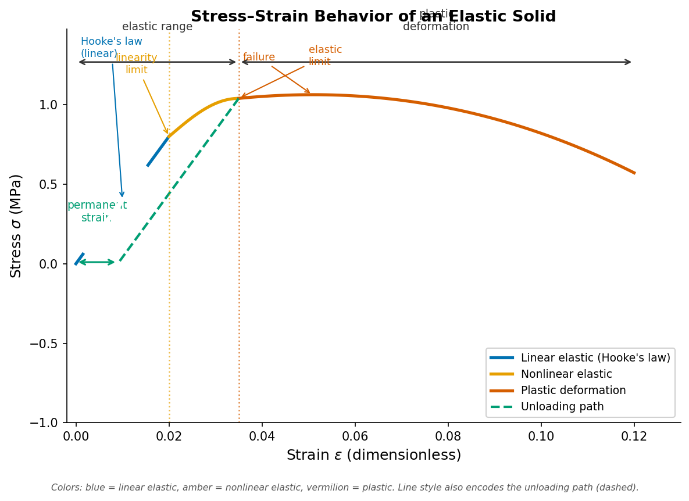
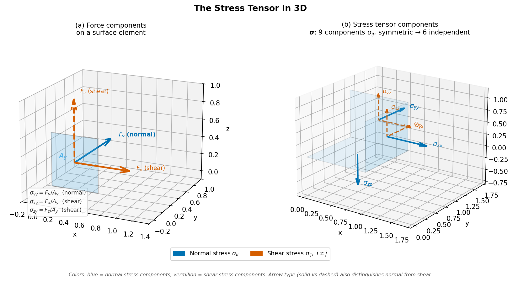

<!-- _class: title-slide -->

# Stress, Strain, and the Equation of Motion

### ESS 314 Geophysics · University of Washington
#### Week 1, Lecture 3 · April 7, 2026
#### Marine Denolle

---

# By the end of this lecture…

- **[LO-3.1]** *Define* the stress and strain tensors; identify normal vs. shear components
- **[LO-3.2]** *Relate* the four elastic moduli ($E$, $K$, $\mu$, $\nu$) to deformation geometries
- **[LO-3.3]** *Write* isotropic Hooke's law using Lamé parameters $\lambda$ and $\mu$
- **[LO-3.4]** *Derive* the equation of motion; identify $V_P = \sqrt{(\lambda+2\mu)/\rho}$
- **[LO-3.5]** *Evaluate* the assumptions of linear elastic theory

---

<!-- _class: bg-overlay -->
<!-- backgroundImage: url('https://upload.wikimedia.org/wikipedia/commons/thumb/6/6f/Cascadia_subduction_zone.svg/1200px-Cascadia_subduction_zone.svg.png') -->
<!-- Source: USGS / Wikimedia Commons — Public Domain -->

# Why Does the Ground Shake?

A Cascadia M9 earthquake will reach Seattle in **~90 seconds** as elastic waves traveling through rock

The wave speed — and the shaking intensity — depend on the **elastic properties of every rock layer** the wave passes through

*Today: building the physics that connects rock stiffness to wave speed*

---

<!-- _class: fig-full -->

# Elastic Deformation: The Key Assumption

**Elastic** = material returns to its original shape after stress is removed

**Linear elastic (Hookean)** = stress ∝ strain

Seismic strains are ~10⁻⁷ — far inside the Hookean regime.
Fault zones, magma chambers, and the deep Earth are exceptions.

Figure 3.1. Seismic waves operate in the blue (linear elastic) region only. Python-generated — assets/scripts/fig_stress_strain_curve.py

---

# Two Modes of Elastic Deformation

**Volumetric (dilatational) strain $\theta$**
- Change in volume, no change in shape
- Resisted by **bulk modulus** $K$
- → P-waves

**Shear strain $\varepsilon_{ij}$** ($i \neq j$)
- Change in shape, no change in volume
- Resisted by **shear modulus** $\mu$
- → S-waves

Fluids: $\mu = 0$ → no resistance to shear → S-waves CANNOT travel in fluids

---

<!-- _class: fig-full -->

# The Stress Tensor

$$\boldsymbol{\sigma} = \begin{pmatrix} \sigma_{xx} & \sigma_{xy} & \sigma_{xz} \\ \sigma_{yx} & \sigma_{yy} & \sigma_{yz} \\ \sigma_{zx} & \sigma_{zy} & \sigma_{zz} \end{pmatrix}$$

- **Diagonal** = normal stresses (compression / tension)
- **Off-diagonal** = shear stresses
- **Symmetric** ($\sigma_{ij} = \sigma_{ji}$) → 6 independent components
- **Force = Stress × Area:** $F_x = \sigma_{xx}\,A_x$ — stress is force per unit area on a surface

Figure 3.2. Normal stresses (blue) and shear stresses (vermilion) on a unit cube. Python-generated — assets/scripts/fig_stress_tensor.py

---

<!-- _class: fig-full -->

# Three Modes of Strain

Figure 3.3. (a) Longitudinal ε_xx = Δh/h. (b) Volumetric θ = ΔV/V. (c) Shear γ = tan ψ. P-waves involve (a)+(b); S-waves involve (c). Python-generated — assets/scripts/fig_strain_types.py

---

# The Strain Tensor

$x$ = coordinate (fixed, meters) · $u(x)$ = displacement (how far that material point moved)

Strain = symmetric part of the displacement gradient:

$$\varepsilon_{ij} = \frac{1}{2}\left(\frac{\partial u_i}{\partial x_j} + \frac{\partial u_j}{\partial x_i}\right)$$

- Diagonal ($i=j$): **extension / compression** — modes (a) longitudinal and (b) volumetric above
- Off-diagonal ($i\neq j$): **angular distortion** — mode (c) shear above
- Factor of ½ excludes rigid-body rotation

**Dilatation** (volume change):

$$\theta = \varepsilon_{xx} + \varepsilon_{yy} + \varepsilon_{zz} = \nabla\cdot\mathbf{u}$$

---

<!-- _class: fig-full -->

# Four Elastic Moduli

Figure 3.4. E (axial stiffness), μ (shear stiffness), K (bulk stiffness), ν (lateral/axial ratio). Python-generated — assets/scripts/fig_elastic_moduli.py

---

# Elastic Moduli: Relationships

Any two moduli specify all others. Seismology uses **Lamé parameters** $\lambda$, $\mu$:

$$\lambda = K - \tfrac{2}{3}\mu = \frac{\nu E}{(1+\nu)(1-2\nu)}$$

$$\mu = \frac{E}{2(1+\nu)} \quad\text{(shear modulus = rigidity)}$$

Key conversions needed for seismology:
- $V_P$ and $V_S$ → $\lambda$, $\mu$, $\rho$ → $E$, $K$, $\nu$
- Typical crustal granite: $\lambda \approx 30$ GPa, $\mu \approx 25$ GPa, $\rho \approx 2700$ kg/m³

---

# Isotropic Hooke's Law

For a homogeneous, isotropic, linear elastic solid:

$$\sigma_{ij} = \lambda\,\delta_{ij}\,\theta + 2\mu\,\varepsilon_{ij}$$

**Term 1** ($\lambda\delta_{ij}\theta$): volume change drives normal stresses in ALL directions — the coupling term

**Term 2** ($2\mu\varepsilon_{ij}$): direct resistance to any strain (normal and shear)

Two parameters ($\lambda$, $\mu$) because isotropy collapses 21 stiffness components to 2

*Units:* Pa · dimensionless + Pa · dimensionless = Pa = [stress] ✓

---

<!-- _class: fig-full -->

# Force Balance on a Continuum Element

Apply **Force = Stress × Area** → Newton's $F = ma$ on an infinitesimal element of density $\rho$.

Figure 3.5. Net force = stress gradient × volume. Divide by A_x dx → equation of motion. Python-generated — assets/scripts/fig_force_balance.py

---

# The Equation of Motion → Wave Equation

**Step 1** — Net force on element:
$$dF_x = A_x\,\frac{\partial\sigma_{xx}}{\partial x}\,dx$$

**Step 2** — Newton's 2nd law ($F = ma$):
$$\rho\,\frac{\partial^2 u}{\partial t^2} = \frac{\partial\sigma_{xx}}{\partial x}$$

**Step 3** — Substitute Hooke's law ($\sigma_{xx} = (\lambda+2\mu)\partial u/\partial x$):

$$\rho\,\frac{\partial^2 u}{\partial t^2} = (\lambda + 2\mu)\,\frac{\partial^2 u}{\partial x^2}$$

$$\Rightarrow \quad V_P = \sqrt{\frac{\lambda+2\mu}{\rho}}$$

---

# Two Wave Speeds from One Equation

| Wave | Equation | Speed |
|------|----------|-------|
| P (compressional) | $\rho\,\ddot{u} = (\lambda+2\mu)\,u''$ | $V_P = \sqrt{(\lambda+2\mu)/\rho}$ |
| S (shear) | $\rho\,\ddot{u} = \mu\,u''$ | $V_S = \sqrt{\mu/\rho}$ |

Since $\lambda \geq 0$: $\lambda + 2\mu > \mu$ → **$V_P > V_S$ always**

*Units:* $\sqrt{\text{Pa}/(\text{kg/m}^3)} = \sqrt{(\text{kg/m·s}^2)/(\text{kg/m}^3)} = \text{m/s}$ ✓

Stiffer rock → faster waves. Denser rock → slower waves.
Their ratio sets the speed — not either quantity alone.

---

# Worked Example: Granite

$\lambda = 30$ GPa, $\mu = 25$ GPa, $\rho = 2700$ kg/m³

$$V_P = \sqrt{\frac{(30+50)\times 10^9}{2700}} = \sqrt{2.96\times 10^7} \approx 5443 \text{ m/s}$$

$$V_S = \sqrt{\frac{25\times 10^9}{2700}} \approx 3043 \text{ m/s}$$

$$\frac{V_P}{V_S} = \sqrt{\frac{80}{25}} = \sqrt{3.2} \approx 1.79 \quad\Leftrightarrow\quad \nu \approx 0.27$$

Characteristic of **upper-crustal granite** ✓

---

<!-- _class: fig-full -->

# Seismic Velocities: Typical Values

Figure 3.7. V_P spans nearly two orders of magnitude across Earth materials. Dry sand is ~100× slower than granite. Python-generated — assets/scripts/fig_seismic_velocities.py

---

# The V_P / V_S Ratio as a Fluid Diagnostic

For $\nu = 0.25$ (typical crust): $V_P/V_S = \sqrt{3} \approx 1.73$

As $\nu \to 0.5$ (fluid saturation): $V_P/V_S \to \infty$

**Seattle Basin example:**
- $V_P \approx 1800$ m/s, $V_S \approx 300$ m/s
- $V_P/V_S = 6.0$, $\nu \approx 0.49$
- → water-saturated sediment

High $V_P/V_S$ = fluid. Low $V_P/V_S$ = dry rock or gas sand.
This is the single most useful seismic diagnostic in exploration and hazard.

---

# AI Prompt Lab

**Try this after class:**

> *"Is V_P = sqrt(E/rho) or V_P = sqrt((λ+2μ)/rho) for seismic P-waves?"*

Both can be correct — but in different contexts. Evaluate whether the AI explains:

- $\sqrt{E/\rho}$: slender rod, uniaxial stress, free lateral expansion
- $\sqrt{(\lambda+2\mu)/\rho}$: 3D bulk wave, constrained lateral deformation
- The conversion: $\lambda + 2\mu = E(1-\nu)/[(1+\nu)(1-2\nu)]$

**If the AI gives only one answer without qualification → it has oversimplified.**

---

# Concept Check

1. A rock has $\lambda = 50$ GPa, $\mu = 30$ GPa, $\rho = 3100$ kg/m³. Calculate $V_P$, $V_S$, and $\nu$. Show unit checks.

2. A sediment has $V_P = 1500$ m/s and $V_S = 50$ m/s. Calculate Poisson's ratio. What does this tell you about the physical state of the sediment?

3. The equation of motion was derived assuming the material is *homogeneous* and *isotropic*. Name one real-Earth situation where each assumption fails, and describe what new physics is needed.

---

# Summary

| Concept | Key Result |
|---------|-----------|
| Elastic deformation | Hookean (linear elastic), small strains |
| Stress tensor | 6 independent components ($\sigma_{ij} = \sigma_{ji}$) |
| Strain tensor | $\varepsilon_{ij} = \frac{1}{2}(\partial_j u_i + \partial_i u_j)$ |
| Hooke's law | $\sigma_{ij} = \lambda\delta_{ij}\theta + 2\mu\varepsilon_{ij}$ |
| Equation of motion | $\rho\ddot{u} = (\lambda+2\mu)u''$ or $\mu u''$ |
| P-wave speed | $V_P = \sqrt{(\lambda+2\mu)/\rho}$ |
| S-wave speed | $V_S = \sqrt{\mu/\rho}$ |

**Next lecture:** Wave types (P, S, Rayleigh, Love) and Snell's law
