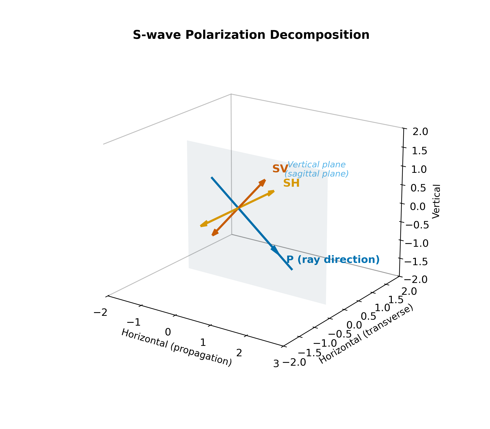
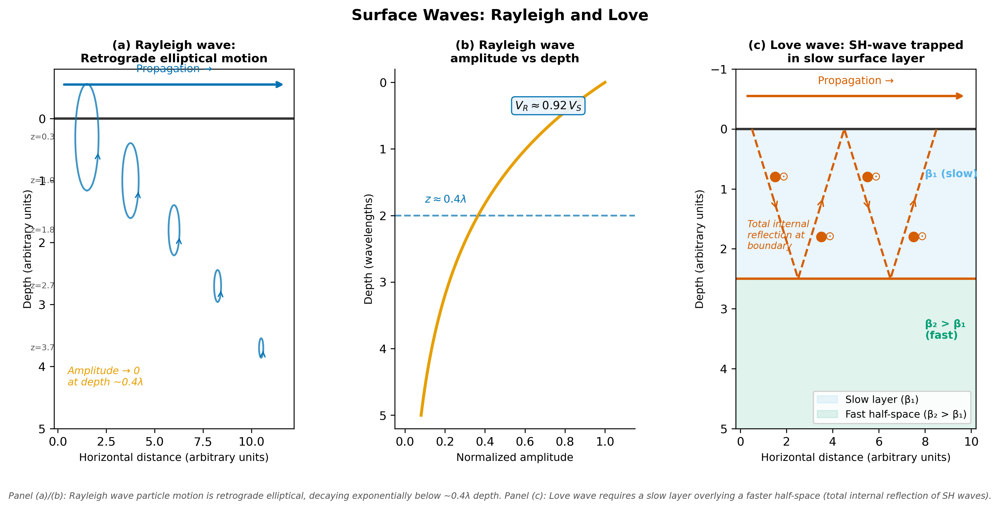

<!-- _class: title -->

# Seismic Wave Types

### ESS 314 Geophysics · University of Washington

#### Week 1, Lecture 4 · April 2, 2026

#### Marine Denolle

---

# By the end of this lecture…

- **[LO-4.1]** *Distinguish* P, S, Rayleigh, and Love waves by particle motion and speed
- **[LO-4.2]** *Explain* physically why S-waves cannot propagate in fluids
- **[LO-4.3]** *Decompose* S-wave polarization into SV and SH components
- **[LO-4.4]** *Calculate* $V_P/V_S$ and interpret it as a fluid-saturation diagnostic
- **[LO-4.5]** *Compare* seismic velocities across Earth materials

---

# One earthquake, three kinds of shaking

A seismometer records:
1. A sharp **vertical jolt** — arrives first
2. A stronger **horizontal shake** — arrives seconds later
3. A long **rolling oscillation** — persists for minutes

These are **not** different earthquakes.

They are different **solutions** to the same wave equation from Lecture 3.

*Today: what are these wave types, and what does each reveal about the Earth?*

---

# Recall: the vector equation of motion

From Lecture 3 — Newton's second law + Hooke's law in a continuum:

$$\rho\,\frac{\partial^2\mathbf{u}}{\partial t^2} = (\lambda+2\mu)\,\nabla(\nabla\cdot\mathbf{u}) - \mu\,\nabla\times(\nabla\times\mathbf{u})$$

This single equation contains **all** seismic wave behavior.

The key: it can be **separated** into two independent wave equations.

---

# Helmholtz decomposition

Any displacement field splits into two parts:

$$\mathbf{u} = \underbrace{\nabla\phi}_{\text{curl-free (P)}} + \underbrace{\nabla\times\boldsymbol{\psi}}_{\text{div-free (S)}}$$

Substituting into the equation of motion yields:

| | Equation | Speed |
|---|---|---|
| **Dilatational** (P) | $\partial^2\phi/\partial t^2 = V_P^2\,\nabla^2\phi$ | $V_P = \sqrt{(\lambda+2\mu)/\rho}$ |
| **Rotational** (S) | $\partial^2\boldsymbol{\psi}/\partial t^2 = V_S^2\,\nabla^2\boldsymbol{\psi}$ | $V_S = \sqrt{\mu/\rho}$ |

Two **independent** wave families in a homogeneous medium.

---

# Why two wave speeds?

**P-waves** compress + dilate → engage **both** bulk and shear resistance

$$V_P = \sqrt{\frac{\lambda + 2\mu}{\rho}} = \sqrt{\frac{K + \tfrac{4}{3}\mu}{\rho}}$$

**S-waves** distort shape only → engage shear resistance **alone**

$$V_S = \sqrt{\frac{\mu}{\rho}}$$

Since $\lambda + 2\mu > \mu$ always: **P-waves are always faster than S-waves**

---

# P-waves: Compressional / Longitudinal

Particle motion is **parallel** to propagation direction

The medium alternately **compresses** (C) and **rarefies** (R)

Conceptually like sound waves — but in rock

**P-waves travel through solids, liquids, and gases**

![alt text: Two-panel figure. Top panel (P-wave, emphasized here): alternating clusters of close-spaced dark blue dots labeled C for compression zones and widely-spaced sky-blue dots labeled R for rarefaction zones, with orange horizontal arrows showing longitudinal displacement parallel to the green propagation arrow. Bottom panel (S-wave): vermilion particles displaced transversely above and below equilibrium in a sinusoidal pattern, with orange vertical arrows perpendicular to the propagation direction. A callout box states S-waves cannot propagate in fluids because the shear modulus mu equals zero.](../assets/figures/fig_pwave_swave_motion.png)

---

# S-waves: Shear / Transverse

Particle motion is **perpendicular** to propagation direction

No volume change — only **shape distortion**

**S-waves CANNOT travel through fluids** ($\mu = 0$)

![alt text: Two-panel figure. Top panel (P-wave): alternating close-spaced dark blue compression zones and widely-spaced sky-blue rarefaction zones, with orange horizontal arrows showing longitudinal displacement parallel to the propagation direction. Bottom panel (S-wave, emphasized here): vermilion particles displaced transversely above and below equilibrium in a sinusoidal pattern, with orange vertical arrows perpendicular to the propagation direction. A callout box states S-waves cannot propagate in fluids because the shear modulus mu equals zero.](../assets/figures/fig_pwave_swave_motion.png)

---

# Why can't S-waves travel through water?

**Physical argument — not just math:**

In a solid: atoms are bonded in a lattice. Transverse displacement creates an **elastic restoring force** that pulls particles back → wave propagates.

In a fluid: molecules are free to rearrange. Transverse displacement causes molecules to **flow sideways** → no restoring force develops → no wave propagates.

$$\mu_{\text{fluid}} = 0 \implies V_S = \sqrt{\mu/\rho} = 0$$

This is why the **outer core** blocks S-waves (Lectures 17–18).

---

# S-wave polarization: SV and SH

S-wave motion is perpendicular to the ray — but "perpendicular" has **two** independent directions:

- **SV** — in the vertical plane containing the ray
- **SH** — horizontal, perpendicular to the ray plane

---

# Why does SV vs. SH matter?

The free surface and horizontal layering **break the symmetry** between vertical and horizontal transverse motions

| Polarization | At free surface | Generates |
|---|---|---|
| **SV** | Vertical + horizontal motion | **Rayleigh waves** (with P) |
| **SH** | Horizontal motion only | **Love waves** (if slow layer present) |

This decomposition becomes critical at boundaries (Lecture 7).

---

# The $V_P/V_S$ ratio

$$\frac{V_P}{V_S} = \sqrt{\frac{\lambda + 2\mu}{\mu}} = \sqrt{\frac{2(1-\nu)}{1-2\nu}}$$

Depends **only** on Poisson's ratio $\nu$, not on density.

| Condition | $\nu$ | $V_P/V_S$ |
|---|---|---|
| Minimum (stable solid) | 0 | $\sqrt{2} \approx 1.41$ |
| **Poisson solid** (typical rock) | **0.25** | $\sqrt{3} \approx \mathbf{1.73}$ |
| Fluid limit ($\mu \to 0$) | 0.5 | $\to \infty$ |

**Anomalously high $V_P/V_S$ → fluid saturation, partial melt, or high pore pressure.**

---

# $V_P/V_S$ as a fluid diagnostic

**Example: Duwamish Valley, south Seattle** (shallow borehole)

$$V_P = 1750 \text{ m/s}, \quad V_S = 220 \text{ m/s}$$

$$\frac{V_P}{V_S} = \frac{1750}{220} = 7.95 \implies \nu = 0.492$$

Almost the incompressible fluid limit (0.5).

**Interpretation:** Water-saturated Holocene alluvium — $V_P$ dominated by pore fluid, $V_S$ controlled by weak grain contacts.

This is why Pioneer Square shakes harder than Capitol Hill.

---

# Seismic velocities of Earth materials

Nearly **two orders of magnitude** from soft clay ($V_S \sim 60$ m/s) to basalt ($V_P \sim 6000$ m/s).

---

# What controls seismic velocity?

**Stiffness increases velocity** — crystalline rocks (high $\mu$, $K$) are fast; unconsolidated sediments are slow

**Density: indirect effect** — denser rocks are also stiffer; stiffness increase dominates

**Fluid saturation:** Filling pores with water increases $K$ but NOT $\mu$
→ $V_P$ increases, $V_S$ unchanged → $V_P/V_S$ increases

**Pressure** (depth) → closes cracks, stiffens contacts → $V$ increases
**Temperature** → weakens contacts, approaches melt → $V$ decreases

---

# Surface waves: Rayleigh

Arise from P + SV interaction with the **free surface** (zero traction boundary)

**Particle motion:** retrograde ellipses — backward at crest, forward in trough

**Amplitude:** decays as $\sim e^{-kz}$, negligible below $\sim 0.4\lambda$

**Speed:** $V_R \approx 0.92\,V_S$ (for $\nu = 0.25$)

---

# Surface waves: Love

**Require** a slow surface layer over a faster half-space

SH waves trapped by **total internal reflection** at layer base → constructive interference → Love wave

**Particle motion:** purely horizontal (SH)

**Phase velocity:** $V_{S1} < V_{\text{Love}} < V_{S2}$

No vertical component — only horizontal shaking.

---

# Surface wave dispersion

Both Rayleigh and Love waves are **dispersive** in a layered Earth:

- **Long periods** → penetrate deeper → sample faster material → travel faster
- **Short periods** → confined to slow near-surface → travel slower

Measuring **phase velocity vs. period** = the **dispersion curve**

The dispersion curve directly reveals $V_S(z)$ — **surface wave tomography**.

This is one of the most powerful tools for imaging the crust and upper mantle.

---

# Wave type summary

| Wave | Particle motion | Speed | In fluids? | Diagnostic use |
|---|---|---|---|---|
| **P** | ∥ propagation | $\sqrt{(\lambda+2\mu)/\rho}$ | ✅ Yes | Fastest; sensitive to $K$ and $\mu$ |
| **S** | ⊥ propagation | $\sqrt{\mu/\rho}$ | ❌ No | Shear rigidity; site characterization |
| **Rayleigh** | Retrograde ellipse | $\approx 0.92\,V_S$ | Surface only | Dispersive; dominant distant shaking |
| **Love** | Horizontal (SH) | $V_{S1} < c < V_{S2}$ | Needs layering | Dispersive; pure horizontal shaking |

---

# The S–P time method

**Problem:** How far away is an earthquake?

$$\Delta t_{S-P} = t_S - t_P, \qquad d = \Delta t \cdot \frac{V_P \cdot V_S}{V_P - V_S}$$

**Example:** Poulsbo M4.3 at PNSN station SEW:

$\Delta t = 4.6$ s, $V_P = 6.3$ km/s, $V_S = 3.64$ km/s

$$d = 4.6 \times \frac{6.3 \times 3.64}{6.3 - 3.64} = 4.6 \times 8.62 \approx 39.7 \text{ km}$$

Consistent with the straight-line distance Poulsbo → UW campus.

---

# ShakeAlert: P-waves save lives

The USGS ShakeAlert system detects **fast-arriving P-waves** to issue alerts before the **more damaging S-waves** arrive.

For a **Cascadia M9**:
- P-wave reaches coast: ~15 s after rupture
- Strong S-wave shaking reaches Seattle: 60–90 s later

That **60–90 s warning window** = time to stop trains, pause surgeries, move away from windows.

The physics: **$V_P > V_S$** — always.

---

# $V_{S30}$ and building codes

**$V_{S30}$** = average shear velocity in the top 30 m of soil

| Site Class | $V_{S30}$ (m/s) | Description |
|---|---|---|
| A | > 1500 | Hard rock |
| B | 760–1500 | Rock |
| C | 360–760 | Dense soil / soft rock |
| D | 180–360 | Stiff soil |
| **E** | **< 180** | **Soft soil** |

Design earthquake force for Class E is **3–5× larger** than Class B.

In Seattle: Capitol Hill (till, ~500 m/s) vs. Pioneer Square (fill, ~180 m/s).

---

# AI as a tool: ML phase picking

Deep-learning models (PhaseNet, EQTransformer) now pick P and S arrivals at near-human accuracy

**Why it works:** the models learn the same physics from this lecture:
- P: impulsive, dominant on vertical component, higher frequency
- S: emergent, dominant on horizontal, lower frequency

**Where it fails:** unusual waveforms outside the training distribution → confident but wrong picks

**Your check:** Does the picked S–P time give a physically plausible $V_P/V_S$? (Should be 1.4–2.5 for crust.)

---

# Concept Check

1. A basalt sample has $V_P = 5900$ m/s and $V_S = 3200$ m/s. Calculate $V_P/V_S$ and Poisson's ratio. Is this consistent with dry crystalline rock?

2. Explain in **two sentences** — without formulas — *why* S-waves cannot travel through water. Reference a specific physical process at the molecular scale.

3. An AI assistant claims "P-waves are faster because compression is faster than shearing." Critique this statement. What does the ratio $\sqrt{(\lambda+2\mu)/\mu}$ actually tell us?

---

# Next time

**Lecture 6: Wavefronts, Rays, and Snell's Law**

Now that we know what wave types exist — how do we predict the **paths** they take through structured media?

*Huygens' principle · ray-wavefront duality · Snell's law · Fermat's principle*

**Lab 1 (Friday):** Introduction to Python — computing $V_P$, $V_S$ for different rock types

