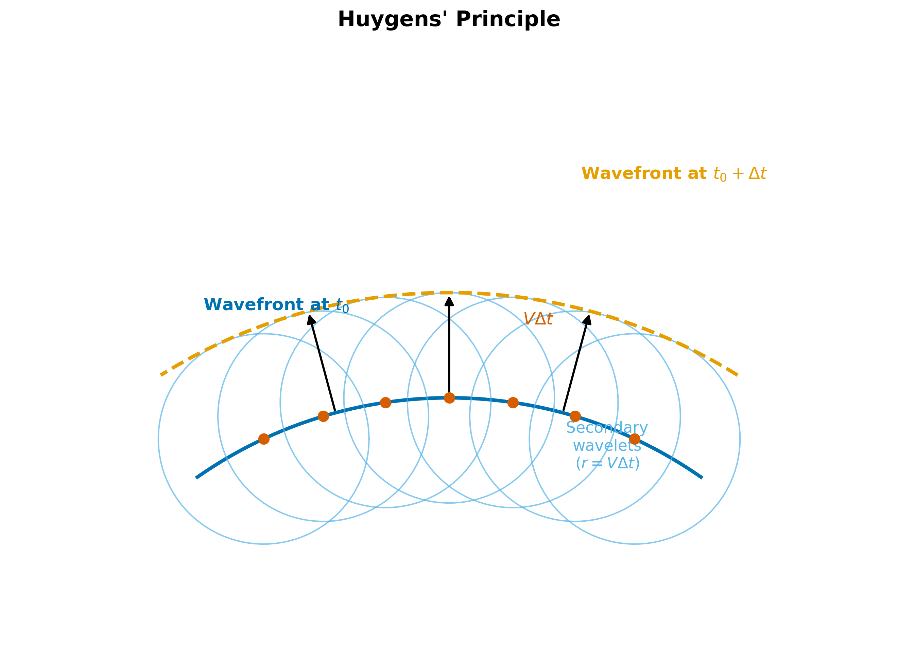
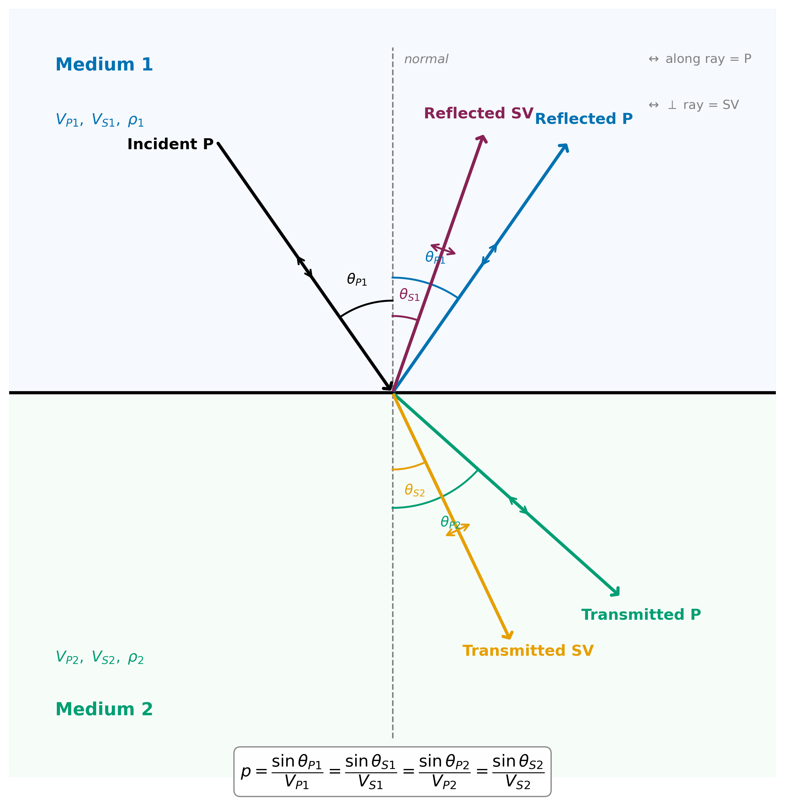
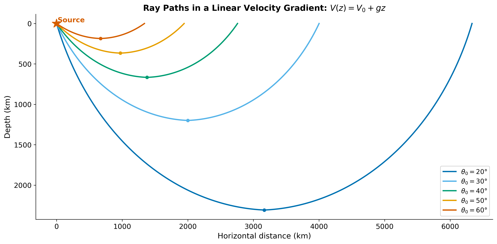

<!-- _class: title -->

# Wavefronts, Rays, and Snell's Law

### ESS 314 Geophysics · University of Washington

#### Week 2, Lecture 5 · April 6, 2026

#### Marine Denolle

---

# By the end of this lecture…

- **[LO-5.1]** *Distinguish* wavefronts from rays and their geometric relationship
- **[LO-5.2]** *Apply* Huygens' principle to construct wavefronts at velocity contrasts
- **[LO-5.3]** *Derive* Snell's law from wavefront geometry
- **[LO-5.4]** *Define* the ray parameter $p$ and explain why it is conserved
- **[LO-5.5]** *Derive* Snell's law from Fermat's principle of least time
- **[LO-5.6]** *Explain* why waves both reflect and refract at every interface
- **[LO-5.7]** *Describe* P–SV mode conversion and the generalized Snell's law
- **[LO-5.8]** *Define* acoustic impedance $Z = \rho V$ and compute normal-incidence $R$ and $T$

---

# The puzzle: bent ray paths

An earthquake occurs offshore of Westport, WA, at 30 km depth in the subducting Juan de Fuca plate.

The P-wave arrives at Olympia from an **unexpected direction** — steeper than the straight line from source to station.

**The wave path was bent** by velocity contrasts in the crust and upper mantle.

*Today: the law that governs this bending — and two ways to derive it.*

---

# Wavefronts and rays

**Wavefront** = surface of constant phase (all points reached at the same time)

**Ray** = direction of energy propagation (⊥ to wavefront in isotropic media)

From a point source in a homogeneous medium:
- Wavefronts are **spherical** (3D) or circular (2D)
- Rays are **straight lines** radiating outward

At distances $\gg \lambda$: the wavefront looks locally flat → **plane wave** approximation

---

# What happens in heterogeneous media?

**Key insight:** The fast side of the wavefront advances farther → wavefront tilts → rays curve toward slower regions.

---

# Huygens' principle (1678)

Every point on a wavefront acts as a **secondary point source**, emitting a spherical wavelet.

The new wavefront = **envelope** tangent to all secondary wavelets.

Not just a trick — it follows from the Green's function representation of the wave equation.

---

# Huygens at a velocity contrast

At an interface between $V_1$ and $V_2 > V_1$:

- Wavelets in medium 2 are **larger** (radius $V_2 \Delta t > V_1 \Delta t$)
- The envelope tilts — wavefront changes direction
- The ray bends **away from the normal** into the faster medium

This is the physical mechanism behind Snell's law.

---

# Deriving Snell's law: the geometry

---

# Deriving Snell's law: the algebra

Two right triangles share hypotenuse $AB$:

$$\sin\theta_1 = \frac{BC}{AB} = \frac{V_1\,\Delta t}{AB}$$

$$\sin\theta_2 = \frac{AE}{AB} = \frac{V_2\,\Delta t}{AB}$$

Divide — $\Delta t$ and $AB$ cancel:

$$\boxed{\frac{\sin\theta_1}{V_1} = \frac{\sin\theta_2}{V_2} = p}$$

---

# Snell's law: what it means

$$\frac{\sin\theta_1}{V_1} = \frac{\sin\theta_2}{V_2} = p$$

- $V_2 > V_1$: $\theta_2 > \theta_1$ → ray bends **away** from normal (into faster medium)
- $V_2 < V_1$: $\theta_2 < \theta_1$ → ray bends **toward** normal (into slower medium)
- Vertical incidence ($\theta_1 = 0$): no bending at all

*Units:* $[\sin\theta / V] = 1/(\text{m/s}) = \text{s/m}$ ✓

Identical to Snell's law in optics — with $V$ replacing $c/n$.

---

# The ray parameter $p$

$$p = \frac{\sin\theta}{V} = \text{constant along the entire ray}$$

**Physical meaning:** horizontal component of the slowness vector $\mathbf{s} = \hat{n}/V$

**Why conserved?** Horizontal translational symmetry — properties vary only with depth. Same physics as conservation of horizontal momentum.

**Through $N$ layers:** $p = \sin\theta_1/V_1 = \sin\theta_2/V_2 = \cdots = \sin\theta_N/V_N$

---

# Worked example: three-layer model

A ray with $p = 0.0002$ s/m passes through:

| Layer | $V$ (m/s) | $\sin\theta = pV$ | $\theta$ |
|---|---|---|---|
| 1 (sediment) | 2000 | 0.400 | 23.6° |
| 2 (limestone) | 4500 | 0.900 | 64.2° |
| 3 (basement) | 6000 | 1.200 | **No real angle!** |

The ray **cannot enter layer 3** — it is totally reflected.

Critical angle at layer 2→3: $\theta_c = \arcsin(4500/6000) = 48.6°$

The ray arrives at 64.2° > 48.6° → post-critical.

---

# Fermat's principle of least time

**The actual ray path between two points is the one with the shortest (stationary) travel time.**

More general than Snell's law: works for curved interfaces, continuous gradients, and 3D media.

Snell's law is a *consequence* of Fermat's principle for flat interfaces.

---

# Fermat's principle: the geometry

---

# Fermat's principle: the calculus

Travel time from $A$ to $B$ via crossing point $x$:

$$T(x) = \frac{\sqrt{h^2 + x^2}}{V_1} + \frac{\sqrt{h^2 + (d-x)^2}}{V_2}$$

Minimize: set $dT/dx = 0$:

$$\frac{x}{V_1\sqrt{h^2+x^2}} = \frac{d-x}{V_2\sqrt{h^2+(d-x)^2}}$$

Recognize: $\sin\theta_1 = x/\sqrt{h^2+x^2}$, $\sin\theta_2 = (d-x)/\sqrt{h^2+(d-x)^2}$

$$\boxed{\frac{\sin\theta_1}{V_1} = \frac{\sin\theta_2}{V_2}}$$

Snell's law — from calculus, not geometry.

---

# Two derivations, one law

| Approach | Method | Strength |
|---|---|---|
| **Huygens** | Wavefront geometry at interface | Physical intuition — "see" the bending |
| **Fermat** | Minimize travel time via $dT/dx = 0$ | Generalizes to curves, gradients, 3D |

Both yield $p = \sin\theta/V = \text{constant}$.

The ray parameter $p$ is the **fundamental invariant** of ray theory.

---

# Reflection: The Other Half of Snell's Law

At every velocity contrast, energy **both refracts and reflects**.

The reflected ray stays in medium 1. Snell's law with $V_1 = V_1$:

$$\frac{\sin\theta_i}{V_1} = \frac{\sin\theta_r}{V_1} \quad\Longrightarrow\quad \theta_r = \theta_i$$

**The angle of reflection equals the angle of incidence.**

This is symmetric about the normal — like a mirror.

Only when $Z_1 = Z_2$ does the reflected wave vanish entirely.

---

# Mode Conversion: One P-Wave In, Four Waves Out

Since $V_S < V_P$: the converted S-wave is always **steeper** than the P-wave.

*Note: SH waves do not convert — they are decoupled from P–SV.*

---

# How Much Reflects? Acoustic Impedance

Snell's law gives the **angles**. The **amplitudes** depend on **acoustic impedance**:

$$Z = \rho\, V \quad [\text{kg/(m}^2\text{·s)}]$$

At **normal incidence** ($\theta = 0$), the reflection and transmission coefficients:

$$R = \frac{Z_2 - Z_1}{Z_2 + Z_1}, \qquad T = \frac{2\,Z_1}{Z_2 + Z_1}$$

| Property | Meaning |
|---|---|
| $R > 0$ | $Z_2 > Z_1$ — same polarity |
| $R < 0$ | $Z_2 < Z_1$ — **polarity flip** |
| $R = 0$ | $Z_1 = Z_2$ — no reflection |
| $R^2 + (Z_1/Z_2)\,T^2 = 1$ | Energy conservation |

At oblique incidence → **Zoeppritz equations** (Lecture 8)

---

# Rays in a velocity gradient

When $V$ increases with depth ($V = V(z)$), rays **curve continuously**:

$p = \sin\theta(z) / V(z) =$ constant → as $V$ increases, $\sin\theta$ increases → ray tilts toward horizontal

**Turning depth:** where $\sin\theta = 1$ (ray is horizontal), at $V(z_\text{turn}) = 1/p$

---

# Rays in the real Earth

Steeper takeoff angle → smaller $p$ → deeper penetration → greater epicentral distance

This is why:
- **Near stations** record shallow rays (refracted through the crust)
- **Distant stations** record deep rays (through the mantle)
- **Antipodal stations** record rays that traverse the core

The relationship $p(\Delta)$ — ray parameter vs. distance — is the **key to inverting Earth structure** from travel times.

---

# The optical analogy

| | Optics | Seismology |
|---|---|---|
| Law | $n_1\sin\theta_1 = n_2\sin\theta_2$ | $\sin\theta_1/V_1 = \sin\theta_2/V_2$ |
| "Slow" medium | Higher refractive index $n$ | Lower velocity $V$ |
| Bending | Toward normal in dense glass | Toward normal in slow rock |

A **mirage** on a hot road = a seismic **turning ray** in a velocity gradient.

Same physics, different scale.

---

# Critical angle and total reflection

When $V_2 > V_1$, increasing $\theta_i$ eventually makes $\sin\theta_2 = 1$ — the transmitted ray grazes the interface.

$$\theta_c = \arcsin\!\left(\frac{V_1}{V_2}\right)$$

For $\theta > \theta_c$: **total reflection** — no transmitted energy, $|R| = 1$

At exactly $\theta_c$: the wave along the interface radiates a **head wave** back into medium 1 at angle $\theta_c$.

Head waves travel at $V_2$ → the foundation of **seismic refraction** (Lectures 6–7).

---

# Why it matters: earthquake location

Every PNSN earthquake location depends on:

1. A **velocity model** $V(z)$ for the PNW crust and mantle
2. **Snell's law** applied at every layer boundary to trace rays
3. Travel times computed from ray paths

Errors in the velocity model → errors in location (5–10 km in Cascadia with 1D models).

The **M9 Project** uses 3D ray tracing through the Community Velocity Model to simulate ground motion for a future Cascadia M9.

---

# AI as a reasoning partner

**Try this prompt:**

> *"Derive Snell's law from Fermat's principle. Start from $T(x) = \sqrt{h^2+x^2}/V_1 + \sqrt{h^2+(d-x)^2}/V_2$, take $dT/dx$, set to zero, and show every step."*

**Evaluate the AI's response against today's derivation:**
- Does it correctly differentiate both terms?
- Does it recognize $\sin\theta = x/\sqrt{h^2+x^2}$ from the geometry?
- Common error: dropping the negative sign in $(d-x)$

---

# Concept Check

1. A ray enters sandstone ($V = 3000$ m/s) from sediment ($V = 1500$ m/s) at $\theta_1 = 20°$. Find $\theta_2$. Is the ray bending toward or away from the normal?

2. Sketch wavefronts for a wave propagating downward through a medium where $V$ increases linearly with depth. Are they flat, curved up, or curved down?

3. A ray with $p = 1.5 \times 10^{-4}$ s/m enters a medium where $V$ increases from 4000 to 8000 m/s. At what velocity does the ray turn? What is the takeoff angle at the surface?

---

# Next time

**Lecture 6: Seismic Refraction I**

The head wave we just introduced is the key observable. Lecture 6 derives the travel-time equations for head waves and shows how to invert slopes and intercepts for layer velocity and thickness — the method Mohorovičić used to discover the crust–mantle boundary.

*Direct waves · head waves · travel-time curves · crossover distance · the Moho*

**Discussion (Wed):** Radar eyes on ice — applying today's physics to GPR
