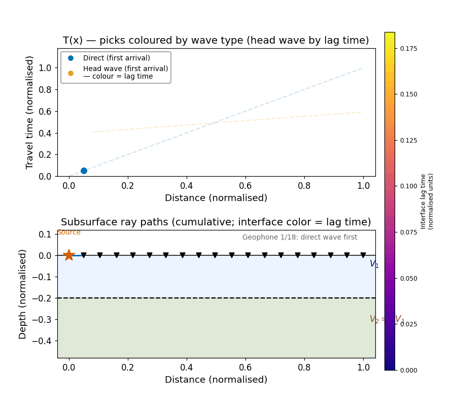

<!-- _class: title -->

# Seismic Refraction I

### ESS 314 Geophysics · University of Washington

#### Week 2, Lecture 6 · April 9, 2026

#### Marine Denolle

---

# By the end of this lecture…

- **[LO-6.1]** *Sketch* a refraction survey geometry and identify direct, reflected, and head wave ray paths
- **[LO-6.2]** *Derive* travel-time equations for direct and head waves in a two-layer model
- **[LO-6.3]** *Distinguish* the critical distance $x_\text{crit}$ from the crossover distance $x_\text{cross}$
- **[LO-6.4]** *Calculate* $t_i$, $x_\text{crit}$, and $x_\text{cross}$; invert the T(x) plot for $V_1$, $V_2$, and $H$
- **[LO-6.5]** *Identify* assumptions of the two-layer model and when they fail

---

# The discovery: Mohorovičić, 1909

A Croatian geophysicist examines seismograms from an earthquake near Zagreb.

- **Nearby stations:** P-wave slope $\approx 1/5.6$ km/s — crustal rock
- **Distant stations:** a faster P-wave appears — slope $\approx 1/8.1$ km/s
- Beyond ~200 km, the fast wave arrives **before** the direct wave

From slopes and intercept → **crust-mantle boundary ≈ 54 km depth**

This is the **Mohorovičić discontinuity** — discovered by seismic refraction.

---

# The refraction survey

![Cross-section of a two-layer model. Source at the left surface. Geophones spaced along the surface to the right. Layer 1 with velocity V_1 and thickness H overlies a half-space with velocity V_2 greater than V_1. Three labeled ray paths originate from the source: a direct wave traveling horizontally near the surface, a reflected wave bouncing off the interface at depth H, and a head wave descending at the critical angle theta_c to the interface, traveling along it at V_2, then returning to the surface at theta_c to reach a distant geophone.](../assets/figures/fig_refraction_survey_geometry.png)

---

# Three types of arrivals

| Arrival | Path | Speed | T(x) shape |
|---|---|---|---|
| **Direct** | Along surface in layer 1 | $V_1$ | Linear, origin |
| **Reflected** | Down to interface, back up | $V_1$ | Hyperbola |
| **Head wave** | Down at $\theta_c$, interface at $V_2$, up at $\theta_c$ | $V_2$ | Linear, intercept |

The refraction method exploits **first arrivals** — the earliest energy at each geophone.

---

# Equipment

**Source:** Sledgehammer on plate (~30 m) · weight drop (~100 m) · explosives (km-scale)

**Receivers:** 12–48 geophones at 2–5 m spacing, or DAS fiber-optic cable

**Recording:** Multichannel seismograph — digitizes all channels simultaneously

At crustal scale: explosions or earthquakes as sources; 100s of stations over 100s of km profiles.

---

# Direct wave travel time

The direct wave travels horizontally through layer 1 at velocity $V_1$:

$$T_\text{direct}(x) = \frac{x}{V_1}$$

A straight line through the origin with **slope $= 1/V_1$**.

The near-offset branch of the T(x) plot gives $V_1$ directly from its slope.

---

# Head wave: three-segment ray path

1. **Down** through layer 1 at $\theta_c$: horizontal reach $= H\tan\theta_c$
2. **Along** the interface: distance $= x - 2H\tan\theta_c$, speed $V_2$
3. **Up** through layer 1 at $\theta_c$: symmetric to segment 1

$$T_\text{head} = \frac{2H}{V_1\cos\theta_c} + \frac{x - 2H\tan\theta_c}{V_2}$$

Apply $\sin\theta_c = V_1/V_2$ and $1 - \sin^2\theta_c = \cos^2\theta_c$:

$$\boxed{T_\text{head}(x) = \frac{x}{V_2} + \underbrace{\frac{2H\cos\theta_c}{V_1}}_{t_i}}$$

⚠️ $\cos\theta_c$ is in the **numerator**.

---

# Intercept time and layer depth

$$t_i = \frac{2H\cos\theta_c}{V_1} = \frac{2H\sqrt{V_2^2 - V_1^2}}{V_1 V_2}$$

Solving for $H$:

$$\boxed{H = \frac{t_i\,V_1\,V_2}{2\sqrt{V_2^2 - V_1^2}}}$$

Once slopes give $V_1$ and $V_2$, the intercept time $t_i$ completely determines the layer thickness $H$.

---

# Critical distance and crossover distance

![Two-panel figure. Top panel: two-layer cross-section. The minimum-offset head-wave ray descends at the critical angle theta_c from the source, reaches the interface midpoint, and returns symmetrically to the surface. The full horizontal span is labeled x_crit equals 2H tan theta_c; the half-span x_crit over 2 is also labeled. Layer thickness H is shown. Bottom panel: T-x diagram. The direct wave is a blue straight line through the origin. The head wave is an orange line with shallower slope, beginning at x_crit and intersecting the direct wave at the crossover distance x_cross. The T-axis intercept t_i is labeled. The zone x less than x_crit is shaded to show no head-wave arrivals exist there.](../assets/figures/fig_refraction_critical_distance.png)

---

# $x_\text{crit}$ vs. $x_\text{cross}$

| Quantity | Physical meaning | Formula |
|---|---|---|
| $x_\text{crit} = 2H\tan\theta_c$ | Min. offset: head wave **exists** | geometry |
| $x_\text{cross} = 2H\!\sqrt{(V_2+V_1)/(V_2-V_1)}$ | Offset: head wave is **first arrival** | $T_d = T_h$ |

Always: $x_\text{crit} < x_\text{cross}$

Between these two offsets the head wave exists but arrives **after** the direct wave.

**Survey design:** the geophone array must reach at least $x_\text{cross}$ or the inversion fails.

---

# How the T(x) diagram is built

The **plasma color** = interface lag time. Same scale in both panels.

---

# The T(x) plot: all three branches

![Travel-time plot. Horizontal axis: offset x. Vertical axis: travel time T. The direct wave is a blue straight line through the origin with slope 1 over V_1. The head wave is a green line with shallower slope 1 over V_2, offset upward by the intercept time t_i. A dashed orange hyperbola shows the reflected wave. A dashed vertical line at x_crit marks where the head-wave line begins. A second dashed vertical line marks the crossover distance x_cross where the direct and head-wave lines intersect. The bold first-arrival envelope follows the direct wave left of x_cross and the head wave right of x_cross.](../assets/figures/fig_refraction_travel_times.png)

---

# The slope-intercept inversion

**From first arrivals to Earth model:**

1. Pick first arrivals on the shot gather
2. Plot $T$ vs. $x$ and identify the two linear branches
3. Near-offset slope $\Rightarrow$ $V_1$; far-offset slope $\Rightarrow$ $V_2$
4. Read $t_i$ from the T-axis intercept of the head-wave line
5. Compute $H = t_i V_1 V_2 / (2\sqrt{V_2^2 - V_1^2})$

---

# Synthetic shot gather and inversion

![Three-panel figure. Panel A: synthetic wiggle-trace shot gather with 13 geophones at 5 to 38 m offset. Positive wiggles are filled blue. Red triangles mark first-arrival picks; a steep direct-wave trend transitions to a shallower head-wave trend near the crossover. Panel B: raw first-arrival pick times versus distance as black dots, showing the slope change. Panel C: the same picks with a blue line fit to the direct-wave branch labeled V_1 equals 350 m per s and an orange line fit to the head-wave branch labeled V_2 equals 1500 m per s. The intercept time t_i is annotated. A green dashed line marks x_cross. A result box gives V_1 equals 350 m per s, V_2 equals 1500 m per s, and H equals 5 m.](../assets/figures/fig_refraction_field_data_synthetic.png)

---

# Field inversion: water table at 5 m

**Near-offset slope** $\Rightarrow$ $V_1 = 350$ m/s (dry sand)

**Far-offset slope** $\Rightarrow$ $V_2 = 1500$ m/s (saturated sand)

**Intercept:** $t_i = 27.8$ ms, $\theta_c = \arcsin(350/1500) = 13.5°$

$$H = \frac{0.0278 \times 350 \times 1500}{2\sqrt{1500^2 - 350^2}} = 5.0 \text{ m}$$

The velocity jump arises because water's bulk modulus dominates the pore space — the $V_P$ physics from Lecture 4 applied at field scale.

---

# Worked example: UW campus bedrock

$V_1 = 800$ m/s (glacial till) · $V_2 = 3200$ m/s (bedrock) · $H = 12$ m

$$\theta_c = 14.5° \qquad t_i = 29.0 \text{ ms} \qquad x_\text{crit} = 6.2 \text{ m} \qquad x_\text{cross} = 31.0 \text{ m}$$

| Offset | $T_\text{direct}$ | $T_\text{head}$ | First arrival |
|---|---|---|---|
| $x = 30$ m | 37.5 ms | 38.4 ms | direct |
| $x = 36$ m | 45.0 ms | 40.3 ms | **head wave** |

The crossover at 31 m falls between these two receivers — consistent with the prediction.

---

# Assumptions and failure modes

| Assumption | Consequence if violated |
|---|---|
| $V_2 > V_1$ | No critical refraction → no head wave → layer invisible |
| Flat interface | Dipping layers distort apparent slopes; depth estimate is biased |
| Homogeneous layers | Velocity gradients curve rays; T(x) is non-linear |
| First arrivals only | Later arrivals carry additional structure; reflection profiling needed |

**Hidden layer:** a thin low-velocity unit between two faster layers generates no first-arrival head wave and is entirely invisible to refraction. Addressed in Lecture 7.

---

# Societal relevance: PNW applications

**Depth to bedrock:** Sound Transit used refraction to map bedrock along Seattle light rail alignments — directly informing cut-and-cover vs. bored-tunnel decisions.

**Water table:** The 350 → 1500 m/s jump is one of the strongest refraction signals in near-surface geophysics; used routinely for contamination plume monitoring.

**Crustal thickness:** Moho depth beneath the Pacific Northwest — ~10 km under the ocean, ~40 km under the Cascades — is mapped from earthquake refraction arrivals recorded by the PNSN.

---

# AI as a reasoning partner

**Prompt to evaluate:**

> *"Derive the head-wave travel time for a two-layer model. Show the three path segments, simplify using $\sin\theta_c = V_1/V_2$, and derive $x_\text{crit}$."*

**Criteria for a correct response:**
- $\cos\theta_c$ appears in the **numerator** of $t_i$
- $x_\text{crit} = 2H\tan\theta_c$ is derived geometrically, not confused with $x_\text{cross}$
- The step $1 - \sin^2\theta_c = \cos^2\theta_c$ is shown explicitly

---

# Concept Check

1. $V_1 = 2000$ m/s, $V_2 = 5500$ m/s, $H = 50$ m. Calculate $\theta_c$, $t_i$, $x_\text{crit}$, $x_\text{cross}$.

2. In three sentences: why does the head wave — which travels a longer total path — arrive first at distant receivers?

3. Slopes 5.0 ms/m and 1.25 ms/m, $t_i = 30$ ms. Determine $V_1$, $V_2$, $H$.

4. A survey records no head-wave arrivals. List three physically distinct explanations.

---

# Next time

**Lecture 7 — Seismic Refraction II**

What happens when the interface is **dipping**? When there are **multiple layers**? When a layer is **hidden**?

*Forward and reverse shooting · dipping-layer geometry · the plus-minus method · hidden layers and velocity inversions*

**Lab 2 (Friday):** Python II — implementing the travel-time equations and forward ray tracing
