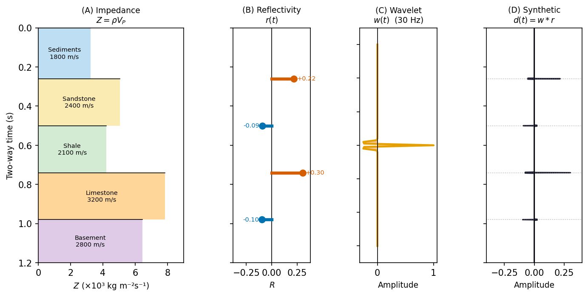
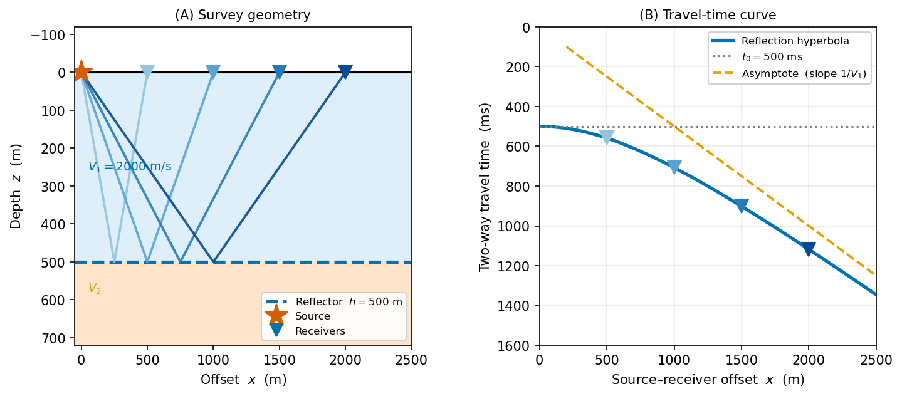

<!-- _class: title -->

# Seismic Reflections I
## Flat-Layer Travel Time, NMO, and CMP Stacking

### ESS 314 Geophysics · University of Washington

#### Week 3, Lecture 8 · April 15, 2026

#### Marine Denolle

---

# By the end of this lecture…

<strong>[LO-8.1]</strong> <em>Derive</em> the normal-incidence reflection coefficient from boundary conditions; compute energy reflection coefficient

<strong>[LO-8.2]</strong> <em>Derive</em> the flat-layer hyperbola $t^2 = t_0^2 + x^2/V_1^2$ from the image-point construction

<strong>[LO-8.3]</strong> <em>Apply</em> NMO correction to a CMP gather; explain why stacking improves SNR by $\sqrt{N_\mathrm{fold}}$

<strong>[LO-8.4]</strong> <em>State</em> the RMS velocity definition; apply Dix equation to recover interval velocities

<strong>[LO-8.5]</strong> <em>Interpret</em> a semblance panel to pick stacking velocities

---

# Before the Equations — Look at This

<figure>

<figcaption style="font-size:0.62em;color:#555;margin-top:0.3em">
Fig. 2 from Ledeczi et al. (2024), <em>Seismica</em> 2(4), <a href="https://doi.org/10.26443/seismica.v2i4.1158">doi:10.26443/seismica.v2i4.1158</a> · Licensed <a href="https://creativecommons.org/licenses/by/4.0/">CC BY 4.0</a> · Reproduced unmodified
</figcaption>
</figure>

<strong>Discussion prompts:</strong> What is the horizontal axis? The vertical axis? Why do some layers appear bright and others dark? Why does the pattern change laterally?

---

# Reading a Seismic Section

**Orientation**
- **Horizontal axis:** distance along the survey line (km)
- **Vertical axis:** two-way travel time (TWTT) in seconds — time increases **downward**; shallower reflectors plot at top
- Each column of pixels = one **seismic trace** recorded at one location

**Amplitude and polarity**
- **Bright reflector** → large impedance contrast between layers
- **Dark zone** → gradational boundary, low contrast, or gradual velocity change
- **Polarity** (light vs. dark wiggle) → sign of $R = (Z_2 - Z_1)/(Z_2 + Z_1)$:
  - positive $R$ if impedance increases with depth
  - negative $R$ if impedance decreases

Note: TWTT is <em>not</em> depth — converting it to depth requires knowing the P-wave velocity field (exactly what this lecture develops).

---

# From a Single Point to the Cross-Section

**Step 1 — Single interface, normal incidence:**
A downgoing pulse hits a boundary → fraction $R$ of the energy reflects upward → arrives at the surface at two-way time $t_0 = 2h/V$.
One reflection = one amplitude value at one $(x, t_0)$ pixel.

**Step 2 — One vertical trace:**
Stack all reflections from all interfaces at location $x$ → a time-series (one column of the image).

**Step 3 — Sweep across the survey line:**
Repeat for every source–receiver pair → mosaic all traces side by side → the **2D seismic section**.

**What controls brightness?**

$$R = \frac{Z_2 - Z_1}{Z_2 + Z_1}$$

High-contrast boundary (e.g., sand–shale, water–rock) → bright.
Small contrast (clay–clay) → dark.

In the Cascadia image: the seafloor is the brightest reflector. Deeper, the décollement and sediment packages appear as bands of varying amplitude — each controlled by $R$ at that boundary.

---

# What Makes a Bright Reflector? Acoustic Impedance

The brightness in the Cascadia image is controlled by **acoustic impedance** $Z = \rho\, V_P$ — the resistance of a medium to wave propagation.

At normal incidence (boundary conditions: continuity of pressure + particle velocity):

$$R = \frac{Z_2 - Z_1}{Z_2 + Z_1} \qquad T = \frac{2Z_2}{Z_1 + Z_2}$$

**Energy fractions:** $\mathcal{R} = R^2$, $\mathcal{T} = 1 - R^2$

| Interface | $Z_1$ (MPa·s/m) | $Z_2$ | $R$ |
|---|---|---|---|
| Sediment → limestone | 3.5 | 6.0 | +0.26 |
| Sand → shale | 4.8 | 4.2 | −0.07 |
| Crust → mantle (Moho) | 13 | 20 | +0.21 |

Most sedimentary contacts: $|R| = 0.01$–$0.15$ → only 1–2% of energy reflected. <strong>CMP stacking is essential to extract the signal.</strong>

---

# From Impedance to Seismogram: The Convolutional Model

$d(t) = w(t) * r(t)$ &nbsp;→&nbsp; each reflector prints a copy of the wavelet, scaled by $R$ and shifted to its TWTT. Blue = positive $R$ (impedance increase); red = negative $R$.

---

# Acquisition: CMP Gather

Every coloured pair shares the same <strong>midpoint</strong> (CMP) → same reflection point on a flat reflector. Fold = spread / (2 × shot spacing). Modern marine: 120–240-fold → SNR ×11–15.

---

# The Reflection Hyperbola

**Image-point construction:** reflect source through reflector.

$$t^2(x) = t_0^2 + \frac{x^2}{V_1^2}$$

$$t_0 = \dfrac{2h}{V_1}$$

$t^2$–$x^2$ is a **straight line** → slope gives $V_1^2$, intercept gives $h$

---

# NMO Correction

**Normal moveout** is the delay at offset $x$ relative to $t_0$:

$$\Delta t_\mathrm{NMO}(x) = \sqrt{t_0^2 + \frac{x^2}{V_\mathrm{NMO}^2}} - t_0 \approx \frac{x^2}{2\,V_\mathrm{NMO}^2\, t_0}$$

NMO correction **shifts each trace up** by $\Delta t_\mathrm{NMO}(x)$, flattening the hyperbola to $t_0$.

**NMO stretch** at large offsets distorts the wavelet. Traces beyond the mute zone ($x/h \gtrsim 1$–$1.5$) are discarded before stacking.

---

# RMS Velocity

For $N$ flat, horizontal layers with velocities $V_i$ and two-way times $\Delta t_i$:

$$V_\mathrm{rms,n}^2 = \frac{\displaystyle\sum_{i=1}^{n} V_i^2\,\Delta t_i}{\displaystyle\sum_{i=1}^{n} \Delta t_i}$$

- $V_\mathrm{rms}$ **replaces** $V_1$ in the hyperbola for multi-layer media
- $V_\mathrm{rms} \geq$ any interval velocity above the interface (RMS > arithmetic mean for increasing-velocity profiles)
- The NMO velocity measured from semblance = $V_\mathrm{rms}$

---

# The Dix Equation

Recover **interval velocity** between two adjacent reflectors:

$$V_n = \sqrt{\dfrac{V_\mathrm{rms,n}^2\,t_{0,n} - V_\mathrm{rms,n-1}^2\,t_{0,n-1}}{t_{0,n} - t_{0,n-1}}}$$

**Key assumptions:** flat, horizontal, isotropic layers — violations are addressed in Lecture 9.

**Precision matters:** a small error in$V_\mathrm{rms}$ propagates strongly to $V_n$ for thin layers (when $t_{0,n} - t_{0,n-1}$ is small).

---

# Velocity Analysis: Semblance Panel

**Semblance** $S(V,\tau)$: coherence of the NMO-corrected CMP gather at trial velocity $V$ and time $\tau$.

$$S(V, \tau) = \frac{\left[\sum_j d_j(\tau + \Delta t_j)\right]^2}{N\,\sum_j \left[d_j(\tau + \Delta t_j)\right]^2} \in [0, 1]$$

Reading the semblance panel:
- **Pick maxima** tracing a velocity function $V(t_0)$ from shallow to deep
- Velocity should **increase with depth** for a normal gradient profile
- **Multiples** appear at lower velocity than primaries at the same $t_0$

---

# CMP Stacking and SNR Gain

After NMO correction and mute:

$$s(t) = \frac{1}{N_\mathrm{fold}} \sum_{j=1}^{N_\mathrm{fold}} d_j^\mathrm{NMO}(t)$$

**SNR improvement:**
$$\mathrm{SNR}_\mathrm{stack} = \sqrt{N_\mathrm{fold}} \times \mathrm{SNR}_\mathrm{single}$$

48-fold → 7× better SNR · 96-fold → 10× · 240-fold → 15×

Post-stack: deconvolution → **migration** (Lecture 10) → interpretation

---

# Worked Example: Two-Layer NMO + Dix

$V_1 = 1800$ m/s, $h_1 = 900$ m; $V_2 = 2600$ m/s, $h_2 = 700$ m

| Reflector | $t_0$ (s) | $V_\mathrm{rms}$ (m/s) |
|---|---|---|
| 1 | 1.000 | 1800 |
| 2 | 1.538 | 2048 |

Dix recovery: $V_2 = \sqrt{(2048^2 \times 1.538 - 1800^2 \times 1.000)/0.538} = 2600$ m/s ✓

---

# SOTA: DL Velocity Analysis

Traditional velocity picking: manual, time-consuming, subjective for millions of CMPs in 3D surveys.

**CNN semblance pickers**: input = semblance image; output = $V(t_0)$ curve. Match expert picks within 1–2% RMS.

**Bayesian uncertainty**: output $p(V_\mathrm{NMO} \mid t_0)$ — widest uncertainty at large TWTTs and near-zero fold zones.

**Physics-constrained inversion**: embed Dix equation as a hard constraint → interval velocities guaranteed consistent with observed $V_\mathrm{rms}$.

---

# Concept Check

1. Two layers: $V_1 = 2000$ m/s at $t_0 = 0.80$ s; $V_\mathrm{rms,2} = 2300$ m/s at $t_0 = 1.40$ s. Compute $V_2$ with Dix. Compute the depth to reflector 2.

2. NMO is applied to a CMP gather using a velocity that is 5% too low. Are the hyperbolas over- or under-corrected? What does the gather look like after correction?

3. A semblance panel shows a peak at $(V = 2000 \text{ m/s},\; t_0 = 1.0 \text{ s})$ and another at $(V = 1500 \text{ m/s},\; t_0 = 2.0 \text{ s})$. What is the second event most likely to be?

4. A 48-fold stack has $\mathrm{SNR}_\mathrm{single} = 0.5$. What is $\mathrm{SNR}_\mathrm{stack}$? Is the reflector visible?

