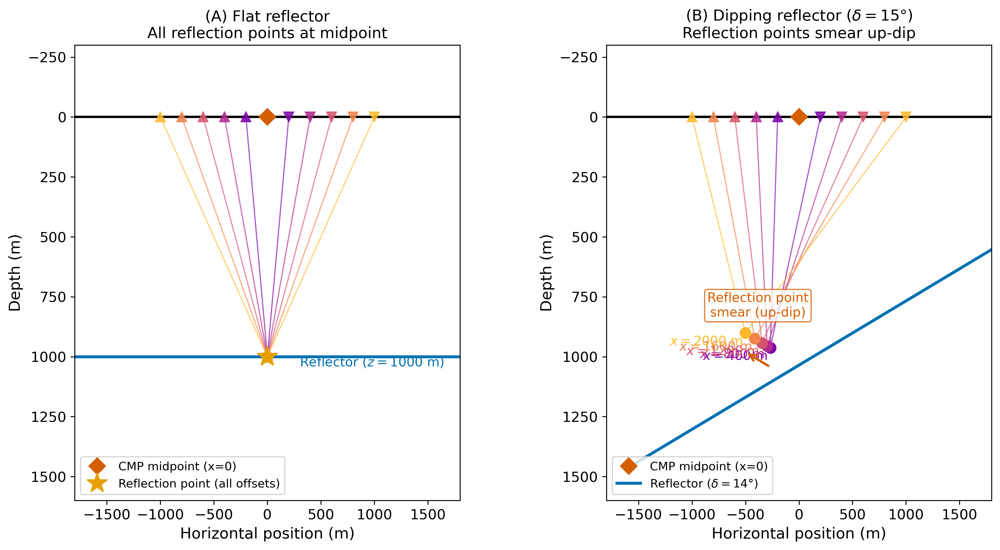
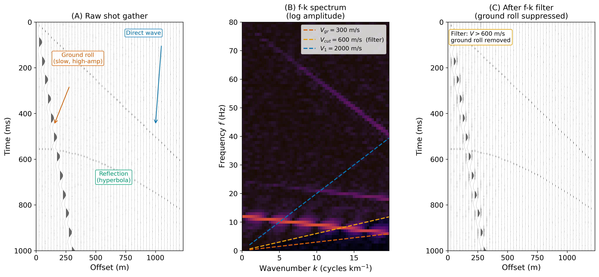
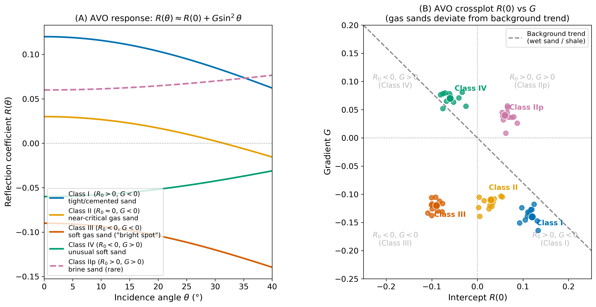
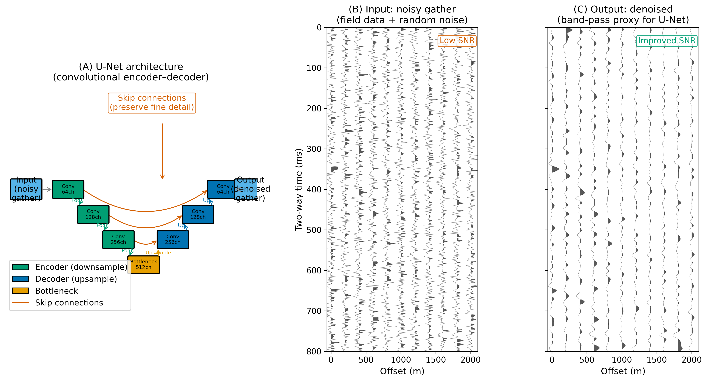

<!-- _class: title -->

# Introduction to Seismic Reflection
## Flat-Layer Travel Time, NMO, and CMP Stacking

### ESS 314 Geophysics · University of Washington

#### Week 3, Lecture 8 · April 15, 2026

#### Marine Denolle

---

# By the end of this lecture…

<strong>[LO-8.1]</strong> <em>Derive</em> the normal-incidence reflection coefficient from boundary conditions; compute energy reflection coefficient

<strong>[LO-8.2]</strong> <em>Derive</em> the flat-layer hyperbola $t^2 = t_0^2 + x^2/V_1^2$ from the image-point construction

<strong>[LO-8.3]</strong> <em>Apply</em> NMO correction to a CMP gather; explain why stacking improves SNR by $\sqrt{N_\mathrm{fold}}$

<strong>[LO-8.4]</strong> <em>State</em> the RMS velocity definition; apply Dix equation to recover interval velocities

<strong>[LO-8.5]</strong> <em>Interpret</em> a semblance panel to pick stacking velocities

---

# Motivation: Why Reflection Surveys?

Refraction surveys: image only shallow layers; limited by the critical angle and source-receiver distance. Reflection surveys: image at any depth — sedimentary cover to the Moho.

Key advantage: **redundancy**. Many source-receiver pairs share the same midpoint → CMP stacking boosts SNR.

- Cascadia subduction: OBS and multichannel reflection profiles resolve the accretionary wedge geometry, décollement depth, fluid pathways
- Seattle fault zone: reflection lines image fault geometry at shallow depth, informing M7+ hazard models

---

# Acoustic Impedance and Reflection Coefficient

**Acoustic impedance:** $Z = \rho\, V_P$

At normal incidence, boundary conditions (continuity of pressure and particle velocity) give:

$$R = \frac{Z_2 - Z_1}{Z_2 + Z_1} \qquad T = \frac{2Z_2}{Z_1 + Z_2}$$

**Energy fractions:** $\mathcal{R} = R^2$, $\mathcal{T} = 1 - R^2$

Typical crustal interface: $|R| = 0.01$–$0.15$. **Only 1–2% of energy is reflected** at most sedimentary contacts → stacking is essential.

---

# The Convolutional Model

The seismogram is a convolution of the **source wavelet** $w(t)$ with the **reflectivity** $r(t)$:

$$d(t) = w(t) * r(t) = \sum_i R_i\, w(t - t_{0,i}), \qquad t_{0,i} = \frac{2z_i}{V_i}$$

- High $|R|$ interface → strong reflector on section
- **Polarity** of $R$ encodes velocity/density jump direction:
  - $Z_2 > Z_1$ → $R > 0$ (peak)
  - $Z_2 < Z_1$ → $R < 0$ (trough)

---

# Acquisition: CMP Gather

**Shot gather**: all receivers from one source. **CMP gather**: all source–receiver pairs with same midpoint $x_m$.

For a **flat horizontal** reflector, every trace in the CMP gather reflects from the **same subsurface point** — directly below $x_m$.

Fold: $N_\mathrm{fold} = \dfrac{\text{spread length}}{2 \times \text{shot spacing}}$

- 96-trace survey, shot spacing 25 m, spread 2400 m → fold = 48
- Modern marine: fold = 120–240 → SNR improvement 11–15×

---

# The Reflection Hyperbola

**Image-point method:** reflect source through reflector at depth $h$. Total path length = straight line from image to receiver.

$$t(x) = \frac{1}{V_1}\sqrt{x^2 + 4h^2}$$

$$t^2(x) = t_0^2 + \frac{x^2}{V_1^2}, \qquad t_0 = \frac{2h}{V_1}$$

- **Slope** of $t^2$–$x^2$ line = $1/V_1^2$; **intercept** = $t_0^2 = 4h^2/V_1^2$
- Deeper reflectors → flatter hyperbola (larger $t_0$, same $V_1$)
- Faster velocity → steeper hyperbola asymptote

---

# NMO Correction

**Normal moveout** is the delay at offset $x$ relative to $t_0$:

$$\Delta t_\mathrm{NMO}(x) = \sqrt{t_0^2 + \frac{x^2}{V_\mathrm{NMO}^2}} - t_0 \approx \frac{x^2}{2\,V_\mathrm{NMO}^2\, t_0}$$

NMO correction **shifts each trace up** by $\Delta t_\mathrm{NMO}(x)$, flattening the hyperbola to $t_0$.

**NMO stretch** at large offsets distorts the wavelet. Traces beyond the mute zone ($x/h \gtrsim 1$–$1.5$) are discarded before stacking.

---

# RMS Velocity

For $N$ flat, horizontal layers with velocities $V_i$ and two-way times $\Delta t_i$:

$$V_\mathrm{rms,n}^2 = \frac{\displaystyle\sum_{i=1}^{n} V_i^2\,\Delta t_i}{\displaystyle\sum_{i=1}^{n} \Delta t_i}$$

- $V_\mathrm{rms}$ **replaces** $V_1$ in the hyperbola for multi-layer media
- $V_\mathrm{rms} \geq$ any interval velocity above the interface (RMS > arithmetic mean for increasing-velocity profiles)
- The NMO velocity measured from semblance = $V_\mathrm{rms}$

---

# The Dix Equation

Recover **interval velocity** between two adjacent reflectors:

$$V_n = \sqrt{\dfrac{V_\mathrm{rms,n}^2\,t_{0,n} - V_\mathrm{rms,n-1}^2\,t_{0,n-1}}{t_{0,n} - t_{0,n-1}}}$$

**Key assumptions:** flat, horizontal, isotropic layers. Dipping layers require the DMO correction (Lecture 9).

**Precision matters:** a small error in$V_\mathrm{rms}$ propagates strongly to $V_n$ for thin layers (when $t_{0,n} - t_{0,n-1}$ is small).

---

# Velocity Analysis: Semblance Panel

**Semblance** $S(V,\tau)$: coherence of the NMO-corrected CMP gather at trial velocity $V$ and time $\tau$.

$$S(V, \tau) = \frac{\left[\sum_j d_j(\tau + \Delta t_j)\right]^2}{N\,\sum_j \left[d_j(\tau + \Delta t_j)\right]^2} \in [0, 1]$$

Reading the semblance panel:
- **Pick maxima** tracing a velocity function $V(t_0)$ from shallow to deep
- Velocity should **increase with depth** for a normal gradient profile
- **Multiples** appear at lower velocity than primaries at the same $t_0$

---

# CMP Stacking and SNR Gain

After NMO correction and mute:

$$s(t) = \frac{1}{N_\mathrm{fold}} \sum_{j=1}^{N_\mathrm{fold}} d_j^\mathrm{NMO}(t)$$

**SNR improvement:**
$$\mathrm{SNR}_\mathrm{stack} = \sqrt{N_\mathrm{fold}} \times \mathrm{SNR}_\mathrm{single}$$

48-fold → 7× better SNR · 96-fold → 10× · 240-fold → 15×

Post-stack: deconvolution → **migration** (Lecture 10) → interpretation

---

# Worked Example: Two-Layer NMO + Dix

$V_1 = 1800$ m/s, $h_1 = 900$ m; $V_2 = 2600$ m/s, $h_2 = 700$ m

| Reflector | $t_0$ (s) | $V_\mathrm{rms}$ (m/s) |
|---|---|---|
| 1 | 1.000 | 1800 |
| 2 | 1.538 | 2048 |

Dix recovery: $V_2 = \sqrt{(2048^2 \times 1.538 - 1800^2 \times 1.000)/0.538} = 2600$ m/s ✓

---

# SOTA: DL Velocity Analysis

Traditional velocity picking: manual, time-consuming, subjective for millions of CMPs in 3D surveys.

**CNN semblance pickers**: input = semblance image; output = $V(t_0)$ curve. Match expert picks within 1–2% RMS.

**Bayesian uncertainty**: output $p(V_\mathrm{NMO} \mid t_0)$ — widest uncertainty at large TWTTs and near-zero fold zones.

**Physics-constrained inversion**: embed Dix equation as a hard constraint → interval velocities guaranteed consistent with observed $V_\mathrm{rms}$.

---

# Concept Check

1. Two layers: $V_1 = 2000$ m/s at $t_0 = 0.80$ s; $V_\mathrm{rms,2} = 2300$ m/s at $t_0 = 1.40$ s. Compute $V_2$ with Dix. Compute the depth to reflector 2.

2. NMO is applied to a CMP gather using a velocity that is 5% too low. Are the hyperbolas over- or under-corrected? What does the gather look like after correction?

3. A semblance panel shows a peak at $(V = 2000 \text{ m/s},\; t_0 = 1.0 \text{ s})$ and another at $(V = 1500 \text{ m/s},\; t_0 = 2.0 \text{ s})$. What is the second event most likely to be?

4. A 48-fold stack has $\mathrm{SNR}_\mathrm{single} = 0.5$. What is $\mathrm{SNR}_\mathrm{stack}$? Is the reflector visible?

<!-- _class: title -->

# Seismic Reflection I
## Dipping Layers, Non-Idealities, and Modern Methods

### ESS 314 Geophysics · University of Washington

#### Week 3, Lecture 8 · April 15, 2026

#### Marine Denolle

---

# By the end of this lecture…

<strong>[LO-8.1]</strong> <em>Derive</em> the dipping-layer travel-time equation; compute up-dip and down-dip apparent velocities; recover true velocity and dip

<strong>[LO-8.2]</strong> <em>Identify</em> multiple types; predict long-path multiple TWTT and NMO velocity; explain why stacking cannot remove it

<strong>[LO-8.3]</strong> <em>State</em> the diffraction equation; describe what migration accomplishes

<strong>[LO-8.4]</strong> <em>Apply</em> Shuey approximation $R(\theta) \approx R(0)+G\sin^2\theta$; classify AVO Classes I–IV

<strong>[LO-8.5]</strong> <em>Evaluate</em> DL denoising claims; identify two failure modes

---

# Why the Flat-Layer Model Fails

Cascadia's accretionary wedge: dipping reflectors 5–25°, active thrust faults, intense ground roll on land surveys, multiples above shallow reflectors.

Three key failures of the flat-layer assumption:

- **Dip**: CMP gather no longer samples a single point → smeared image
- **Multiples**: have same NMO velocity as primaries → not removed by stacking
- **Diffractions**: fault tips appear as broad hyperbolae → false structure

Each requires a **distinct correction strategy**.

---

# Dipping Layer: Geometry

For perpendicular depth $h$, dip $\delta$, velocity $V_1$:

$$t_d(x) = \frac{1}{V_1}\sqrt{x^2 + 4hx\sin\delta + 4h^2} \quad \text{(down-dip)}$$

$$t_u(x) = \frac{1}{V_1}\sqrt{x^2 - 4hx\sin\delta + 4h^2} \quad \text{(up-dip)}$$

Both have $t(0) = t_0 = 2h/V_1$ — **same zero-offset time**.

Key: a <strong>linear term</strong> $\pm\,(2t_0\sin\delta/V_1)\cdot x$ appears in $t^2$ — the mathematical signature of dip

---

# Dipping Layer: Asymmetric Curves

*Down-dip: MORE moveout (slower apparent $V$). Up-dip: LESS moveout (faster apparent $V$). All share the same $t_0$.*

---

# CMP Reflection-Point Smear

*For dipping reflectors, stacking without **DMO correction** blurs the subsurface image. DMO repositions reflection points before NMO stacking.*

---

# NMO Velocity and Dip Recovery

Taylor expansion of $t_d(x)$ at small $x$ gives:

$$V_\mathrm{NMO,dip} = \frac{V_1}{\cos\delta} \quad (> V_1 \text{ for any } \delta > 0)$$

Recover $V_1$ and $\delta$ from two-survey apparent velocities $V_d$, $V_u$:

$$V_1 = \frac{2V_d V_u}{V_d + V_u} \qquad \sin\delta = \frac{V_u - V_d}{V_u + V_d}$$

---

# Multiple Reflections

---

# The Multiple Suppression Problem

Long-path surface multiple TWTT:

$$t_\mathrm{mult}^2(x) = (2t_0)^2 + \frac{x^2}{V_\mathrm{rms}^2}$$

**Same NMO velocity as the primary** → NMO correction flattens BOTH simultaneously. **Stacking cannot suppress the multiple.**

Suppression methods:
- **SRME** (surface-related multiple elimination): autocorrelation-based prediction and subtraction
- **DL in $\tau$-$p$ domain**: CNN trained to separate primaries from multiples by slope

---

# Diffractions: Huygens Principle

Any sharp edge (fault tip, channel boundary, unconformity) acts as a **secondary point source** of spherical waves.

$$t_\mathrm{diff}(x) = \frac{2}{V_1}\sqrt{(x-x_s)^2 + z_s^2}$$

Key properties vs primary reflections:
- **Uniform amplitude** across all offsets (isotropic emission)
- Energy from a **single point**, not a planar interface
- Migration collapses it to the point $(x_s, z_s)$

---

# Diffractions in the Seismic Section

*Bowtie patterns (synclines) and diffraction tails (fault tips) are unmigrated artefacts. Migration (Lecture 10) collapses them.*

---

# Shot Gather Noise and f–k Filtering

**Coherent noise in raw shot gathers:**
- Ground roll: $V \approx 300$ m/s, $f \approx 5$–20 Hz — **high amplitude**
- Direct wave: $V \approx V_1$, linear, easily muted
- Air blast: $V \approx 340$ m/s

**f–k filter:** reject all $|k| > f / V_\mathrm{cutoff}$, preserving $V > V_\mathrm{cutoff}$

$$\mathrm{SNR}_\mathrm{stack} = \sqrt{N_\mathrm{fold}} \times \mathrm{SNR}_\mathrm{single}$$

A 48-fold survey improves SNR by a factor of $\approx 7$.

---

# f–k Ground Roll Suppression

*Ground roll occupies the slow fan (high $|k|$ per Hz). Rejecting it preserves reflections ($V > 600$ m/s).*

---

# AVO: Zoeppritz + Shuey

At oblique incidence $\theta_i$, energy partitions into reflected P, S, transmitted P, S (Zoeppritz equations). Shuey (1985) linearisation:

$$R(\theta_i) \approx \underbrace{R(0)}_{\text{intercept}} + \underbrace{G}_{\text{gradient}} \sin^2\theta_i$$

- $R(0) = (Z_2 - Z_1)/(Z_2 + Z_1)$ — normal-incidence reflectivity
- $G$ = AVO gradient, sensitive to $\Delta(V_P/V_S)$ — **fluid content**
- Gas substitution lowers $V_P$, leaves $V_S$ unchanged → large $|G|$

---

# AVO Classes I–IV

*Gas sands (Class III): **negative $R(0)$ and $G$** — amplitude brightens with offset. The $R(0)$–$G$ crossplot separates gas from brine-saturated sands.*

---

# DL Denoising: U-Net Architecture

*Skip connections preserve fine spatial detail. Supervised training requires paired noisy/clean data — unavailable for field data; self-supervised methods train on the noisy data alone.*

---

# DL Failure Modes — Critical Evaluation

1. **Domain shift**: network trained on synthetic gathers fails on field data where noise is non-stationary and geologically correlated
2. **Physics inconsistency**: denoised output may violate AVO, polarity, or reciprocity — creating spurious bright spots
3. **Interpretability gap**: cannot determine whether amplitude anomaly is a true DHI or a network artifact

*False bright spots from DL denoising have been documented in published case studies.*

---

# Worked Example: Dipping Layer

$h = 800$ m, $V_1 = 2000$ m/s, $\delta = 10°$

| Quantity | Formula | Result |
|---|---|---|
| $t_0$ | $2h/V_1$ | **0.80 s** |
| $V_\mathrm{NMO}$ | $V_1/\cos\delta$ | **2031 m/s** |
| $t_d(2400\,\text{m})$ | Exact dip eq. | **1.553 s** |
| $t_u(2400\,\text{m})$ | Exact dip eq. | **1.322 s** |

Check: $\sin\delta = (2421-1704)/(2421+1704) = 0.174 \approx \sin10°$ ✓

---

# Concept Check

1. A flat-layer NMO correction is applied to a dipping reflector ($\delta = 12°$). Is the corrected gather over- or under-corrected? Quantify the velocity error.

2. A long-path multiple arrives at $t_0 = 1.4$ s with $V_\mathrm{rms} = 2400$ m/s. What is the parent primary TWTT? Compute the reflector depth.

3. What distinguishes a diffraction hyperbola from a primary reflection? Name two geological features in the Cascadia wedge that commonly produce diffractions.

4. A sand–shale interface has $R(0) = -0.08$ and $G = -0.10$. What AVO class is this? Is the sand likely gas- or brine-saturated?
