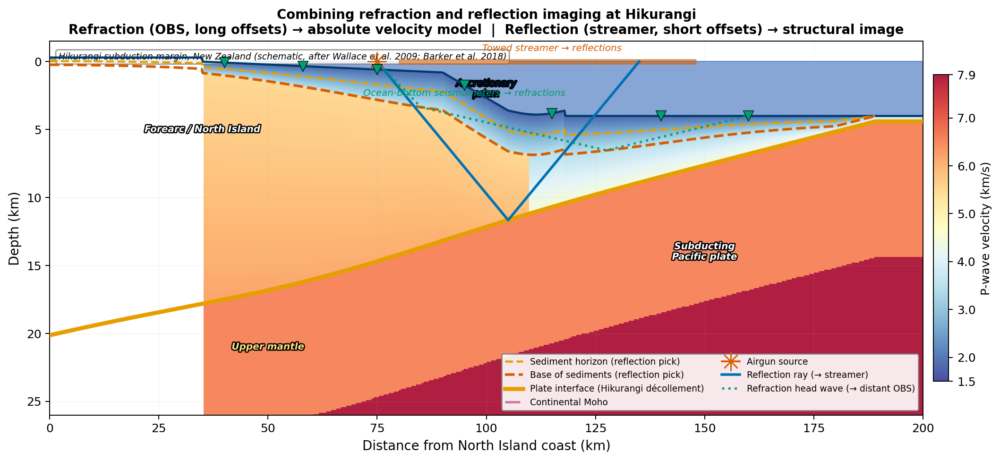
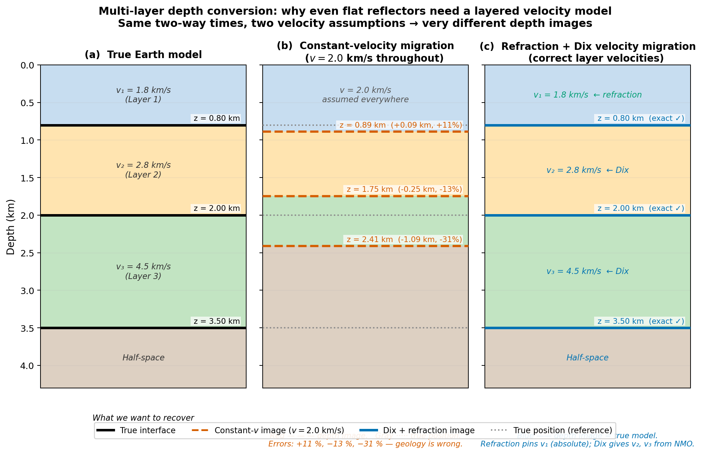
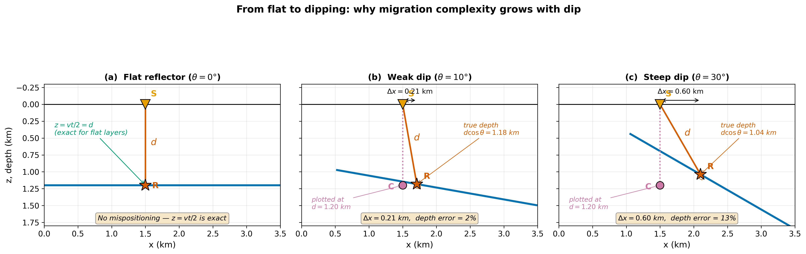
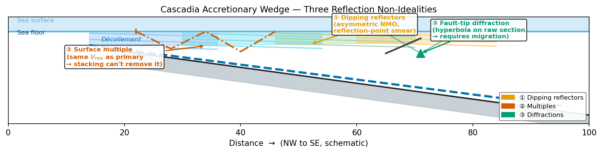
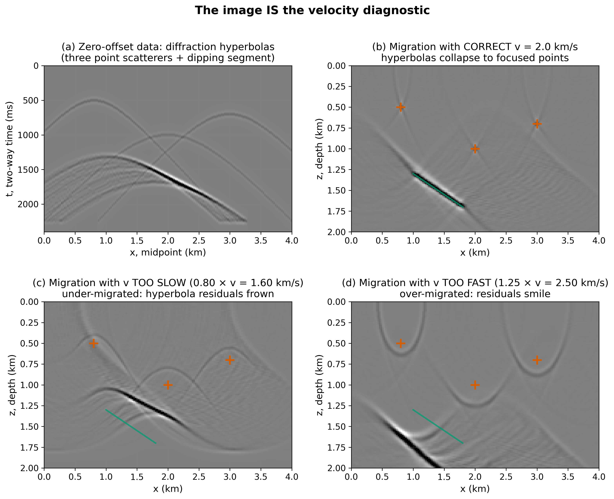

<!-- _class: title -->

# Building Earth Images
## The Iterative Refraction–Reflection Workflow

**ESS 314 — Introduction to Geophysics**
Lecture 10 · Monday 4/27/2026
Marine Denolle · University of Washington

---

## Learning objectives

By the end of this lecture:

- Explain the difference between **forward modeling** ($\mathbf{d} = F\mathbf{m}$) and **migration** ($\hat{\mathbf{m}} = F^\top\mathbf{d}$)
- Show why **even flat reflectors** need a layered velocity model to be correctly depth-converted
- Derive the migration corrections $\Delta x = d\sin\theta$ and $\tau = t\cos\theta$ for dipping layers
- Describe how Kirchhoff migration **collapses diffractions** to their source points
- **Diagnose** from a migrated image whether the velocity was correct, too slow (frowns), or too fast (smiles)
- Apply the **8-step iterative workflow** combining refraction and reflection
- Evaluate a deep-learning surrogate: who provided its training data?

---

## The Hikurangi subduction margin



Pacific plate subducts beneath North Island, New Zealand.
**How do we image the plate interface at 5–20 km depth?**
Same airgun shots → refractions to OBS (long offset) + reflections to streamer (short offset)

---

## Two windows, one Earth

**Refraction imaging (OBS, long offsets)**
→ absolute layer velocities $v_1, v_2, \ldots$
→ reliable to ~1–10 km depth

**Reflection imaging (streamer, shorter offsets)**
→ structural image at all depths
→ velocities are relative, not absolute

Neither method alone gives a quantitatively correct depth image.
**Their combination, iterated, does.**

---

## The framework: forward and inverse modeling

| | Forward model | Inverse / adjoint |
|---|---|---|
| **Question** | Given $\mathbf{m}$, predict $\mathbf{d}$? | Given $\mathbf{d}$, estimate $\mathbf{m}$? |
| **Operator** | $F$ (physics → data) | $F^\top$ (data → image) |
| **Example** | $t = 2z/v$, ray tracing | Kirchhoff sum, RTM |
| **Requires** | Model + velocity $v$ | Data + velocity $v$ |
| **Output** | Synthetic seismogram | Depth image |

$$\mathbf{d} = F\,\mathbf{m} \qquad \hat{\mathbf{m}} = F^\top\,\mathbf{d}$$

**Both need $v(x,z)$.** Migration ($F^\top$) is not the true inverse — it's the adjoint. Its quality depends entirely on the velocity model.

---

## Building the image: four cases

| Case | Complication | Key equation | Migration needed? |
|:---:|---|---|:---:|
| **1** | Flat layer, constant $v$ | $z = vt/2$ | Trivial (time→depth) |
| **2** | Multiple flat layers | Dix + refraction | Yes — need layered $v$ |
| **3** | Dipping layers | $\Delta x = d\sin\theta$, $\tau = t\cos\theta$ | Yes — mispositioning |
| **4** | Diffractions | Kirchhoff sum along hyperbola | Yes — collapse to point |

Each case adds one physical complication. Each case shows the same lesson: **you need an accurate velocity model.**

---

## Case 1 — Flat layer, constant velocity

For a flat reflector at depth $z$, velocity $v$, zero-offset geometry:

$$t = \frac{2z}{v} \quad\Longrightarrow\quad z = \frac{vt}{2}$$

- Normal ray is **vertical** — the display is correct
- "Migration" = multiply by $v/2$ → **exact time-to-depth conversion**
- No horizontal shift, no depth error

**This is why intro courses skip migration for flat layers.** The display is already right.

---

## Case 2 — Multiple flat layers: the velocity matters

Three layers with velocities $v_1 < v_2 < v_3$, interfaces at $z_1 < z_2 < z_3$:

$$t_1 = \frac{2z_1}{v_1}, \quad t_2 = t_1 + \frac{2(z_2-z_1)}{v_2}, \quad t_3 = t_2 + \frac{2(z_3-z_2)}{v_3}$$

To recover depths → need interval velocities $v_1, v_2, v_3$ via Dix:

$$v_n^2 = \frac{V_{{\rm rms},n}^2\,t_n - V_{{\rm rms},n-1}^2\,t_{n-1}}{t_n - t_{n-1}}$$

**Problem:** Dix integrates downward. Error in $v_1$ propagates into $v_2$, $v_3$.
**Solution:** Refraction gives absolute $v_1$ → anchors the chain.

---

## Case 2 — The depth image depends on velocity



**Same two-way times. Two velocity assumptions. Very different images.**
Constant $v = 2.0$ km/s → deepest interface 31% wrong.
Refraction + Dix → all three interfaces exact.

---

## Case 3 — Dipping layers: mispositioning

For a dipping reflector ($\theta$ from horizontal), the normal ray is not vertical.
The instrument records only $t = 2d/v$ — no directional information.
Conventional display: plot event straight down at depth $d$. **Two errors result:**

$$\Delta x = d\sin\theta \quad (\text{too far downdip})$$

$$\tau = t\cos\theta \quad (\text{corrected time, shallower depth})$$

Hand-migration formulas (using slope $p_0 = \partial t / \partial y$):

$$\Delta x = \frac{v^2 p_0 t}{4}, \qquad \tau = t\sqrt{1 - \frac{v^2 p_0^2}{4}}$$

Both $\to 0$ when $\theta \to 0$ (flat-layer limit).

---

## Case 3 — Flat to dipping: error grows with dip



| Dip $\theta$ | $\Delta x$ | Depth error |
|:---:|:---:|:---:|
| 0° | 0 | 0% |
| 10° | 0.21 km | 2% |
| 30° | 0.60 km | 13% |

Migration applies the corrections. Both corrections depend on **the velocity** — again.

---

## Case 4 — Diffractions: signature of structure

Any **geometric discontinuity** (fault tip, unconformity edge, salt flank) generates a diffraction.

In zero-offset data, a point scatterer at $(x_0, z_0)$ produces a **hyperbola**:

$$t(y) = \sqrt{\left(\frac{2z_0}{v}\right)^2 + \left(\frac{2(y-x_0)}{v}\right)^2}$$

An unprocessed section over complex geology is full of overlapping hyperbolas.

Three challenges in a real accretionary wedge:

- Dipping reflectors → mispositioning (Case 3)
- Surface multiples → same $V_{\rm rms}$, hard to remove
- **Diffraction hyperbolas → geological structure hidden until migrated**

---

## Case 4 — Diffractions in the Cascadia wedge



The diffraction hyperbola at the fault tip is not noise — it **is the fault**.
Kirchhoff migration collapses it to a point at the fault tip location.

---

## Kirchhoff migration: the adjoint pair


**Forward** $F$: scatterer $(x_0, z_0)$ $\to$ hyperbola in data. Writes energy along the curve.
**Migration** $F^\top$: sums data along hyperbola $\to$ focused point. Reads energy along the same curve.

---

## Kirchhoff in pseudocode

```text
for every (ix, iz) in the model:
    for every midpoint y in the data:
        t = sqrt( (2·z[iz]/v)² + (2·(x[ix]−y)/v)² )   # same hyperbola!
        if forward:   data[t, y]    += model[iz, ix]    # F  : spreads
        else:         model[iz, ix] += data[t, y]       # Fᵀ : collapses
```

Same loop. Same geometry. Opposite direction of the copy operation.
This is what **"migration is the adjoint of forward modeling"** means concretely.

---

## The velocity–image duality

$$m(x,z) = \sum_{y} w \cdot d\!\left(y,\;\sqrt{\left(\tfrac{2z}{v}\right)^2 + \left(\tfrac{2(x-y)}{v}\right)^2}\right)$$

The summation hyperbola depends on $v$. Wrong $v$ → wrong hyperbola → residual energy.

| Migration velocity | Image signature | Action |
|---|---|---|
| Correct | Diffractions collapse to points; flat gathers | Done |
| Too slow | Downward arcs — **frowns** | Increase $v$ |
| Too fast | Upward arcs — **smiles** | Decrease $v$ |

**The image is the velocity diagnostic.**

---

## Frowns and smiles



Frowns → migration hyperbola too narrow → velocity too slow.
Smiles → migration hyperbola too wide → velocity too fast.
No borehole needed to read this diagnostic.

---

## Why each method needs the other

| | Refraction | Reflection |
|---|---|---|
| **Measures** | Absolute $v_1, v_2, \ldots$ | Stacking velocity $V_{\rm rms}(t_0)$ |
| **Depth range** | Surface to deepest refractor | Any depth |
| **Strength** | Absolute velocity, robust | Full structural image |
| **Blind spot** | No LVZ; max refractor depth limited | Relative velocities; near-surface errors compound through Dix |

**Refraction anchors the velocity. Reflection reveals the structure. Migration fuses both.**

---

## The 8-step iterative workflow

| Step | Action | Method | Product |
|:---:|---|---|---|
| **1** | Pick first breaks | Refraction | $t_{\rm fb}(x)$ |
| **2** | Invert first arrivals | Refraction tomography | Shallow $v(x,z)$ |
| **3** | Pick NMO velocities | Reflection semblance | $V_{\rm rms}(t_0)$ |
| **4** | Dix inversion | Reflection | Interval $v_{\rm int}$ |
| **5** | Stitch models | Both | Initial $v_0(x,z)$ |
| **6** | Migrate stacked section | Kirchhoff / RTM | Image $F^\top\mathbf{d}$ |
| **7** | Diagnose image | Residual moveout | Frowns / smiles / flat? |
| **8** | Update $v$, repeat | Velocity model building | Improved $v_1$ → Step 6 |

Loop **6 → 7 → 8** until gathers are flat and diffractions focused.

---

## The feedback that makes iteration work

```
Refraction → v_shallow (absolute)
    ↓
Dix → v_deep (relative, anchored)
    ↓
Migration (Step 6) → image
    ↓
Frowns? → increase v    ←───────┐
Smiles? → decrease v    ←───────┤
Flat?   → DONE          ←───────┘
              ↑
       Velocity update (Step 8)
```

The velocity–image duality converts image quality into velocity corrections — **without any external reference**.

---

## Deep learning as an accelerator

| Workflow step | DL application | What it replaces |
|---|---|---|
| Step 1 | First-break picking U-Net {cite:p}`Mardan2024` | Human picking from intercept-time physics |
| Between 1–2 | Self-supervised denoising {cite:p}`LiTradLiu2024` | Wave-equation signal/noise separation |
| Steps 2–5 | Velocity model building {cite:p}`YangMa2019` | Tomography + NMO + Dix in one pass |

Training data for all three networks was produced by **physics-based operators**.

DL **accelerates** the chain. It does not replace the physics upstream of its training data.

---

## Ask this of any surrogate

1. **What physics-based operator** does this network replace?
2. **Who produced the training data**, and what physical knowledge was required?
3. **What is the training distribution** — would you trust this network outside it?

Same questions apply to regression formulas, empirical curves, and neural networks.
**The depth of the physics required to answer them is the depth of this course.**

---

## Concept check

A zero-offset section shows a diffraction hyperbola with apex at
$(x = 3.0\text{ km},\ t_0 = 1.2\text{ s})$.

After migration with $v = 2.0$ km/s → **crisp point image**.
After migration with $v = 2.5$ km/s → **upward-curving arc**.

1. Which velocity is more correct, and how can you tell?
2. What depth does the correct image imply?
3. What would $v = 1.5$ km/s produce?

*Discuss with your neighbor. Write one sentence on your index card.*

---

## Why Hikurangi matters

- Capable of $M_w > 8.5$ megathrust + trans-Pacific tsunami
- Plate interface depth and coupling → building codes, evacuation zones, shakemaps
- Northern margin: unusually **shallow interface** (1–2 km below seafloor near trench)
  → highest tsunami hazard → only known from seismic imaging

Published campaigns (Wallace et al. 2009; Barker et al. 2018) applied exactly the 8-step workflow:
OBS first arrivals → shallow $v$ → reflection migration → focused plate-interface image.

**GNS Science programme:** <https://www.gns.cri.nz/research-projects/hikurangi-subduction-margin/>

---

## Lab 4 — Design → Simulate → Image

The lab notebook provides:
- A multi-layer synthetic **forward model** (wave equation simulation)
- A Kirchhoff **migration** routine (~30 lines of NumPy)
- A set of three migration velocity options

Students will:
1. Run the forward model to generate a synthetic zero-offset section
2. Migrate with correct $v$, $0.80\times v$, and $1.25\times v$
3. Report which image is correct and **how they could tell from the image alone**
4. Add a 4th migration velocity from refraction-only input — does it improve or degrade the image?

---

## Tying it together

- **Forward model** $\mathbf{d} = F\mathbf{m}$: given Earth, predict data
- **Migration** $\hat{\mathbf{m}} = F^\top\mathbf{d}$: given data, estimate Earth (requires $v$)
- **Four cases** of increasing complexity all demand accurate $v(x,z)$:
  flat → multi-layer → dipping → diffractions
- **Refraction + reflection + migration** = one iterative loop to estimate $v$ and build the image
- **Velocity–image duality**: the image itself diagnoses whether $v$ is right
- **Deep learning** accelerates steps; does not replace the physics upstream of its training data

---

## Further reading

- Claerbout (2010). *Basic Earth Imaging*, Ch. 3–5. Open: <http://sepwww.stanford.edu/sep/prof/bei11.2010.pdf>
- Lowrie & Fichtner (2020). *Fundamentals of Geophysics*, Ch. 3 (UW Libraries)
- Zelt & Barton (1998). Refraction tomography. *JGR* 103, 7187
- Mardan & Fabien-Ouellet (2024). First-break picking U-Net. *Near Surface Geophysics*
- Li et al. (2024). Self-supervised denoising. *Geophysics*
- Yang & Ma (2019). Velocity model building. *Geophysical Journal International*
