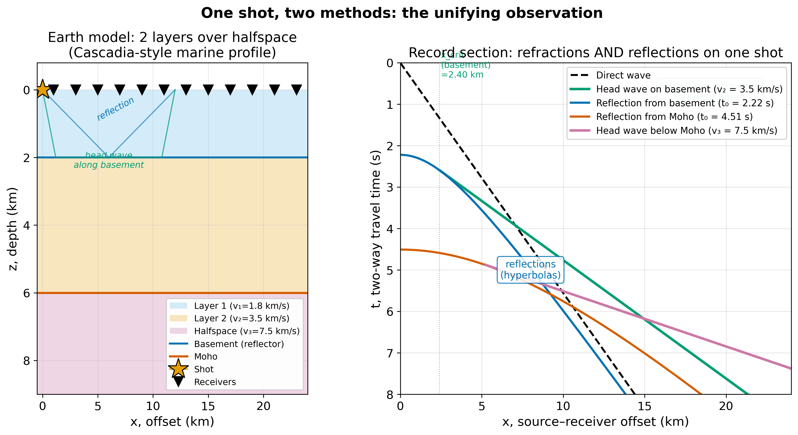
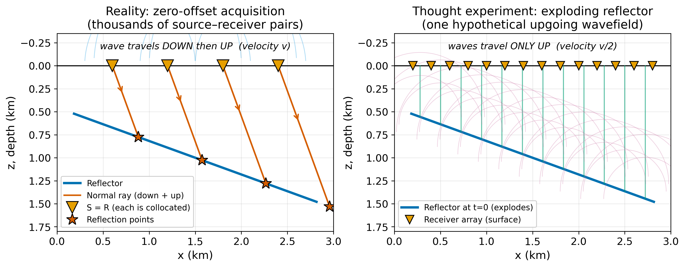
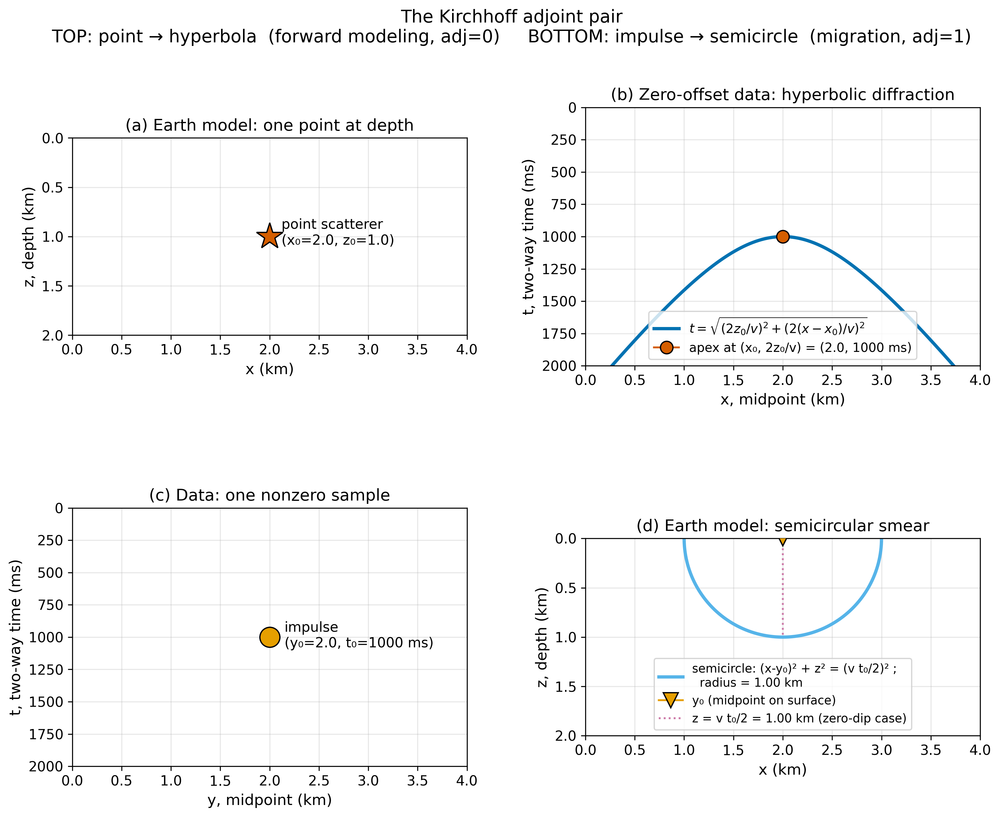

<!-- _class: title -->

# From Travel Times to Images
## Migration and the Unity of Active-Source Seismology

**ESS 314 — Introduction to Geophysics**
Lecture 10 · Monday 4/27/2026
Marine Denolle · University of Washington

---

## Learning objectives

By the end of this lecture, students will be able to:

- Derive the zero-offset migration shifts $\Delta x = d\sin\theta$ and $\tau = t\cos\theta$
- State the exploding-reflector analogy and its failure modes
- Describe the Kirchhoff forward–migration adjoint pair
- Diagnose whether a migration velocity was correct, too slow, or too fast from the image
- Articulate where deep learning serves as a surrogate for a physics-based operator — and what it does not replace

Tagged: **LO-1, LO-2, LO-3, LO-4, LO-5, LO-7**

---

## One shot, two methods



CASIE-21 (Cascadia, 2021) records reflections on the streamer and refractions on the OBS — **one acquisition, one Earth, two data modes**.

---

## Why dipping reflectors are mispositioned


$z = d\cos\theta \qquad \Delta x = d\sin\theta$

The event is **plotted beneath $S$**; the reflector is **updip and shallower**.

---

## Hand migration: the kinematic shifts

Two-way time from the normal ray:

$$ d = \frac{v\,t}{2} $$

Horizontal shift and vertical compression:

$$ \Delta x = \frac{v^2 p_0\, t}{4}, \qquad \tau = t\sqrt{1 - \frac{v^2 p_0^2}{4}} $$

- $p_0 = \partial t/\partial y$ is the **slope of the event** on the unmigrated section
- $\sin\theta = v\,p_0/2$ is **Snell's parameter with the round-trip factor of two**
- Hand migration: apply to each event segment independently

---

## The "powerful analogy": exploding reflectors



**Thought experiment:** reflectors explode at $t=0$; upgoing waves at $v/2$
One hypothetical wavefield, not thousands of shots

---

## When the analogy breaks

The exploding-reflector analogy is **kinematically exact for primary reflections at non-critical angles in a constant-velocity medium**. It fails for:

- **Multiples.** Sea-floor multiple arrives at $2t_1$ in reality, $3t_1$ in the model
- **Lateral velocity variations.** Laterally-bent rays are not reproduced by an upgoing-only wavefield
- **Polarity.** A true reflection flips sign between waves approaching from above and below; the exploding reflector does not

Reverse-time migration and one-way wave-equation migration extend beyond these limits — at higher computational cost.

---

## The Kirchhoff adjoint pair



Forward modeling and migration are **transposes** of each other.
Same geometric curve, copy direction reversed.

---

## One loop, two operations

```text
for every (ix, iz) in the model:
  for every midpoint x' in the data:
    t = sqrt( (2 z[iz]/v)^2 + (2 (x[ix] - x')/v)^2 )
    if flag == "forward":  data[t, x']      += model[iz, ix]
    else:                  model[iz, ix]    += data[t, x']
```

- **Forward (diffraction):** spreads a scatterer into its hyperbola
- **Adjoint (migration):** sums along the hyperbola back to the scatterer

*Source:* {cite:t}`Claerbout2010`, subroutine `kirchslow`, Chapter 5.

---

## The migration image depends on velocity

$$ m(x,z) = \sum_{x'} w\cdot d\!\left(x',\ \sqrt{\left(\tfrac{2z}{v}\right)^2 + \left(\tfrac{2(x - x')}{v}\right)^2}\right) $$

Migration integrates data along a **hyperbola whose shape depends on $v$**.

- Right $v$ → right hyperbola → **energy collapses to a point**
- Wrong $v$ → wrong hyperbola → **energy left behind as residual**

The image is **the velocity diagnostic**.

---

## Correct, too slow, too fast


---

## Reading the residuals

| Migration velocity | Image signature | Name |
|---|---|---|
| Correct | diffractions collapse to points | focused |
| Too slow | residual arcs opening downward | **frowns** (under-migrated) |
| Too fast | residual arcs opening upward | **smiles** (over-migrated) |

Frowns and smiles are the operational basis of **migration velocity analysis** — iterate until the image is focused.

---

## Concept check

A marine reflection hyperbola has apex at $(x = 5\text{ km},\ t_0 = 2.0\text{ s})$.

1. After migration with $v = 2.5$ km/s the hyperbola collapses to a point at $z = 2.5$ km.
2. After migration with $v = 3.0$ km/s the point becomes an **upward-curving** arc.

Which velocity is more nearly correct, and how can you tell?
What would $v = 2.0$ km/s produce?

*Discuss with your neighbor. Write your answer on the index card.*

---

## The refraction–reflection bridge

Migration requires $v(x, z)$. **Neither refraction nor reflection alone provides all of it.**

- **Refraction first arrivals** constrain $v$ in the **shallowest section**, down to the deepest refractor
- **Reflection NMO** constrains $v$ between the **intermediate layers** that refraction never reaches
- **Migration** tests the combined model: **residual moveout → velocity update**

Refraction and reflection are two constraints on one model.

---

## The unified processing loop

1. **Pick first breaks** → refraction tomography → $v_{\rm refr}(z)$ near surface
2. **Pick NMO velocities** → Dix → $v_{\rm NMO}(x, z)$ deeper section
3. **Stitch** into initial $v(x, z)$
4. **Migrate**
5. **Inspect image for frowns and smiles**
6. **Update $v$, re-migrate** (iterate)

Every active-source imaging workflow — academic or industrial — is a variant of this loop.

---

## The Cascadia hook

- CASIE-21 (2021): 15-km streamer + OBS, Nootka to Mendocino
- Same airgun shots recorded as reflections **and** refractions
- Plate interface lies $5$–$25$ km below seafloor — too deep for direct observation, too shallow to ignore
- Image geometry controls: locked-zone mapping, tsunami forecasts, M9 rupture modeling

Project overview: <https://casie21.weebly.com/>

---

## Deep learning in the processing chain — three examples

- **First-break picking.** U-Net pretrained on ImageNet, fine-tuned on <10 % of hand-picked shots {cite:p}`Mardan2024`
- **Shot-gather denoising.** Self-supervised U-Net that removes non-Gaussian noise without clean training labels {cite:p}`LiTradLiu2024`
- **Velocity model building.** Encoder–decoder that maps raw shot gathers → $v(x,z)$ in one pass {cite:p}`YangMa2019`

Each network is a **surrogate** for an operator the physics already defines.

---

## Accelerators, not replacements

Every surrogate requires training data that only exist *because* the physics exists:

- Mardan's U-Net needs hand-picked first breaks from experts who understand intercept times
- Li's denoiser needs a signal/noise statistical model grounded in wave propagation
- Yang & Ma's network is trained on $(v, \text{gather})$ pairs produced by a finite-difference wave-equation solver

**The physics is upstream of the data. The data is upstream of the network. Remove the physics and the training data disappears.**

---

## AI literacy — the question to ask

When a paper reports a neural network for an imaging task, the student of geophysics asks:

1. **What operator** does the network replace?
2. **What data trained it**, and **who produced those data**?
3. **What is the training distribution**, and does the evidence in the paper justify deployment outside it?

These are the same epistemic questions one asks of any surrogate model — regression, empirical formula, or neural network. Deep learning changes the technology, not the questions.

---

## Tying it together

- Migration and modeling are **transposes** of each other (Kirchhoff `adj=0` vs `adj=1`)
- The migrated image **depends on velocity**; wrong velocity leaves residual curvature
- **Refraction + reflection + migration** are one iterative workflow to estimate $v(x, z)$
- Deep learning accelerates steps of this workflow; it does **not** replace the physics that produces the training data

---

## What to do for Lab 4

The lab notebook ships with a synthetic-data generator and a Kirchhoff migration routine (~30 lines of NumPy). Students will:

- Design a survey (from the Wednesday discussion section)
- Generate synthetic zero-offset data for a chosen velocity model
- Migrate with the **correct** velocity, **0.80×** the correct velocity, and **1.25×** the correct velocity
- Report which image is correct and **how they could tell from the image alone**

---

## Further reading

- Claerbout (2010). *Basic Earth Imaging*, Chapters 3–5. Open: <http://sepwww.stanford.edu/sep/prof/bei11.2010.pdf>
- Lowrie & Fichtner (2020), *Fundamentals of Geophysics*, Ch. 3 (UW Libraries)
- Zelt & Barton (1998). Refraction tomography, *JGR* 103, 7187–7210
- MIT OCW 12.510, migration lecture notes (CC BY-NC-SA)
- EarthScope/IRIS Active Source Resources: <https://www.earthscope.org/data/active-source/>

---

<!-- _class: end -->

## Questions?

Office hours: Tu/Th 3:00–4:00 pm · ATG 204
**Next lecture:** Whole Earth Structure I
**Lab 4:** Design → Simulate → Image
