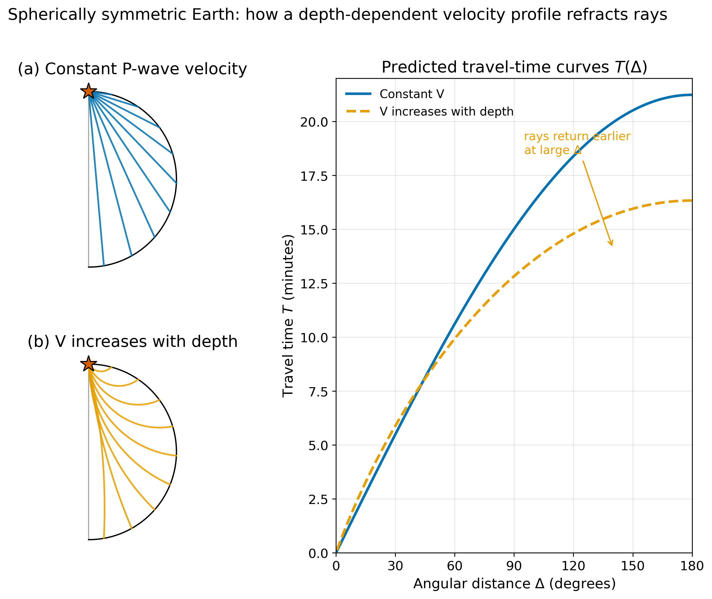
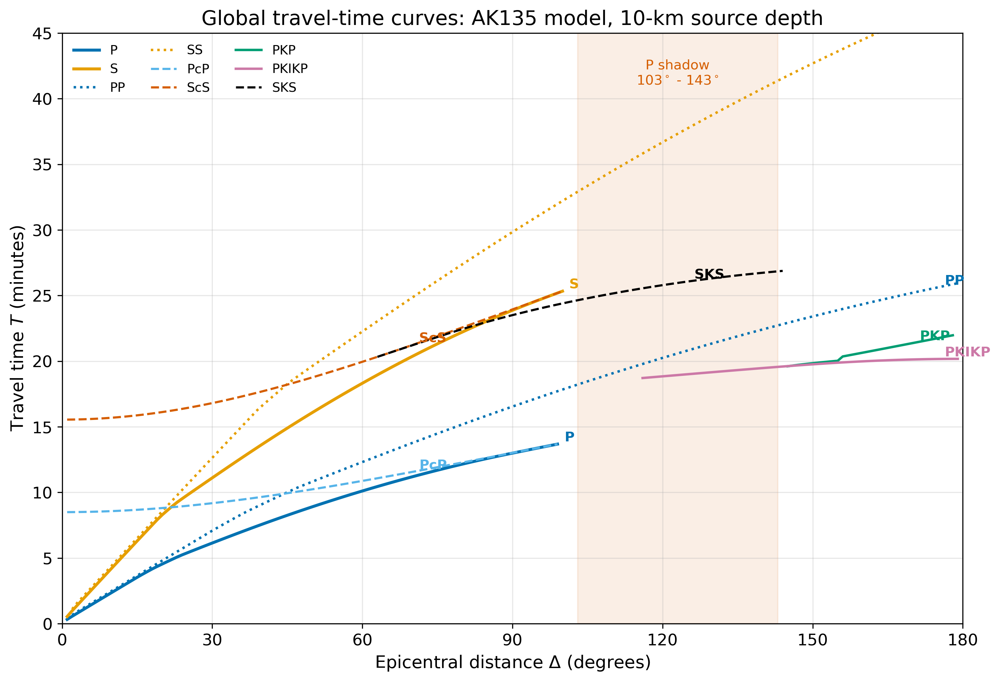
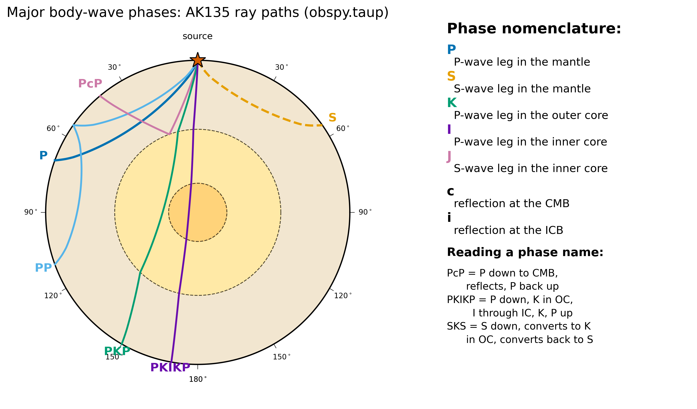
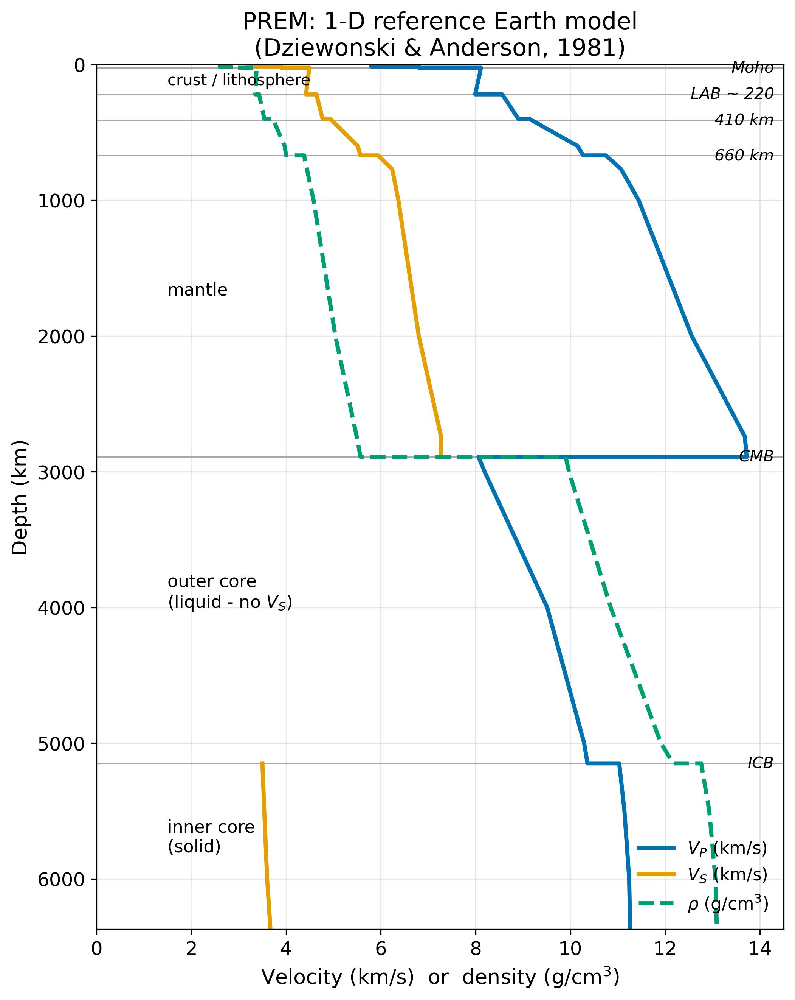

<!-- _class: lead -->

# Whole Earth Imaging

**Lecture 11 · Week 6**
ESS 314 Introduction to Geophysics

Marine Denolle · University of Washington

---

## By the end of this lecture, you will be able to:

- **[LO-11.1]** Describe how global travel-time observations probe Earth's radial structure.
- **[LO-11.2]** Read a global travel-time diagram and identify the major body-wave phases (P, S, PP, PcP, PKP, PKIKP, SKS).
- **[LO-11.3]** Explain the shadow-zone reasoning behind the three canonical discoveries: fluid outer core (Oldham 1906), depth to CMB (Gutenberg 1914), and solid inner core (Lehmann 1936).

*Prerequisites: Snell's law (Lec 3), ray-wavefront duality (Lec 4), forward/inverse problem framing (Module 2 intro).*

---

## The motivating claim

No one has ever been more than **12.3 km** below the surface.

That is roughly **1/500th** of the way to the centre.

Yet seismologists report the radius of the core to within a kilometre,
the depth to the CMB to a few kilometres, and the speed of sound in the core
to three significant figures.

### How?

*Answer: by reading the times at which seismic waves arrive at stations around the globe.*

---

## The reasoning arc for today

A seismic wave at $\Delta = 100^\circ$ has sampled the **entire mantle**.
A wave at $\Delta = 170^\circ$ has passed through the **core twice** and the **inner core once**.

Each travel time is a line integral of slowness along a path through the planet.

Collect enough — invert — and a 1-D Earth emerges.

---

## Physics: why rays curve

*Snell's law at each infinitesimal interface bends the ray toward the slower side.*
*The shape of $T(\Delta)$ encodes the depth dependence of velocity.*

---

## Both shadow zones start at 103° — for different reasons

- **103° is geometric** — the epicentral distance at which a direct mantle ray just grazes the CMB
- **S shadow → antipode**: fluid outer core, $\mu = 0 \Rightarrow \beta = 0$, shear cannot propagate
- **P shadow → 143°**: P refracts into core ($\alpha_m \approx 13.7$ km/s → $\alpha_c \approx 8$ km/s); PKP fills in beyond the caustic

---

## Discovery 1 · Oldham 1906

> S-waves do not arrive at stations more than ~103° from the source.

**Inference:** the Earth has a **fluid outer core**, a zone where shear waves cannot propagate.

*The reasoning required nothing more than absence-of-observation plus the physics of shear in fluids.*

---

## Discovery 2 · Gutenberg 1914

> A band of missing P arrivals exists between ~103° and ~143°.

**Inference:** a sharp velocity drop at the CMB refracts P-rays strongly.
**Depth estimate:** ~2900 km → within a few percent of modern PREM value (2891 km).

*The reasoning required Snell's law applied at a single global interface.*

---

## Discovery 3 · Lehmann 1936

> Weak P-wave energy arrives inside the predicted P shadow, at ~150°–160°.

**Inference:** there must be a **solid inner core** with higher $V_P$ than the outer core, reflecting/refracting waves back into the shadow band.

*The reasoning required reading anomalies in the P-shadow — a detail-driven result.*

---

## Global travel-time curves — the AK135 inversion

Each curve is the forward prediction of a named phase. *Every curve is also a teaching tool for phase identification.*

---

## Phase nomenclature — the grammar

**P/S** = mantle   **K** = outer core (P)   **I/J** = inner core (P/S)
**c** = reflection at CMB   **i** = reflection at ICB

---

## Worked example — CMB depth from $T_{PcP} - T_P$

At $\Delta = 90^\circ$ (AK135):
- $T_P \approx 12.8$ min
- $T_{PcP} \approx 13.4$ min
- $\Delta T = 36$ s

With average mantle $V_P \approx 11$ km/s:

$$d_{\mathrm{extra\ path}} \approx \tfrac{1}{2} \cdot 11 \cdot 36 \approx 200~\mathrm{km}$$

→ CMB at ~2900 km. **Modern value: 2891 km.**

---

## The 1-D answer: PREM

*Dziewonski & Anderson 1981.*
*Still the reference — 45 years on.*
*Note $V_S = 0$ in the outer core.*

---

## Key equation — travel time as integral of slowness

$$T = \int_{\text{source}}^{\text{receiver}} u(\mathbf{r})\,ds, \qquad u = 1/V$$

For a spherically symmetric Earth, $T$ depends only on ray parameter $p$ and the radial profile $V(r)$.

> Inversion of many $T_i(\Delta_i)$ for $V(r)$ → PREM.

---

## Cascadia anchor

Every teleseismic first arrival recorded at a **PNSN** station is compared to AK135.

The residual — positive or negative by a few seconds — is a **direct measurement of 3-D mantle structure beneath our feet**.

> *That residual is the data of Lecture 12.*

---

## Research horizon

- **Inner-core rotation**: Vidale et al. 2024 (Nature) — still debated.
- **Comparative planetology**: Mars (InSight, Stähler et al. 2021), Moon (Apollo, Weber et al. 2011).
- **CMB texture**: ULVZs, D″ phase transitions mapped with ScS precursors.
- **AI-assisted picking**: PhaseNet/EQTransformer — 10× catalog completeness in 5 years.

---

## AI Literacy — Epistemics (LO-7)

Try this prompt: *"List the seismic phases that pass through Earth's inner core and their typical travel times at $\Delta = 150^\circ$."*

### What to check
1. Is each named phase valid under P/S/K/I/J/c/i?
2. Has it been observationally confirmed? (PKJKP: *contested*.)
3. Do the travel times match `obspy.taup` AK135 predictions?

**The rule: never treat AI-generated scientific lists as primary sources. Cross-check.**

---

## Concept checks

1. If $V_P = 10$ km/s everywhere, what is $T$ at $\Delta = 180^\circ$? Compare to PKIKP (~20 min). Sign of the difference?
2. A seismogram at unknown $\Delta$ shows P at 7 min, S at 13 min. Estimate $\Delta$ from the curves. What phases come next?
3. Why does the existence of PKIKP inside the P shadow require a solid inner core?

---

## Summary

- **Why:** Travel times of body waves at global distances probe the deep Earth.
- **What:** Three discoveries — fluid outer core, CMB depth, solid inner core — from shadow-zone reasoning alone.
- **How:** Global $T(\Delta)$ curves inverted for the radial profile $V_P(r)$, $V_S(r)$, $\rho(r)$ → **PREM**.
- **Next:** Residuals from PREM become the data for 3-D tomography. Lecture 12.

---

## Further reading

- Kennett et al. 1995, *GJI* — AK135 model. (Open access.)
- Stein & Wysession 2003, Ch. 3.3–3.5. (UW Libraries.)
- IRIS/EarthScope Global Stacks: https://ds.iris.edu/spud/eventplot
- Lowrie & Fichtner 2020, Ch. 3.5–3.6. (UW Libraries — primary text.)
- `obspy.taup` — `TauPyModel(model="ak135")` — reproduce every figure.
