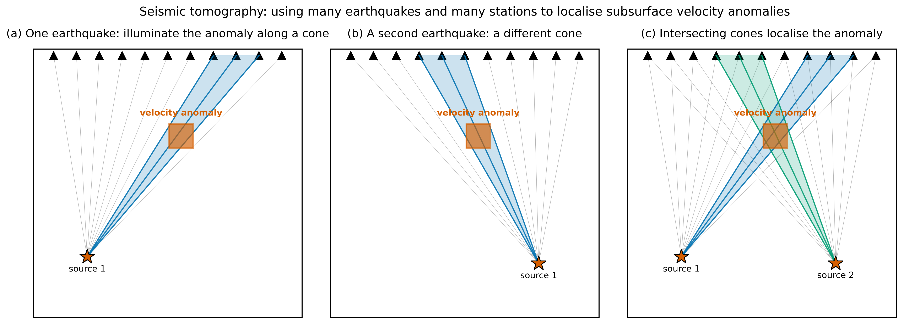
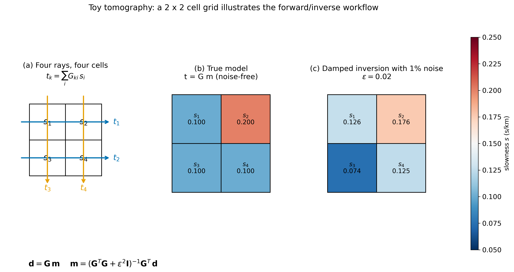
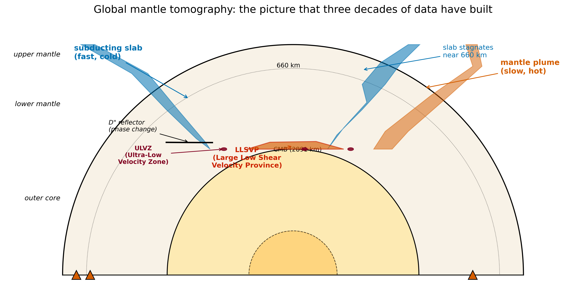

<!-- _class: lead -->

# Seismic Tomography

**Lecture 12 · Week 6**
ESS 314 Introduction to Geophysics

Marine Denolle · University of Washington

---

## By the end of this lecture, you will be able to:

- **[LO-12.1]** Formulate a tomographic inverse problem as $\mathbf{d} = \mathbf{G}\,\mathbf{m}$ and explain what each term represents.
- **[LO-12.2]** Recognise that tomographic inversions are ill-posed, and describe the role of regularisation (damping, weighting).
- **[LO-12.3]** Interpret a global or regional tomographic image — slabs, plumes, LLSVPs, ULVZs — and connect the Cascadia Juan de Fuca slab to this framework.

*Prerequisites: PREM and phase identification (Lec 11); linear algebra (matrix inverse, transpose); travel time as integral of slowness (Lec 4, Lec 11).*

---

## Stand in Seattle. What is 60 km below your feet?

*The Juan de Fuca plate descends eastward beneath Seattle, then under the Cascade arc. The melt zone feeds Rainier, St Helens, and the rest of the arc — **east** of Seattle.*

**Every number above came from a travel-time residual measured in fractions of a second.**

---

## The motivating question

We cannot drill there. We cannot see there. Yet the picture on the previous slide is **built to kilometre resolution** from broadband seismograms at surface stations.

### How?

*Lecture 11 answered this for the 1-D Earth.*
*Lecture 12 does it for the 3-D Earth — the real one.*

---

## The geometric core idea

- **One source:** anomaly is localised along a **cone**.
- **Two sources:** cones **intersect** → 2-D location.
- **Many sources × many stations:** full 3-D localisation.

---

## Consequence: coverage controls resolution

- **Well-imaged regions**: Japan, California, western Europe (dense rays, diverse azimuths).
- **Poorly-imaged regions**: oceans, Antarctica, Southern Hemisphere.

### Always ask: where are the earthquakes? Where are the stations?

Every published tomogram must include a **resolution test** (checkerboard).

---

## The forward problem, discretised

Divide Earth into cells; assume slowness $s_i$ constant per cell.

$$t_k = \sum_{i=1}^{N} G_{ki} \, s_i$$

$G_{ki}$ = path length of ray $k$ through cell $i$. Most entries are **zero** — most rays don't cross most cells.

In matrix form:
$$\boxed{\ \mathbf{d} = \mathbf{G}\,\mathbf{m}\ }$$

- $\mathbf{d}$: travel times (length $M$)  |  $\mathbf{m}$: slownesses (length $N$)  |  $\mathbf{G}$: $M \times N$ sensitivity matrix.

---

## The simplest tomography — 2×2 cells, 4 rays

*(a) Geometry. (b) True model: one slow cell. (c) Damped inversion with 1% noise: anomaly localised; amplitude smeared.*

---

## The toy system explicitly

$$
\begin{pmatrix} t_1\\ t_2\\ t_3\\ t_4 \end{pmatrix}
=
\begin{pmatrix} h & h & 0 & 0\\ 0 & 0 & h & h\\ h & 0 & h & 0\\ 0 & h & 0 & h\end{pmatrix}
\begin{pmatrix} s_1\\ s_2\\ s_3\\ s_4 \end{pmatrix}
$$

> $\mathbf{G}$ is **rank 3**, not rank 4.
> A uniform slowness change fits *any* data: the null space is nonzero.
> Every real tomography has a null space. Regularisation picks what to fill it with.

---

## But rays bend — Snell's law makes $\mathbf{G}$ non-linear

$$p = \frac{\sin i}{V} = \text{const along a ray}$$

When $V$ varies, the ray bends → the path lengths $G_{ki}$ change → **$\mathbf{G}$ depends on $\mathbf{m}$ itself**.

**Born (linearised) approximation** around a reference model $\mathbf{m}_0$:
$$\delta\mathbf{d} \approx \mathbf{G}(\mathbf{m}_0)\,\delta\mathbf{m}$$

**Iterate:** solve for $\delta\mathbf{m}$, update model, retrace rays, repeat.

**Full-waveform inversion (FWI)** replaces ray tracing entirely:
- Simulate the 3-D elastic wavefield numerically (SPECFEM3D)
- Compute **adjoint kernels** — volumetric sensitivity to every parameter
- Match the *entire waveform*, not just the first arrival
- Doubles resolution; captures finite-frequency "banana-doughnut" effects

---

## The inverse problem — why least squares needs help

**Ordinary least squares:**
$$\hat{\mathbf{m}}_{\mathrm{OLS}} = (\mathbf{G}^{T}\mathbf{G})^{-1}\mathbf{G}^{T}\mathbf{d}$$

$\mathbf{G}^T\mathbf{G}$ is often singular or near-singular → noise explodes.

**Damped least squares (key equation):**
$$\boxed{\ \hat{\mathbf{m}} = (\mathbf{G}^{T}\mathbf{G} + \varepsilon^{2}\mathbf{I})^{-1}\mathbf{G}^{T}\mathbf{d}\ }$$

$\varepsilon^{2}$ trades **resolution** for **stability**. Too small → noise. Too large → washed out.

---

## Two philosophical cautions

> **1. The inverse problem has no unique solution.**
> Many models fit the data within error. Regularisation selects one. *The published model is a choice, not a fact.*

> **2. Resolution is not uniform.**
> Near array edges, and where rays don't bottom, anomalies are smeared and attenuated.
> Always report resolution tests.

---

## Reading a global mantle tomogram

**Blue (fast):** cold slabs. **Red (slow):** hot plumes, wedge melts. **LLSVPs** at CMB. **ULVZs**, **D″**.

---

## Global mantle tomography: what to recognise

- **Blue slabs** descending through the upper mantle. Some *stagnate* at 660 km; some *penetrate* to the CMB (Farallon).
- **Red plumes** rising from the lower mantle under hotspots (Hawaii, Iceland, Yellowstone, Afar).
- **LLSVPs** — Pacific + Africa — cover ~25% of the CMB.
- **ULVZs** — 10–50 km thick, $\delta V_S \sim -30\%$, partial melt or Fe-enriched.
- **D″** — post-perovskite phase transition a few hundred km above the CMB.

---

## Seismic vs. medical tomography

|  | **Medical CT** | **Seismic** |
|---|---|---|
| Source | X-ray tube rotating | Earthquakes |
| Observable | X-ray attenuation | Travel time |
| Geometry | *Uniform illumination* | **Skewed — plate boundaries only** |

**Same math.** *Different geometry is why seismic tomography is harder.*

**Ambient-noise tomography** (Shapiro et al. 2005) — treat every station as a virtual source → fixes the geometry problem regionally.

---

## Cascadia anchor — why this matters for PNW hazard

- **Slab geometry** → width of the locked megathrust → **maximum magnitude** of the next Cascadia earthquake.
- **Hydrated slab-top low-velocity layer** → controls **episodic tremor and slip (ETS)** observed every ~14 months under the Olympic Peninsula (Rogers & Dragert 2003).
- **Mantle-wedge melt volume** → long-term volcanic hazard from Rainier, St Helens, and the rest of the Cascades.

> *Every tomographic picture is also a hazard-assessment tool.*

---

## Research horizon (2021–2026)

**Travel-time → full-waveform**
- GLAD-M25 and successors (Lei et al. 2020; Tromp 2020 *Nat Rev Earth Env*) — adjoint FWI doubles resolution
- Finite-frequency kernels: sensitivity is a **banana-doughnut**, not a ray delta-function
- Multiscale FWI incorporating multiple period bands simultaneously (Fichtner group, ETH, 2021–2024)

**ML augmentation**
- **SeisBench** (Woollam et al. 2022, *SRL*) — unified ML picker API; one to two orders of magnitude more picks from continuous data
- Neural-network tomographic solvers: promising, but must be validated against conventional inversions before geological interpretation

**New data sources**
- **Ambient-noise FWI**: cross-correlation wavefields now used in full adjoint inversion — no earthquakes needed for crustal imaging
- **DAS**: fibre-optic cables as dense seismic arrays; PNW shallow structure (UW, 2022–2024)

**Probabilistic inversion**
- HMC / variational Bayes approaches: sample the full model posterior → honest uncertainty estimates on slab geometry, LLSVP boundaries

---

## AI Literacy — critical tool use (LO-7)

Three places ML sits in the tomography pipeline — and fails:

1. **ML phase pickers.** Miss emergent arrivals; confound S/P on vertical; degrade out-of-domain. *Always spot-check against manual picks.*
2. **ML tomographic solvers.** Can *hallucinate* structure not in the data. *Validate against conventional least squares on the same data.*
3. **AI literature summaries.** Can invent papers, authors, figures. *Every citation must be DOI-verified.*

---

## Prompt to try

> *"Compare the Cascadia tomographic models of Schmandt & Humphreys (2010) and Bodmer et al. (2018). What slab-geometry differences do they report?"*

### Now verify:
- Do both papers exist? (DOI resolves?)
- Does each paper actually discuss slab geometry?
- Are the numerical differences the assistant reports traceable to figures/tables?

*If any claim fails verification, assume the whole answer is suspect.*

---

## Concept checks

1. Write $\mathbf{G}$ for a 3×3 grid with 3 horizontal + 3 vertical rays. Find a null-space $\delta\mathbf{m}$.
2. Damping $\varepsilon^2 = 0.01$ recovers a slab with $+2\%$ $V_P$. At $\varepsilon^2 = 0.1$, recovered amplitude is $+1\%$. What does this say about the **true** amplitude? About resolution?
3. In Fig. `fig-cascadia`: where on the seafloor was the subducted crust created? Will the wedge melt zone be a positive or negative $V_P$ anomaly, and at what order of magnitude?

---

## Summary

- **Why:** To see beneath our feet in 3-D, from surface seismograms alone.
- **What:** $\mathbf{d} = \mathbf{G}\mathbf{m}$, inverted with damped least squares.
- **Caveats:** Non-unique; resolution non-uniform; regularisation is a choice.
- **Applications:** Cascadia slab geometry ties directly to megathrust and volcanic hazard.
- **Next:** These same equations reappear in earthquake location (Lec 13) and moment-tensor inversion (Lec 14).

---

## Further reading

- Aster, Borchers & Thurber 2018, *Parameter Estimation and Inverse Problems*, 3rd ed. (UW Libraries.)
- Shapiro et al. 2005, *Science* — ambient-noise tomography. (Open access.)
- Schmandt & Humphreys 2010, *EPSL* — Cascadia body-wave tomography.
- Bodmer et al. 2018, *GRL* — Juan de Fuca buoyancy and megathrust segmentation.
- Lei et al. 2020, *GJI* — GLAD-M25 global full-waveform inversion. (Open access.)
- Lowrie & Fichtner 2020, Ch. 3.6–3.7. (UW Libraries — primary text.)
