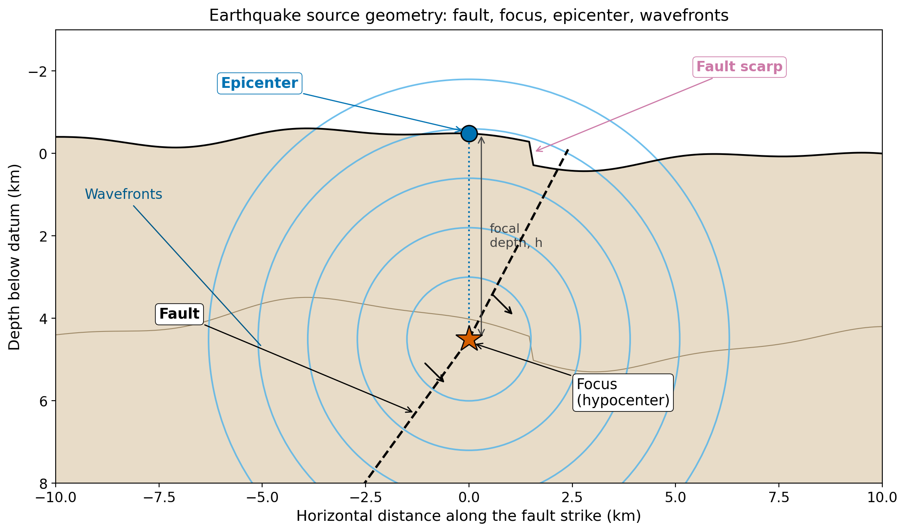
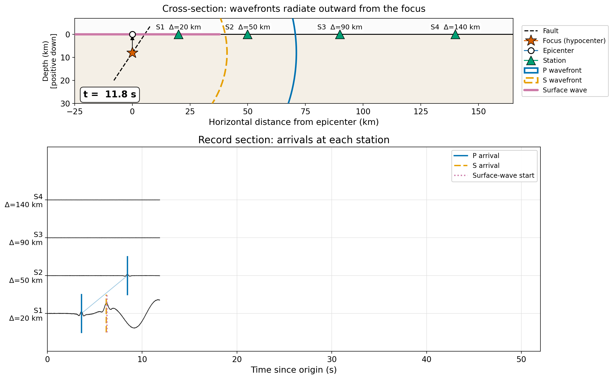
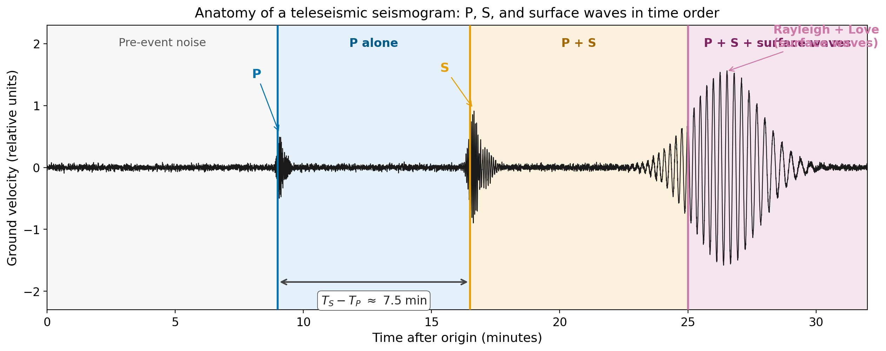
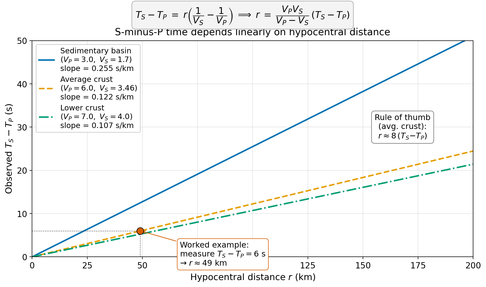
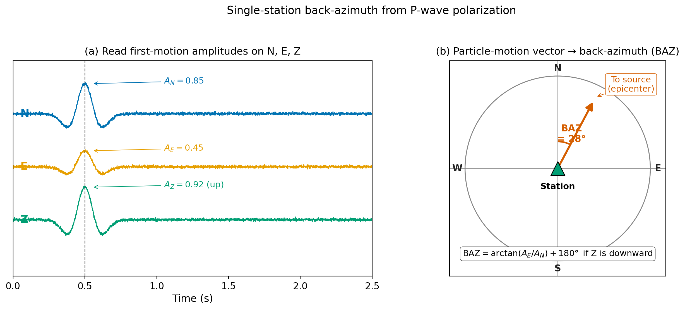
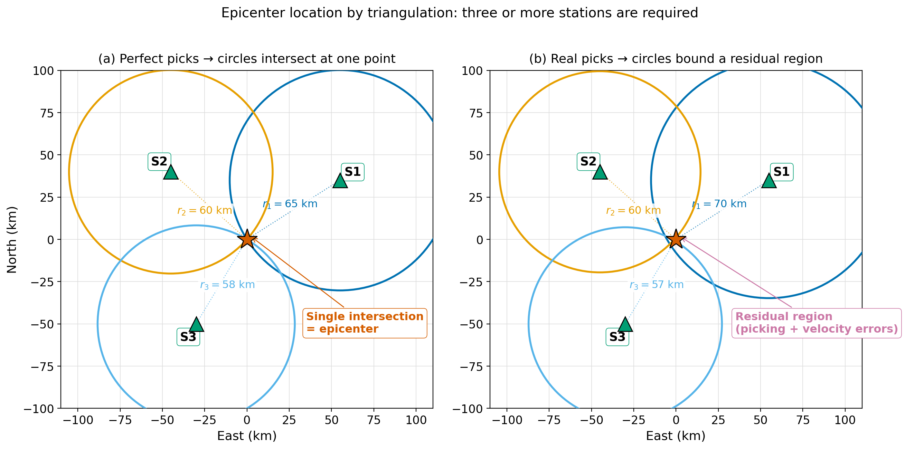
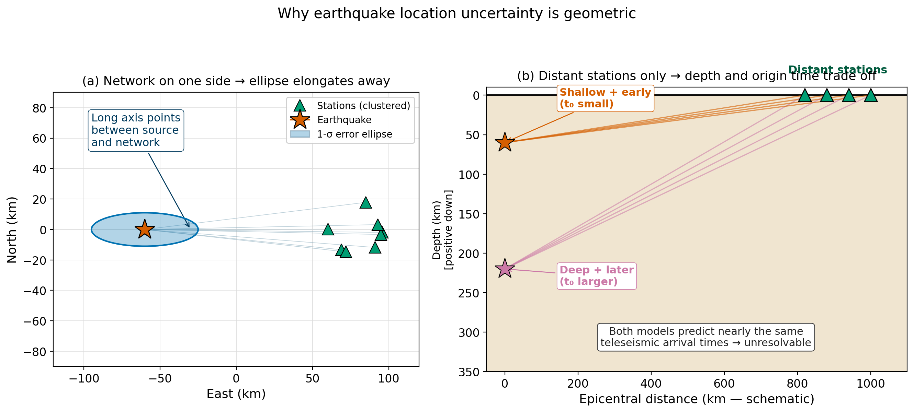

<!-- _class: title -->

# Earthquake Phenomena I
## Records, Phases, and Location

ESS 314 — Introduction to Geophysics
University of Washington · Spring 2026

Marine Denolle

---

## Learning Objectives

By the end of this lecture, you will be able to:

- **[LO-1]** Identify P, S, and surface waves on a seismogram and explain *why* they arrive in that order
- **[LO-2]** Convert an $S$-minus-$P$ time into a hypocentral distance using a known velocity model
- **[LO-3]** Frame earthquake location as a forward / inverse problem in $(x_0, y_0, z_0, t_0)$
- **[LO-5]** Explain the geometric origin of location uncertainty
- **[LO-7]** Critique an AI-picked phase or relocated catalog

---

## §1 The geoscientific question

The Pacific Northwest sits above the **Cascadia subduction zone**.

- Last megathrust event: $M_w \sim 9$, on **26 January 1700**
- Hundreds of smaller earthquakes per month, recorded by **PNSN**
- Every earthquake is hidden underground — the focus is never directly observed during rupture
- Yet, from surface records, we routinely infer **where, when, how big, and what kind**

This lecture: *where* and *when*.

---

## What the source geometry looks like

**Focus** (hypocenter): point where rupture initiates
**Epicenter**: vertical projection of focus to surface
**Focal depth** $h$: vertical distance between them

---

## §2 Three pieces of physics combine

1. **Two body-wave modes.** P and S waves leave the source together; $V_P/V_S = \sqrt{3}$ in a Poisson solid

2. **Spherical wavefronts.** Geometric spreading reduces amplitudes, but *arrival times* are governed by the integral of slowness along the ray

3. **The free surface.** Converts body-wave energy into surface waves and produces the depth phases (pP) used for teleseismic depth determination

---

## Wave propagation in time

The three wavefronts spread at distinct speeds → arrivals always in **P → S → surface** order at every station.

---

## §3 The seismogram, anatomized

The interval $T_S - T_P$ is the **diagnostic measurement** for distance.

---

## The S-minus-P relation

Subtract the P arrival time from the S arrival time at one station:

$$
T_S - T_P \;=\; D \left( \frac{1}{V_S} - \frac{1}{V_P} \right)
$$

Solving for hypocentral distance:

$$
\boxed{\;D \;=\; \frac{V_P\, V_S}{V_P - V_S}\,(T_S - T_P)\;}
$$

For average crust ($V_P = 6.0$, $V_S = 3.46$ km/s):

$$
D \;\approx\; 8.2 \times (T_S - T_P)
$$

— the textbook **rule of eight**.

---

## S-P time as a function of distance

Slower velocity contrast → steeper slope → small velocity-model errors → large distance errors.

---

## Single-station back-azimuth

$$
\mathrm{AZI} \;=\; \arctan(A_E / A_N)
$$

Vertical-component polarity resolves the $180°$ ambiguity.

---

## §3.4 Triangulation: the multi-station epicenter

- **3 stations** → epicenter (3 unknowns: $x_0, y_0, t_0$)
- **4 stations** → epicenter + depth (4 unknowns)

---

## §3.5 Resolving focal depth

- **Local distance**: right triangle, $h = \sqrt{D^2 - \Delta^2}$
- **Teleseismic distance**: depth phase, $t_{pP} - t_P$ → focal depth

---

## §4 The forward problem

Given a candidate hypocenter $\mathbf{m} = (x_0, y_0, z_0, t_0)$, predict the P arrival time at every station:

$$
T_P^{(i)\,\mathrm{pred}}
\;=\;
t_0 \;+\; \frac{1}{V_P}\,\sqrt{(x_i - x_0)^2 + (y_i - y_0)^2 + (z_i - z_0)^2}
$$

Two key properties:

- **Linear in $t_0$** — origin time enters as an additive constant
- **Non-linear in $(x_0, y_0, z_0)$** — distance enters through a square root

This decomposition is what Geiger's 1912 algorithm exploits.

---

## §5 The inverse problem

Define the residual at observation $i$:

$$
r_i(\mathbf{m}) \;=\; d_i^{\,\mathrm{obs}} - G_i(\mathbf{m})
$$

Minimize the misfit:

$$
\Phi_2(\mathbf{m}) = \sum_i \left( \frac{r_i}{\sigma_i} \right)^{\!2}
\quad\text{(L$_2$, Gaussian errors)}
$$

$$
\Phi_1(\mathbf{m}) = \sum_i \left| \frac{r_i}{\sigma_i} \right|
\quad\text{(L$_1$, robust to outliers)}
$$

Iterative: linearize about $\mathbf{m}_k$, take a least-squares step, repeat.

---

## Why location uncertainty is geometric

- Clustered network → ellipse points radially *away*
- Distant stations only → depth and $t_0$ trade off

---

## Relative location: HypoDD

When two earthquakes are close together, the *difference* of their arrival times depends only on the *difference* of their coordinates — velocity-model errors cancel.

- {cite:t}`Waldhauser2000` — double-difference algorithm
- Routinely achieves **tens of metres** relative precision
- Resolves fault-plane structures invisible in absolute catalogs
- {cite:t}`Hauksson2012` (SoCal), {cite:t}`Shelly2016` (Long Valley), {cite:t}`Ross2019` (San Jacinto)

---

## §6 Worked example — a Puget Lowland event

A station at $\Delta = 50$ km records $T_P = 14.2$ s, $T_S = 21.1$ s, with $A_N = 0.74$, $A_E = 0.32$, $A_Z = +0.92$.

- **Distance**: $D = 8.2 \times 6.9 \approx 56$ km
- **Back-azimuth**: $\mathrm{AZI} = \arctan(0.32/0.74) \approx 23°$
- **Depth**: $h = \sqrt{56^2 - 50^2} \approx 25$ km

A 25 km focal depth is consistent with a deep intra-slab event in the subducting Juan de Fuca plate — the same regime as the **2001 $M_w$ 6.8 Nisqually** earthquake.

---

## §7 Course connections

- **Lecture 12 (Tomography)**: same forward/inverse framework, different unknown
- **Lecture 14 (next)**: takes location as known, asks *how big* — magnitude, $M_0$
- **Lectures 18, 23**: gravity and magnetic inverse problems — the same non-uniqueness reappears
- **Week 5 lab**: phase picking and location with `ObsPy` and PNSN data

---

## §8 Research horizon — ML phase picking

- **PhaseNet** {cite:p}`Zhu2019PhaseNet`: U-Net trained on 600,000 NCEDC waveforms; ~96% precision on P
- **EQTransformer** {cite:p}`Mousavi2020EQT`: hierarchical attention; hundreds of microearthquakes detected with one-third of typical networks
- **PhaseNO** {cite:p}`Sun2023PhaseNO`: multi-station Fourier neural operator
- **Cascadia ML catalog**: re-trained EQTransformer on 20 years of PNSN data
- Not a replacement for the physics — a fast front-end that supplies the $(T_P, T_S)$ that the inverse problem consumes

---

## §8 Research horizon — Distributed Acoustic Sensing

- A single fibre-optic cable, interrogated by laser pulses, becomes a dense seismic array of thousands of channels
- **Submarine fibres off Cascadia** {cite:p}`Wilcock2025`: detect offshore earthquakes invisible to onshore networks
- Crucial for **early warning of offshore megathrust ruptures**
- Active research area at UW (Denolle group): semi-supervised picking on DAS strain-rate data {cite:p}`Zhu2023DAS`

---

## §9 Societal relevance — ShakeAlert

- Operational across Washington and Oregon since 2021
- Ingests data from ~1500 PNSN seismic stations + ~760 GNSS sensors
- Real-time location and magnitude → seconds-to-minutes of warning
- Cascadia M9: tens of seconds of warning in Seattle
- Nisqually-style intra-slab event: ~10 s of warning typical
- **GFAST** {cite:p}`Crowell2024GFAST`: geodetic algorithm avoids magnitude saturation at $M_w$ 7

---

## AI Literacy — when to trust an ML phase pick

ML pickers achieve ~95% precision on **data that look like their training data**.

- **Recall drops 30–40% across regions** {cite:p}`Munchmeyer2022`
- Even worse on ocean-bottom, borehole, DAS, or mining data
- **Three habits**:
  1. Know the training distribution
  2. Verify a sample by eye
  3. Carry the velocity-model assumption forward — a pick is not a location

---

## Concept check

1. If the velocity model used $V_P = 5.5$ instead of $V_P = 6.0$ km/s (same $V_P/V_S$), how would the calculated $D$ change?

2. For an event $\Delta = 5$ km from the closest station, do you trust the single-station $D$ more, or the multi-station triangulated epicenter?

3. With only teleseismic stations, which of $(x_0, y_0, z_0, t_0)$ is best constrained, and which is most degenerate?

---

<!-- _class: closing -->

## Recap

- The seismogram presents three principal phases in **P → S → surface** order
- $T_S - T_P$ at one station gives **hypocentral distance**
- **Three or more stations** triangulate the epicenter; **four** for depth
- Location is a **non-linear inverse problem**, linear only in $t_0$
- Uncertainty has a **geometric origin**: station distribution and depth-time trade-off
- ML pickers and DAS are transforming the data flow — the physics is unchanged

**Next: Earthquake Phenomena II — magnitude and seismic moment**
