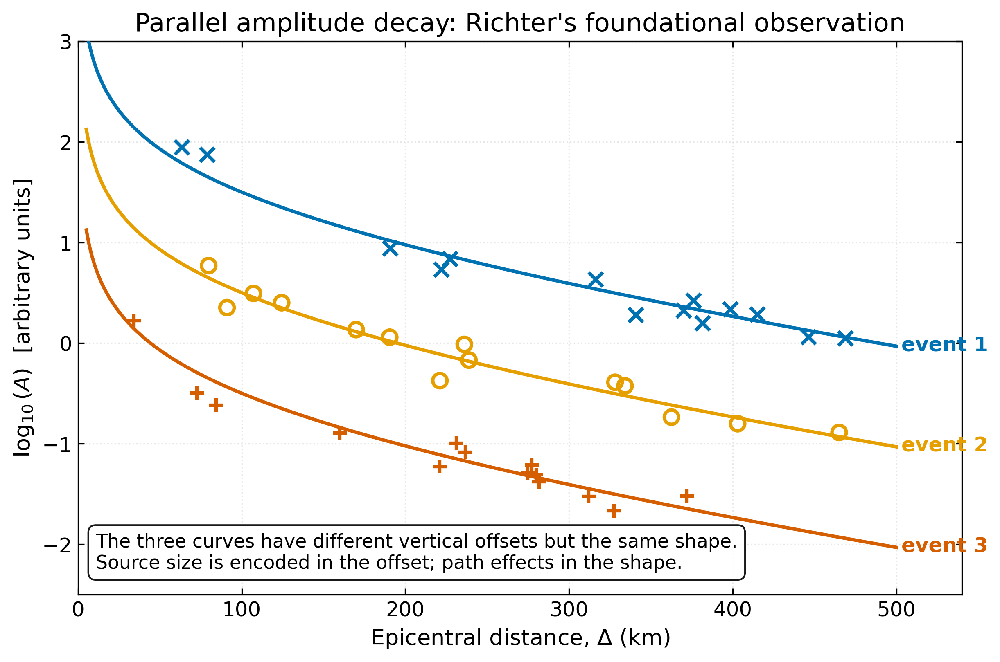
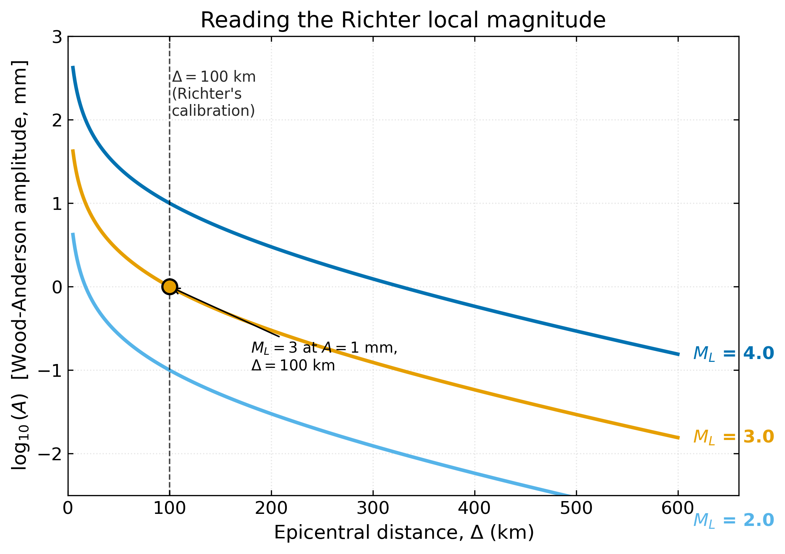
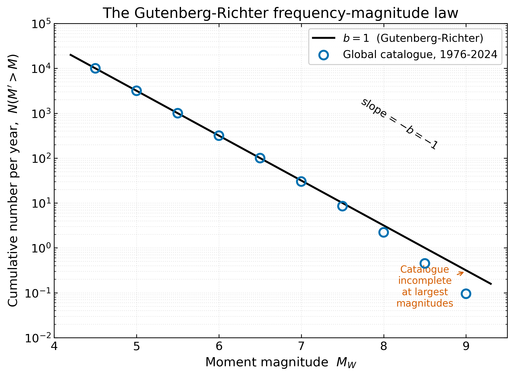
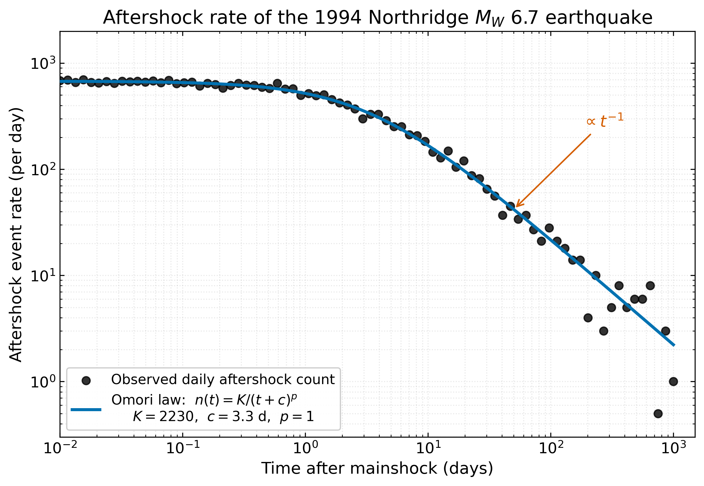

<!-- _class: lead -->

# Earthquake Phenomena II
## Magnitude, Energy, and Statistics

**ESS 314 — Introduction to Geophysics**
Lecture 15  •  Spring 2026
University of Washington • Earth & Space Sciences

Marine Denolle

---

## Learning objectives

By the end of today, you will be able to:

- **[LO-14.1]** Explain why magnitude scales use base-10 logarithms and convert magnitude differences into amplitude / moment / energy ratios.
- **[LO-14.2]** Distinguish $M_L$, $m_b$, $M_S$, and $M_W$ — phase, period, instrument, and saturation behaviour.
- **[LO-14.3]** Apply $M_0 = \mu A \bar{s}$ and the Gutenberg-Richter and Omori laws to interpret a catalogue.

*Course LOs:* LO-1, LO-2, LO-4, LO-7 • *Outcomes:* LO-OUT-B, C, E, H

---

## 1. How do we put one number on an earthquake?

- 11 March 2011, 05:46 UTC: a rupture begins offshore Tōhoku, Japan.
- 14 minutes later, the first long-period waves reach PNSN broadband stations in Washington.
- Within hours, the world is told this was an "$M_W$ 9.1".

> *What does that one number actually measure, and what does it leave out?*

*Read more → [Lecture 15 §1](../lectures/15_earthquake_phenomena_II.html#1-the-framing-question-how-do-we-put-a-single-number-on-an-earthquake)*

---

## 2. Why a logarithm?

Three observations from Charles F. Richter (1935):

1. Wave amplitudes from one event decay smoothly with epicentral distance $\Delta$.
2. Different events trace **parallel** decay curves.
3. Amplitudes span **eight orders of magnitude** (μm → m).

→ Compress the dynamic range with $\log_{10}$, then read source size as the **vertical offset** between the curves.

---

## 2. (continued) Richter's foundational observation

*Source size lives in the curve's offset; path lives in its shape.*

*Read more → [Lecture 15 §2](../lectures/15_earthquake_phenomena_II.html#2-the-physics-why-a-logarithm-and-why-amplitudes-decay-with-distance)*

---

## 3. A hierarchy of magnitudes

| Scale | Phase | Period $T$ | Saturates? | Today's role |
|---|---|---|---|---|
| $M_L$ | local S | ~0.1–1 s | yes (~6.5) | local networks |
| $m_b$ | teleseismic P | ~1 s | yes (~6.5) | rapid global alerts |
| $M_S$ | Rayleigh | 20 s | yes (~8) | historical catalogues |
| **$M_W$** | full source | all | **no** | **modern standard** |

---

## 3a. Richter's local magnitude

$$M_L = \log_{10} A(\Delta) - \log_{10} A_0(\Delta)$$

- $A(\Delta)$ — peak amplitude on a Wood-Anderson seismometer, in mm.
- $A_0(\Delta)$ — empirical distance correction, anchored at $A_0 = 1$ μm at $\Delta = 100$ km.
- One unit of $M_L$ ↔ **10×** ground motion ↔ ~32× radiated energy.

---

## 3a. (continued) Reading the Richter nomogram

*Read more → [Lecture 15 §3a](../lectures/15_earthquake_phenomena_II.html#3a-local-magnitude-m_l-richters-original-scale)*

---

## 3b. Going global: $m_b$ and $M_S$

$$m_b = \log_{10}\!\left(\frac{A}{T}\right) + Q(\Delta, h)$$

$$M_S = \log_{10}\!\left(\frac{A}{T}\right) + 1.66 \log_{10}\Delta + 3.30$$

- $m_b$ uses 1-s P-waves at teleseismic distances → fast, but narrow-band.
- $M_S$ uses 20-s Rayleigh waves → broader-band, but only shallow events.
- Both **saturate** at large source size.

---

## 3c. Why magnitudes saturate

For a rupture of duration $\tau \sim L / v_r$:

$$f_c \approx \frac{1}{\tau} \quad \Rightarrow \quad f_c \;\downarrow\; \text{ as } \; L \;\uparrow$$

When $f_c$ falls below the scale's measurement frequency, you stop seeing the source — the seismogram averages a constant amplitude.

→ $m_b$ saturates near $f_c \sim 1$ Hz; $M_S$ saturates near $f_c \sim 0.05$ Hz.

---

## 3d. Seismic moment and moment magnitude

$$\boxed{\; M_0 = \mu \, A \, \bar{s} \;} \qquad \boxed{\; M_W = \tfrac{2}{3} \log_{10} M_0 - 6.03 \;}$$

| Symbol | Meaning | Typical value |
|---|---|---|
| $\mu$ | shear modulus | 30 GPa (crust) |
| $A$ | rupture area | km² to $10^5$ km² |
| $\bar{s}$ | average slip | mm to tens of m |

$M_0$ in **N·m**.  •  1 unit of $M_W$ ↔ ~32× more moment ↔ ~32× more energy.  •  $M_W$ does **not** saturate.

---

## 3d. Magnitude saturation, visually

*Read more → [Lecture 15 §3c–3d](../lectures/15_earthquake_phenomena_II.html#3c-the-saturation-problem)*

---

## 4. Forward problem — worked example

A circular rupture, $A = \pi R^2$, on a crustal fault.

**Given:** $R = 5$ km, $\bar{s} = 0.4$ m, $\mu = 30$ GPa.

$$M_0 = (3{\times}10^{10}) \cdot \pi (5{\times}10^3)^2 \cdot 0.4 \approx 9.4 \times 10^{17} \;\text{N·m}$$

$$M_W = \tfrac{2}{3}\log_{10}(9.4{\times}10^{17}) - 6.03 \approx 5.93$$

→ Realistic for a small subduction event.

*Read more → [Lecture 15 §4](../lectures/15_earthquake_phenomena_II.html#4-the-forward-problem-predicting-an-earthquakes-magnitude-from-its-physics)*

---

## 5. Inverse problem — going from seismograms to $M_0$

Three modern routes:

1. **Long-period spectral level** — read the flat low-frequency plateau of the displacement spectrum.
2. **Centroid moment tensor (CMT)** — fit synthetic body and surface waves to long-period data ($T > 100$ s) → full moment tensor.
3. **Finite-fault inversion** — invert the slip distribution $s(\xi, \tau)$ on a discretised fault.

GCMT catalogue: ~50 routine solutions per month worldwide.

*Read more → [Lecture 15 §5](../lectures/15_earthquake_phenomena_II.html#5-the-inverse-problem-estimating-m_0-from-seismograms)*

---

## 6a. The Gutenberg–Richter law

Two empirical laws govern earthquake catalogues — Gutenberg-Richter for **size**, Omori for **time**.

$$\log_{10} N(M' > M) = a - bM$$

- $a$ — total seismicity level (regional).
- $b$ — slope; **globally $b \approx 1$**.

→ Each unit increase in $M$ **divides** the rate by 10.

---

## 6a. Global frequency–magnitude statistics

*Read more → [Lecture 15 §6a](../lectures/15_earthquake_phenomena_II.html#6a-the-gutenberg-richter-frequency-magnitude-relation)*

---

## 6b. Aftershocks and Omori's law

$$n(t) = \frac{K}{(t + c)^p}, \qquad p \approx 1$$

- Aftershock rate decays roughly as $1/t$.
- Largest aftershock typically about **one magnitude** below the mainshock (Båth's law).
- ~5% of "aftershocks" turn out to be **larger** than the prior shock — relabelling them retrospectively as foreshocks.

---

## 6b. Northridge 1994 — Omori in action

*The same pattern reappears in every aftershock sequence — see §6b of the notes for the 2020 Alaska Peninsula example with two superposed Omori decays.*

*Read more → [Lecture 15 §6b](../lectures/15_earthquake_phenomena_II.html#6b-aftershocks-and-omoris-law)*

---

## 7. Connecting to Cascadia and the Pacific Northwest

- **Cascadia subduction zone** — capable of $M_W \approx 9$ ruptures (last one 26 January 1700 CE).
- **Frankel et al. 2018** — physics-based ground-motion simulations for $M_W$ 9 Cascadia (*BSSA* 108: 2347–2369).
- A **factor-of-four** difference in source moment ($M_W$ 8.4 → $M_W$ 9.0) corresponds to **~64×** more energy and **2 minutes** of strong shaking instead of 30 seconds.
- **PNSN + ShakeAlert + GFAST (2024)** put real-time, non-saturating geodetic magnitude into your phone.

> *Did anyone in this room — or your family — feel the 2001 Nisqually $M_W$ 6.8 event?* That intra-slab shock was small enough that all four magnitude scales agreed; the next Cascadia megathrust will not be.

*Read more → [Lecture 15 §7](../lectures/15_earthquake_phenomena_II.html#7-connecting-to-cascadia-why-magnitude-matters-in-the-pacific-northwest)*

---

## 8. Putting it all together — energy, frequency, size

*Read more → [Lecture 15 §8](../lectures/15_earthquake_phenomena_II.html#8-the-big-picture-how-big-are-earthquakes-and-how-often)*

---

## 8. (continued) Cumulative moment release, 1900–2024

*Most of the global moment budget is released by a handful of $M \geq 9$ events. The $b$-value tells you the rate; $M_W$ tells you the budget.*

---

## 9. Research horizon — post-2020 highlights

- **Real-time GNSS magnitude.** Goldberg et al. *Seismica* 2024 — PGD → $M_W$ in seconds for tsunami warning ([doi:10.26443/seismica.v3i1.1129](https://doi.org/10.26443/seismica.v3i1.1129)).
- **GFAST in ShakeAlert (2024).** UW-developed geodetic algorithm now in operational alerts (Crowell, PNSN 2024) — finally a non-saturating estimator for Cascadia.
- **ML phase pickers + magnitude.** Mousavi & Beroza *ARES* 2023 (open access); PhaseNO multi-station extension (Sun et al. 2023). Magnitude of completeness drops by ~1 unit.
- **ETAS forecasting.** Hardebeck et al. *ARES* 2024 — cascading aftershocks in real time; deployed for the 2023 Türkiye doublet (Mai et al. 2023).
- **DAS magnitude.** Yin et al. *GJI* 2023 — fibre-optic cables now produce $M_W$ within 0.2 unit of catalogue, including offshore Cascadia (Wilcock 2025).

*Read more → [Lecture 15 §9](../lectures/15_earthquake_phenomena_II.html#9-research-horizon)*

---

## 9. (continued) Magnitude beyond Earth — InSight on Mars

- **InSight** (2018–2022): the first single-station planetary seismic catalogue.
- Magnitudes reported on $M_W^{\rm Ma}$ — uses Mars's crustal rigidity ($\mu \approx 25$ GPa) and a Martian distance correction (Böhm et al. 2022).
- **S1222a** (4 May 2022): $M_W^{\rm Ma} \approx 4.7$ — largest non-impact marsquake observed, the first to excite detectable surface waves (Kawamura et al. 2023).
- **Same equation:** $M_0 = \mu A_f \bar{s}$. Different planet.

> *For the planetary-science track: the moment-magnitude framework you just learned is the same machinery that placed Mars on the seismicity hierarchy.*

---

## 10. AI literacy — magnitude as a reasoning partner

**Prompt 1.** *"Explain magnitude saturation to a 10th-grader."* — Critique the LLM's analogy.

**Prompt 2.** *"An earthquake has $M_W$ 7.0, fault area 200 km², rigidity 30 GPa. What is the average slip?"* — Verify each algebra step; LLMs occasionally substitute $M_W$ for $M_0$ in $\bar{s} = M_0 / (\mu A_f)$.

**Prompt 3.** *"Why does $M_S$ saturate but $M_W$ doesn't?"* — Compare the LLM's answer to the corner-frequency argument from §3c.

→ Submit the better of *your* answer or the LLM's, with a short rubric-based critique.

*Read more → [Lecture 15 §10](../lectures/15_earthquake_phenomena_II.html#10-ai-literacy-using-an-llm-to-reason-about-magnitude)*

---

## A note on Lab 4 — coding anxiety welcome here

- Lab 4 uses **ObsPy** to download a PNSN waveform and compute $M_L$ — *the physics is what's being assessed*, not your Python fluency.
- ObsPy abstracts the heavy lifting (SEED parsing, instrument response, taper/filter). You write ~20 lines of code.
- Office hours and the `#labs` Slack channel are explicitly for "I'm stuck on a Python error" questions — those are not stupid, they are part of every working seismologist's day.

> *If you have never run a Jupyter notebook before, the lab handout walks through every step. The grading rubric is on the physics, not the syntax.*

---

## 11. Concept check

1. Two earthquakes have the same $M_W$ but one occurred at 10 km depth and the other at 200 km depth. Why might their reported $M_S$ values differ — and which scale would you trust?

2. A regional catalogue gives $b = 0.7$. What does that tell you, physically, compared to a region with $b = 1.0$?

3. Two ruptures release the same $M_0$. One has area $A_1 = 100$ km² and the other $A_2 = 400$ km². What is the ratio of their average slip values? Of their stress drops (assume same fault shape)?

---

<!-- _class: lead -->

## Next time

**Lecture 16 — Ground Motions**
From source magnitude to GMPEs, basin amplification, and the shaking maps that drive building codes.

*Reading: Lowrie & Fichtner Ch. 3 • Frankel et al. 2018 (BSSA, M9 Cascadia)*

→ Full lecture notes: [`15_earthquake_phenomena_II.md`](../lectures/15_earthquake_phenomena_II.html)
