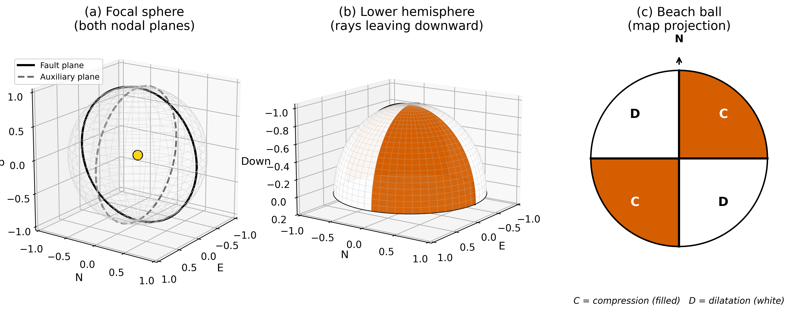
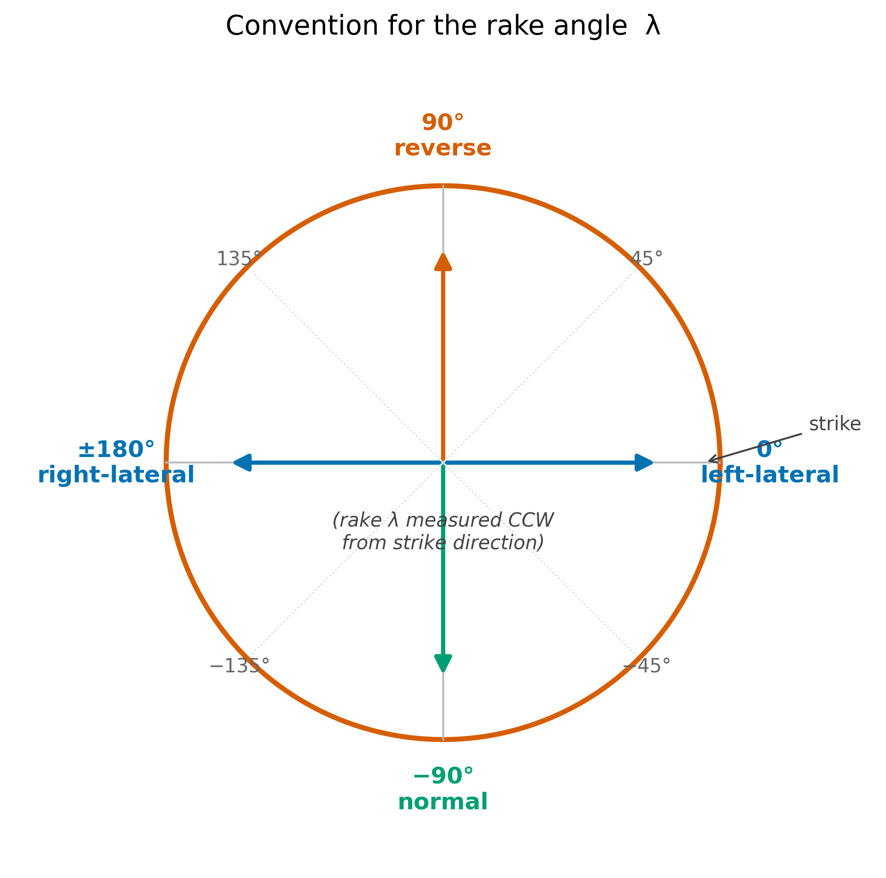
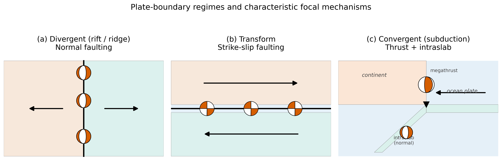

<!-- _class: lead -->

# Earthquake Focal Mechanisms and Faults
## Reading the first wiggle

**ESS 314 — Introduction to Geophysics**
Lecture 16  •  Spring 2026
University of Washington • Earth & Space Sciences

Marine Denolle

---

## Learning Objectives

By the end of this lecture, you should be able to:

- **LO-OUT-A** — Explain the four-quadrant compression / dilatation P-wave radiation pattern.
- **LO-OUT-C** — Read a beach ball; identify fault style and approximate strike, dip, rake.
- **LO-OUT-D** — Interpret the fault-plane / auxiliary-plane ambiguity and how to resolve it.
- **LO-OUT-E** — Connect focal mechanisms to plate-boundary types and PNW tectonics.

*Aligned course objectives: LO-1, LO-2, LO-3, LO-4.*

---

## A Puget Sound morning, 28 February 2001

- **M 6.8 Nisqually earthquake** ruptured at 53 km depth beneath Anderson Island.
- The State Capitol was damaged; ≈250,000 people felt strong shaking.
- The earthquake was **deep** and **extensional** — within the descending Juan de Fuca slab.

How is any of that known, when no one was at the source?

→ The **focal mechanism**: a compact summary of source geometry, inferred from the first wiggles to arrive on regional seismograms.

---

## A focal mechanism is...

- The orientation of the **fault plane** that ruptured.
- The **slip direction** of the hanging wall on it.
- The pattern of **P-wave radiation** that geometry produces.

Every PNSN earthquake larger than ≈M3 has one.
The Global CMT project has produced **>65,000** of them since 1976.

Focal mechanisms are the bridge between the **seismogram** and **plate tectonics**.

---

## The push–pull pattern

A slipping fault loads its surroundings with a four-quadrant stress pattern:

- Two quadrants are **pushed outward** → P-wave begins as **compression** (first motion **up**).
- Two quadrants are **pulled inward** → P-wave begins as **dilatation** (first motion **down**).
- The boundary between quadrants is the **fault plane** and an **auxiliary plane** perpendicular to it.

---

<small>Right-lateral strike-slip fault: NE & SW quadrants record upward first motions; NW & SE record downward. Adapted from Lowrie & Fichtner (2020); regenerated open-licensed.</small>

*Read more → [Lecture 16 §2b](../lectures/16_focal_mechanisms.html#2b-the-four-quadrant-push-pull-pattern)*

---

## The double-couple equivalence

A point shear dislocation on a fault is **mathematically equivalent** to a pair of perpendicular force couples — a **double couple**.

$$
M_{ij} = M_0 \, (n_i d_j + n_j d_i)
$$

- $\mathbf{n}$ = fault normal · $\hat{\mathbf{d}}$ = slip direction · $M_0 = \mu A |\mathbf{u}|$
- The form is **symmetric** under $\mathbf{n} \leftrightarrow \hat{\mathbf{d}}$.
- Far-field seismic radiation depends only on $M_{ij}$.

→ Two perpendicular planes radiate identically. **Fault-plane / auxiliary-plane ambiguity is built into the physics.**

*Read more → [Lecture 16 §2a](../lectures/16_focal_mechanisms.html#2a-faults-as-double-couples)*

---

## The P-wave radiation pattern

For a **vertical strike-slip fault striking north**, the radiation in the horizontal plane reduces to:

$$
F^P(\phi) = \sin(2\phi)
$$

- Positive (compression) for $0° < \phi < 90°$ and $180° < \phi < 270°$.
- Negative (dilatation) for $90° < \phi < 180°$ and $270° < \phi < 360°$.
- Vanishes on the nodal planes $\phi = 0°, 90°, 180°, 270°$.

The general form (Aki & Richards 2002, eq. 4.84) depends on $(\phi_s, \delta, \lambda, i, \phi)$.

*Read more → [Lecture 16 §3c](../lectures/16_focal_mechanisms.html#3c-the-p-wave-radiation-pattern)*

---

## The focal sphere

<small>The lower hemisphere of an imaginary sphere around the source is projected stereographically to a disk — the **beach ball**. Filled = compression; open = dilatation.</small>

*Read more → [Lecture 16 §2d](../lectures/16_focal_mechanisms.html#2d-the-focal-sphere)*

---

## Strike, dip, and rake

- **Strike** $\phi_s$ — azimuth of fault trace, 0–360° from north.
- **Dip** $\delta$ — angle of fault plane below horizontal, 0–90°.
- **Rake** $\lambda$ — slip direction in the fault plane from strike, $-180°$ to $180°$.

*Read more → [Lecture 16 §3d](../lectures/16_focal_mechanisms.html#3d-strike-dip-and-rake)*

---

## Rake convention

<small>Rake encodes the *style* of slip on the fault plane. Memorise the four end-members: 0° = left-lateral; 90° = thrust; 180° = right-lateral; $-90°$ = normal.</small>

---

## Three end-member fault styles

---

## Fault-style cheat sheet

| Style | Dip | Rake | Tectonic setting |
|-------|-----|------|------------------|
| Strike-slip | 70°–90° | 0° or ±180° | Transforms; intracontinental |
| Normal | 40°–70° | $-135°$ to $-45°$ | Rifts, ridges, back-arc |
| Thrust | 5°–40° | 45° to 135° | Subduction; fold-and-thrust belts |

**Beach-ball signatures:**
- Strike-slip → four quadrants meeting at centre.
- Normal → white inner section, dark crescents.
- Thrust → dark inner section, white crescents.

---

## Forward problem

**Given** $(\phi_s, \delta, \lambda)$ and source–station geometry, **predict** the polarity at every station.

1. Compute the moment tensor $M_{ij}$ from the three angles.
2. Ray-trace to find the take-off direction $(i, \phi)$ for each station.
3. Evaluate $F^P(i, \phi; \phi_s, \delta, \lambda)$ — the sign predicts polarity.

→ Implemented in `labs/lab_06_focal_mechanisms.ipynb` using ObsPy.

*Read more → [Lecture 16 §4](../lectures/16_focal_mechanisms.html#4-the-forward-problem-predicting-polarity-at-every-station)*

---

## Inverse problem

> Find $(\phi_s, \delta, \lambda)$ that best separate up-first-motion stations from down-first-motion stations on the focal sphere.

- **FPFIT, HASH** — first-motion grid search.
- **Global CMT, W-phase** — full-waveform inversion of body and surface waves.
- **ML methods** (Mousavi et al. 2020; Zhu et al. 2022) — neural-network polarity pickers and mechanism estimators.

A small, classical inverse problem — but with one fundamental ambiguity.

*Read more → [Lecture 16 §5](../lectures/16_focal_mechanisms.html#5-the-inverse-problem-from-polarities-to-strike-dip-and-rake)*

---

## The fault-plane ambiguity

Both nodal planes radiate identically. To pick the fault, you need **independent information**:

- **Aftershock cloud** — usually outlines the actual rupture plane.
- **Surface rupture** — geological mapping resolves it directly.
- **Geodesy** — InSAR / GPS displacement fields fit one plane better.
- **Tectonic context** — slab geometry, regional stress, etc.

This is a research problem in itself. *A focal mechanism alone is consistent with two different earthquakes.*

---

## Plate boundaries — three signatures

<small>Each plate-boundary type carries its own focal-mechanism signature. Subduction zones host **multiple** styles — a key reason Cascadia is so geophysically rich.</small>

---

## Worked example: 2001 Nisqually

$$
M_w = 6.8, \quad h = 53\,\mathrm{km}, \quad \phi_s = 357°, \quad \delta = 83°, \quad \lambda = -104°
$$

- **Style?** $\lambda = -104°$ → **normal**. Hanging wall dropped.
- **Why so deep?** The hypocentre is in the descending Juan de Fuca slab.
- **Physical interpretation:** **downdip extension within the slab** under its own weight.
- **Which nodal plane is the fault?** Steep N–S plane (the shallow plane is geometrically inconsistent with slab orientation).

*Read more → [Lecture 16 §6](../lectures/16_focal_mechanisms.html#6-a-worked-example-the-2001-nisqually-earthquake)*

---

## Cascadia: one margin, four mechanisms

<small>Megathrust · intraslab normal · crustal thrust · oceanic transform — within ~600 km.</small>

*Read more → [Lecture 16 §7](../lectures/16_focal_mechanisms.html#7-connecting-to-cascadia-one-margin-four-mechanisms)*

---

## Hazard implications

| Source | Depth | Shaking signature | Tsunami? |
|--------|-------|-------------------|----------|
| Megathrust | shallow | long-duration, long-period | **Yes** |
| Crustal thrust (e.g. Seattle Fault) | shallow | short, sharp, very high PGA | localised |
| Intraslab (e.g. Nisqually) | deep | broad, moderate | No |
| Oceanic transform (Blanco) | shallow | offshore, modest onshore | rare |

→ Each style requires **different building-code provisions** and **different warning protocols**.

---

## AI literacy: AI Epistemics

**Activity (15 min, groups of 3):**

1. **Design first** — sketch your own workflow for an M5 event in central Puget Lowland.
2. **Query** — ask Claude / ChatGPT / Gemini the same question.
3. **Evaluate** the AI response on physics correctness, assumption transparency, operational feasibility, failure-mode flagging.
4. **Compare** — where did your design beat the AI? Where did it lose? Find one thing AI was confidently wrong about.

→ **Goal:** treat AI outputs as *hypotheses* to test, not as answers to accept.

---

## Concept check (1/3)

A vertical-component seismometer records a **downward first motion** for the P-wave from a nearby earthquake. What does that tell you, geometrically?

::: speaker-notes
The station sits in a **dilatational quadrant** of the source's radiation pattern. The fault and auxiliary planes pass between this station and any station that recorded an upward first motion.
:::

---

## Concept check (2/3)

A focal mechanism shows two nodal planes: one striking 005°, dipping 12°E; the other striking 185°, dipping 78°W. Aftershocks lie in a thin layer dipping ≈12°E.

Which is the fault? What style?

::: speaker-notes
The **shallow east-dipping plane** is the fault — aftershocks resolve the ambiguity. With dip 12° and a thrust signature implied by the question, this is consistent with a **subduction megathrust**.
:::

---

## Concept check (3/3)

The Global CMT solution for the 2011 M9 Tōhoku earthquake has $\phi_s = 203°$, $\delta = 10°$, $\lambda = 88°$.

What style of faulting? What plate-boundary type?

::: speaker-notes
Rake $\lambda = 88°$ ∈ (45°, 135°) → **thrust**. Dip 10° → very shallow. This is the textbook **subduction megathrust** signature.
:::

---

## Further reading

- **Aki & Richards (2002)** *Quantitative Seismology*, Ch. 4.
- **Lowrie & Fichtner (2020)** Ch. 3, §3.5. (UW Libraries)
- **McCrory et al. (2012)** Juan de Fuca slab geometry, *JGR*. doi:10.1029/2012JB009407
- **Mousavi et al. (2020)** Earthquake Transformer, *Nat. Commun.* doi:10.1038/s41467-020-17591-w
- **Global CMT** globalcmt.org · **PNSN** pnsn.org

→ Lab 6 next week: first-motion analysis with ObsPy on PNSN data.

---

<!-- _class: lead -->

## Full lecture notes

Everything in this deck — and a great deal more — is written up at

→ **[Lecture 16 — Earthquake Focal Mechanisms and Faults](../lectures/16_focal_mechanisms.html)**

Next lecture: **[Lecture 17 — Ground Motions](../lectures/17_ground_motionsground_motions.html)**
— from focal mechanism to seafloor displacement to wave propagation.

*Questions? mdenolle@uw.edu*
