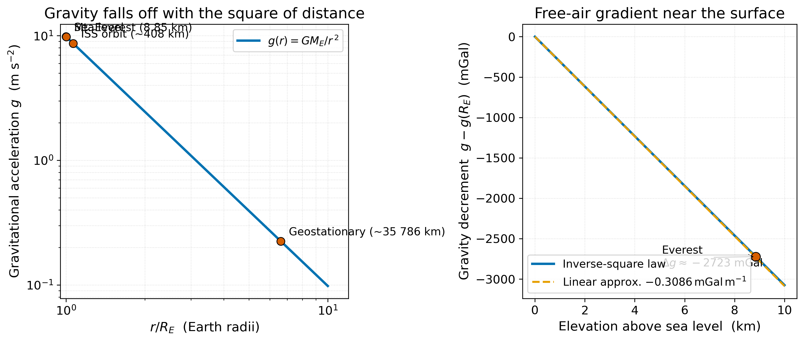
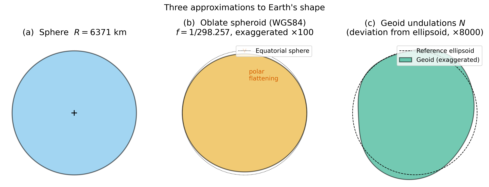
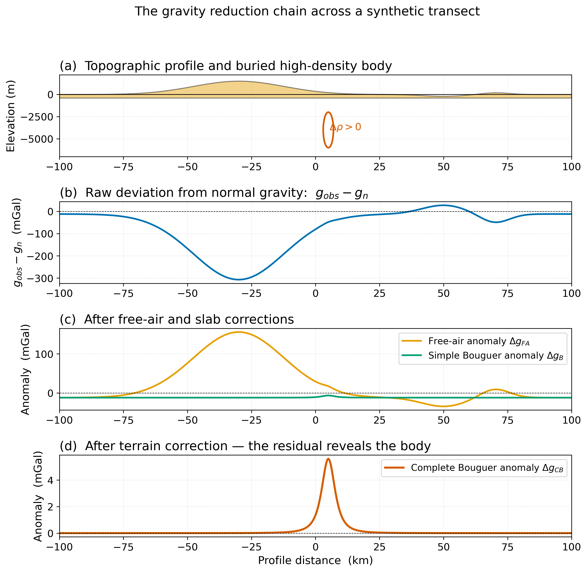

<!-- _class: title -->

# Lecture 19 — Earth's Gravity Field & the Geoid

**ESS 314 — Introduction to Geophysics**
University of Washington · Spring 2026

Marine Denolle · Mon May 4, 2026 · JHN 111

---

## By the end of this lecture, you should be able to…

- **[LO-19.1]** Apply Newton's law on a spherical Earth: $g = G M_{E}/R_{E}^{\,2}$.
- **[LO-19.2]** Distinguish sphere ↔ ellipsoid ↔ geoid as three approximations to Earth's shape.
- **[LO-19.3]** Apply the four gravity corrections — latitude, free-air, Bouguer, terrain.
- **[LO-19.4]** Compute representative magnitudes (mGal) for realistic stations.

> Course objectives addressed: **LO-1**, **LO-2**, **LO-4**.

---

## A motivating observation

Two stations on the same line of longitude:

- One at the foot of Mt. Rainier
- One on Puget Sound, 30 km away

Both gravimeters read $g$ to $\pm 10^{-8}$ relative precision. **They differ by tens of mGal.** Why?

→ Three contributors: Earth's shape, station elevation, local geology.

---

## Newton's law of universal gravitation

$$ F = G \, \frac{m_{1} m_{2}}{r^{2}}, \qquad G = 6.674 \times 10^{-11} \text{ m}^{3} \text{kg}^{-1} \text{s}^{-2} $$

Force on a unit test mass → **gravitational acceleration**:

$$ g(r) = \frac{G M}{r^{\,2}} $$

The acceleration is the same for every test mass — a fact unknown until Galileo, central to general relativity.

---

## Gravity is a *field*

Conservative force ⇒ potential $U$ exists with $\mathbf{g} = -\nabla U$.

$$ U(\mathbf{r}) = -\,G \int_{V} \frac{\rho(\mathbf{r}')}{|\mathbf{r}-\mathbf{r}'|}\, dV' $$

- **Equipotentials** are perpendicular to $\mathbf{g}$ everywhere.
- A still water surface follows an equipotential — **this is what "horizontal" means**.
- Plumb line points along $\mathbf{g}$ — **this is what "vertical" means**.

---

## How $g$ varies with distance

Left: $g(r) = G M_{E}/r^{2}$, log-log. Right: linear free-air gradient $-0.3086\,$mGal m⁻¹ near surface.

---

## Numbers to carry

- $g$ at sea level $\approx 9.81$ m s⁻² $\equiv$ 981 000 mGal.
- $g$ at the summit of Everest $\approx 9.78$ m s⁻² — **about 2.7 Gal lower**.
- $g$ at the ISS orbit (~408 km) $\approx 8.66$ m s⁻² — astronauts are *not* weightless, they are in free fall.
- $g$ at geostationary orbit $\approx 0.22$ m s⁻². 

The ISS is *not* in deep space. **$g$ falls off slowly.**

---

## Three approximations to Earth's shape

Each panel is the "next correction" on the previous one.

- **(a) Sphere** ($R = 6371$ km): good to a few parts in $10^{3}$.
- **(b) Oblate spheroid** ($f = 1/298.257$): rotation flattens the poles by ~21 km.
- **(c) Geoid:** real equipotential, lumpy at the ±100 m level globally.

---

## Theoretical (normal) gravity at the ellipsoid

$$
g_{n}(\varphi) \approx 978\,032.7 \, \bigl( 1 + 5.30 \!\times\! 10^{-3} \sin^{2}\varphi - 5.82 \!\times\! 10^{-6} \sin^{2}2\varphi \bigr) \;\text{mGal}
$$

- Equator: $g_{n} \approx 978\,033$ mGal
- Poles: $g_{n} \approx 983\,219$ mGal
- Total equator-to-pole difference: **~5186 mGal**, dominated by rotation.

Subtract this off: $\Delta g_{\text{raw}} = g_{\text{obs}} - g_{n}(\varphi)$ — the **latitude correction**.

---

## Measuring $g$

**Absolute gravimeters.** Free-fall timed by laser interferometry. Accuracy ~5–10 µGal. Bulky, expensive.

**Relative gravimeters.** A test mass on a precisely calibrated "zero-length spring." Read **differences** between stations. Accuracy ~10 µGal. Field-portable.

The two methods are complementary: absolute instruments anchor the network; relative instruments fill it in.

---

## Why we need 4 decimal places

A gravimeter measures $g$ to ~1 part in $10^{8}$.
Geological signals are 0.1–100 mGal.
Elevation effects can be **300+ mGal**.

→ Without careful corrections, the geological signal is lost in the noise of station placement.

The next four slides take a single transect and walk through each correction.

---

## The reduction chain

A buried 5-mGal target sits underneath a **300-mGal** elevation effect. Each correction below removes a known, predictable contribution.

---

## Free-air correction

A station at elevation $h$ is **farther from Earth's centre**, so $g$ is smaller.

$$ \frac{dg}{dr} = -\frac{2 g}{r} = -\,0.3086 \text{ mGal m}^{-1} $$

→ Add $0.3086\, h$ mGal back to the observation.

The **free-air anomaly**:
$$ \Delta g_{FA} = g_{\text{obs}} - g_{n}(\varphi) + 0.3086\, h $$

---

## Bouguer (slab) correction

There is **rock between the station and the geoid**, pulling the gravimeter down.

Approximate it as an infinite horizontal slab:
$$ g_{\text{slab}} = 2\pi G \rho_{c} h \approx 0.0419\!\times\!10^{-3} \rho_{c} h \text{ mGal} $$

Subtract this from $\Delta g_{FA}$:
$$ \Delta g_{B} = \Delta g_{FA} - 0.0419\!\times\!10^{-3} \rho_{c} h $$

For "normal" crust ($\rho_{c}=2.67$): combined elevation correction is **~0.197 mGal m⁻¹**.

---

## Terrain correction

The infinite-slab assumption fails in real terrain.
- Mountains *above* the station pull *up* and laterally (away).
- Valleys *below* the station leave a mass deficit.

→ **Always** add a positive correction. Today, computed numerically from a DEM.

The **complete Bouguer anomaly**:
$$ \Delta g_{CB} = g_{\text{obs}} - g_{n} + \text{FA}_{\text{corr}} - B_{\text{corr}} + T_{\text{corr}} $$

By construction, $\Delta g_{CB}$ is **due to lateral density variations near the survey** — the geological target.

---

## The reduction chain — what's left

After all four corrections, the residual reveals the buried body that motivated the survey.

In Lecture 20: how to *read* this residual to recover subsurface structure.

---

## Worked example — alpine station at 45°N, 2000 m

Latitude term: $g_{n}(45^{\circ}) \approx 980\,629$ mGal.
Free-air: $+0.3086 \times 2000 = +617$ mGal.
Bouguer ($\rho_{c}=2.67$): $-0.0419\!\times\!10^{-3}\times 2.67 \times 2000 = -224$ mGal.
Terrain (rough alpine): $\sim +10$ mGal.

**Total elevation correction: $\sim +400$ mGal.** A 5-mGal target is two orders of magnitude smaller than the corrections.

→ Why precision and care in the reduction chain are non-negotiable.

---

## Forward problem — what does the model predict?

Given:
- Latitude $\varphi$
- Elevation $h$
- Density model $\rho(\mathbf{r})$ for rock above the geoid

→ The reduction chain is a *deterministic* forward map.

The "inverse" problem of this lecture is mostly **bookkeeping**: extract the residual. The interesting inverse problem comes in Lecture 20.

---

## Non-uniqueness — the punchline

Gravity is an **integral** of $\rho$. Two density distributions can give the *same* surface $g$.

Two specific ambiguities:
- **Depth ↔ density**: deeper, denser body looks the same as shallower, lighter body.
- **Reduction density**: choosing a wrong $\rho_{c}$ creates topography-correlated artifacts.

→ Gravity alone is rarely enough. Joint with seismic, magnetic, geological constraints.

---

## Course connections

- **Backward**: seismic tomography (L11–12) gives velocity → density via empirical scaling.
- **Forward**: L20 — read residual anomalies for subsurface structure.
- **Forward**: L21 — long-wavelength Bouguer signal = isostatic compensation.

---

## Research horizon — gravity from space

**GRACE-FO** (NASA/GFZ, 2018–): two satellites tracked to fraction-of-µm separation. Measures **time-varying** gravity → ice loss, water storage, slow-slip events.

Open access: Tapley et al. (2019) *Nature Climate Change*, https://doi.org/10.1038/s41558-019-0456-2

Centimetre-level static geoid is now achievable. (Pail et al. 2023 review, open access.)

---

## Societal relevance — the Earth is losing mass

Greenland ice loss measured by GRACE: ~270 Gt yr⁻¹, accelerating.

For the PNW:
- The **geoid itself** moves at mm/decade — affects regional sea-level interpretation.
- Aquifer-storage changes (Columbia Plateau) are reaching detection threshold for airborne gravity.

USGS SIR 2010-5101 (public domain) is the open-access entry point.

---

## AI Literacy — AI as a tool

Two productive uses of ML in modern gravity:

- **Edge detection** in gridded gravity-gradient data (CNNs).
- **Ensemble inversion**: an ensemble of trained NNs produces a *distribution* of plausible models, capturing non-uniqueness explicitly.

ML cannot solve the underlying inverse-problem ambiguity (Green's third identity is mathematical, not algorithmic). But it can **make the ambiguity visible** by sampling the posterior.

---

## Concept Check

1. A free-air anomaly of $+200$ mGal at a 3-km alpine station; the simple Bouguer at the same station is $-150$ mGal. **What does this tell you about local compensation?**
2. Sketch qualitatively the free-air and Bouguer anomalies you expect across a 4-km-deep ocean trench.
3. Two stations at the same elevation and latitude on opposite sides of a vertical fault have Bouguer anomalies differing by 5 mGal. **Can the data alone tell you the throw?** What additional measurement would constrain it?
