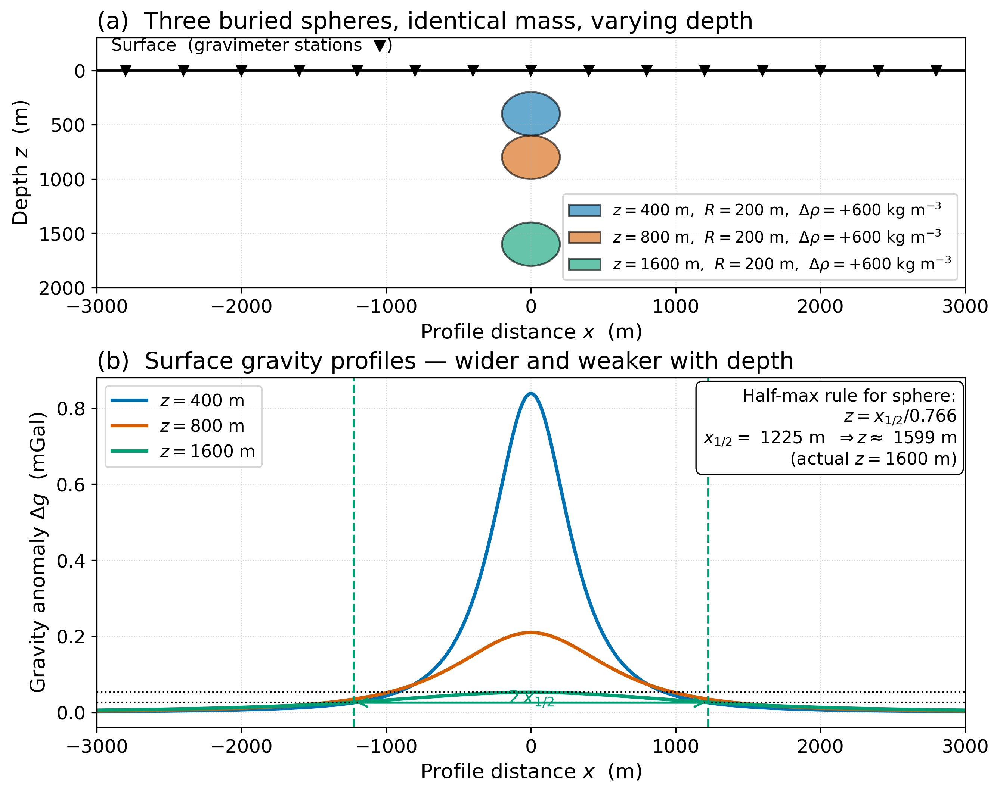
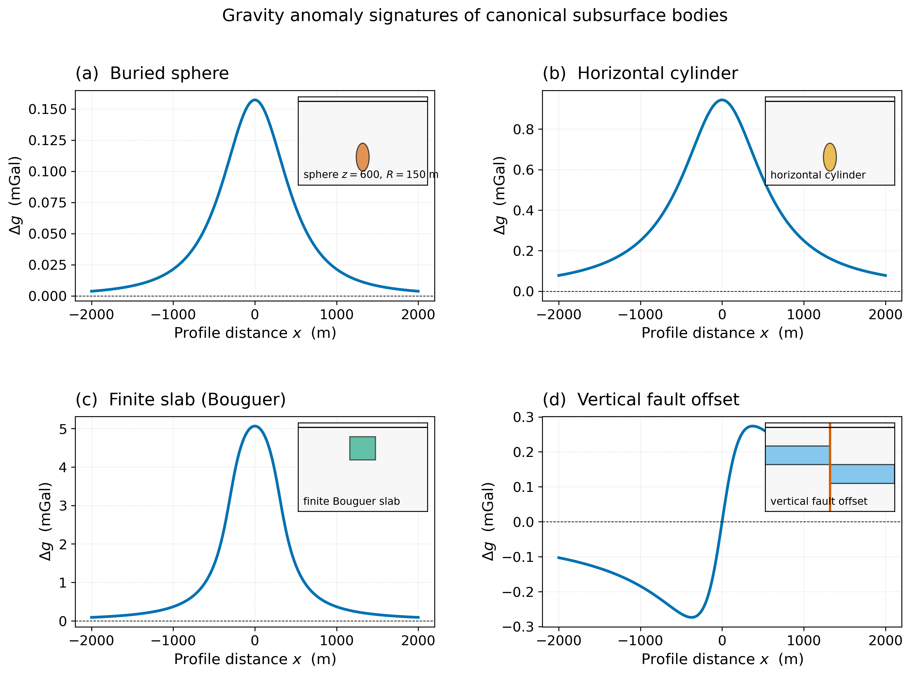
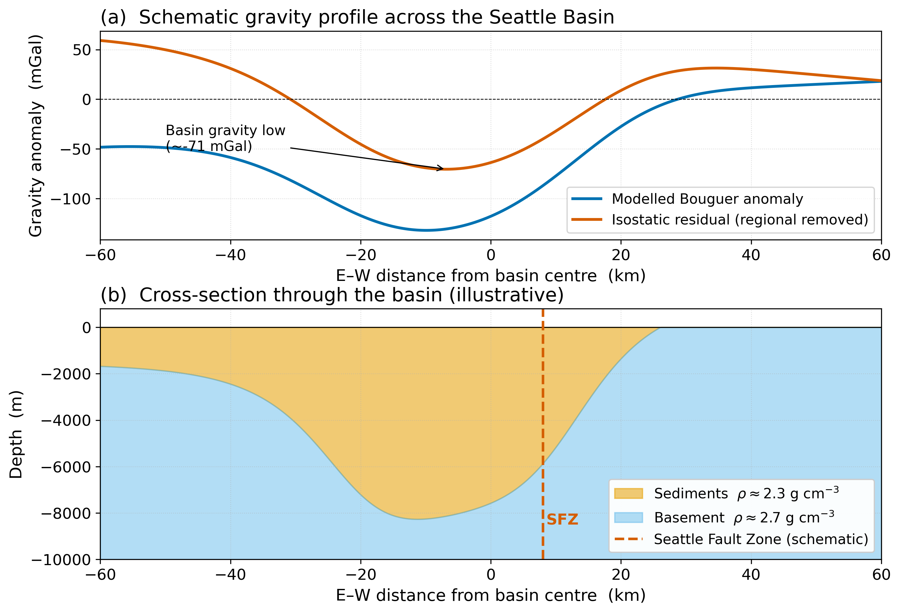

<!-- _class: title -->

# Lecture 20 — Gravity Anomalies & Subsurface Modeling

**ESS 314 — Introduction to Geophysics**
University of Washington · Spring 2026

Marine Denolle · Tue May 5, 2026 · JHN 111

---

## By the end of this lecture, you should be able to…

- **[LO-20.1]** Compute $\Delta g(x)$ above buried sphere, cylinder, slab, fault offset.
- **[LO-20.2]** Apply the half-maximum rule to estimate depth from a profile.
- **[LO-20.3]** Distinguish *regional* vs. *residual* anomalies.
- **[LO-20.4]** Use $\partial g/\partial x$ to locate geological edges and faults.
- **[LO-20.5]** Set up a forward-modelling workflow and articulate inverse-problem non-uniqueness.

> Course objectives addressed: **LO-1**, **LO-2**, **LO-3**, **LO-4**, **LO-5**.

---

## Where we are

Lecture 19 → cleaned-up complete Bouguer anomaly $\Delta g_{CB}$.
By construction, $\Delta g_{CB}$ records **lateral density variations near the survey**.

This lecture: **how do we read it?**

Two questions:

- *Forward* — given a subsurface, predict the profile.
- *Inverse* — given the profile, recover the subsurface.

---

## The vertical pull from a buried mass element

$$ dg_{z} = \frac{G \, \rho \, z' \, dV}{(x^{2}+y^{2}+z'^{\,2})^{3/2}} $$

Three properties of this kernel set everything that follows:

- **Linear** in density → bodies *superpose*.
- Only **density contrast** $\Delta\rho$ matters (background subtracted in Lecture 19).
- The kernel is smooth → **non-unique** by Green's third identity.

---

## The buried sphere — canonical formula

$$ \Delta g(x) = \frac{G \, M \, z}{(x^{2}+z^{2})^{3/2}}, \qquad M = \frac{4}{3}\pi R^{3} \, \Delta\rho $$

- Peak: $g_{\max} = G M / z^{2}$ at $x=0$.
- Half-max width: $x_{1/2} \approx 0.766\, z$.

→ **Half-max rule**: $z = x_{1/2} / 0.766$ recovers depth from the profile width.

---

## Half-max rule in action

Three identical-mass spheres at $z = 400, 800, 1600$ m → wider, weaker profiles with depth. Half-max rule recovers $z=1599$ m for actual $z=1600$ m.

---

## The other canonical shapes

Each geometry has its own **signature** in the surface profile. Recognise the shape → apply the right formula.

---

## Closed-form formulas to memorise

**Horizontal cylinder** (axis ⊥ profile):
$$ \Delta g(x) = \frac{2 G \lambda z}{x^{2}+z^{2}}, \quad \lambda = \pi R^{2} \Delta\rho, \quad x_{1/2} = z. $$

**Infinite slab (Bouguer):**
$$ \Delta g = 2\pi G \Delta\rho \, h. $$

**Vertical fault offset**: antisymmetric step, steepest gradient *over the fault plane*.

→ Three numbers carry the information: $g_{\max}$, $x_{1/2}$, and $\partial g/\partial x|_{\max}$.

---

## Density contrast — not absolute density

$\Delta g$ depends on **$\Delta \rho$**, not on $\rho$ itself.

A salt body in shale ($\Delta\rho < 0$) → **negative** anomaly.
A serpentinite body in basalt ($\Delta\rho > 0$) → **positive** anomaly.

A body whose density matches its surroundings is **invisible**, regardless of size.

---

## Regional vs. residual

The **wavelength** of an anomaly scales with **depth to source**.

- Long-wavelength → **regional**, deep sources, tectonic-scale geodynamics.
- Short-wavelength → **residual**, near-surface bodies — what most surveys want.

Standard practice: fit a smooth surface to the regional, subtract it.

→ The choice of regional surface is a **modelling decision** with subjective elements. Document it.

---

## Horizontal gradient — finding the edges

$\partial \Delta g / \partial x$ peaks at **vertical density contrasts**.

- Over a fault → gradient peaks above the fault plane.
- Over a basin edge → gradient peaks at the wall.
- Long-wavelength regional trends → suppressed by differentiation.

Map-view gradient images are routine in modern interpretation: they pull out structural lineaments that are not obvious in the underlying anomaly map.

---

## The forward problem is *easy*

Given a model, compute $\Delta g$:
- Closed forms for sphere, cylinder, slab, polygon.
- **Talwani algorithm** (1959): arbitrary 2-D polygon → analytic gravity.
- 3-D bodies: discretise, integrate.

Lab 5 implements all of this in Python. Vary parameters, build intuition.

---

## The inverse problem is *hard* — three reasons

1. **Geometry**: given a known shape, half-max rule gives depth — works at the qualitative level.
2. **Non-uniqueness**: many density distributions yield the same surface field. *Mathematical, not algorithmic.*
3. **Total mass**: the only thing uniquely determined by the surface field is $\int \Delta\rho \, dV$ — **and** only if the survey extends past the body.

---

## Increasing depth must be compensated by…

…increasing density contrast and/or increasing volume.

Without independent constraints, **these tradeoffs cannot be separated**.

→ Combine gravity with seismic (constraints on geometry) or with rock physics (constraints on density). Joint interpretation is the rule, not the exception.

---

## Worked example — the salt dome

Observation: near-circular Bouguer low. $g_{\max} = -16$ mGal, $x_{1/2} \approx 3700$ m. Salt $\rho \sim 2.20$, shale $\rho \sim 2.40$ g cm⁻³.

Half-max rule: $z = 3700 / 0.766 \approx 4830$ m.
Mass: $M = |g_{\max}| z^{2} / G \approx 5.6 \times 10^{13}$ kg.
Radius: $R = (3M / 4\pi |\Delta\rho|)^{1/3} \approx 3800$ m.
Top of salt: $z - R \approx 1000$ m.

→ A *first-order* interpretation. Seismic reflection over the same body almost always tightens the depth-to-top by 2× or more.

---

## A PNW worked example — Seattle Basin

A 60-mGal isostatic-residual low across the basin. Width → depth (~7–8 km). Asymmetry → Seattle Fault Zone offset.

---

## Hidden in the residual — earthquake hazard

The Seattle Basin's low-density fill amplifies long-period ground motion **3–5×** for Cascadia M9 earthquakes.

The basin's **gravity-derived geometry** is the input to ground-motion simulation codes used in the regional PSHA.

→ Gravity interpretation feeds directly into building-code design ground motions.

USGS OFR 2018-1149 (Frankel et al., public domain) is the open-access entry point.

---

## Course connections

- **Backward** to L19: Bouguer reduction provides the input.
- **Backward** to L10–12: forward/inverse problems, resolution-vs-uniqueness.
- **Forward** to L21: long-wavelength Bouguer = isostatic compensation.
- **Forward** to L24: same forward/inverse logic for magnetic anomalies.

---

## Research horizon

- **USGS open data**: full national gravity archive (public domain, https://mrdata.usgs.gov/services/gravity).
- **Brocher et al. (2017)**: PNW crustal-block model, open access via AGU.
- **Linsel et al. (2023)**: deep-learning fault-edge detection, arXiv preprint.
- **Steinberger et al. (2022)**: long-wavelength gravity contains *flow* information, not just density.

---

## AI Literacy — AI Epistemics

**Test prompt**: *"Derive the gravity anomaly above a buried sphere. Give the half-width-to-depth relation and explain why the result is non-unique."*

A good response:
- Derives equation in 3 steps.
- Recovers $x_{1/2} \approx 0.766\, z$.
- Articulates depth-density tradeoff.

A poor response:
- Plausible-looking formula with subtle errors (missing $z$, wrong exponent).
- Confident but unverifiable claim.

→ **Trust by verification, not by appearance**. Check dimensional consistency, run the formula on a known case, compare half-width-to-depth ratio against the textbook value.

---

## Concept Check

1. Two anomalies have **identical peak amplitude** ($+5$ mGal) but $x_{1/2,\text{A}} = 200$ m and $x_{1/2,\text{B}} = 2000$ m. Estimate the depth and source mass of each.
2. A profile across a vertical fault shows an antisymmetric step of **4 mGal**, with $|\partial g/\partial x|_{\max} = 0.5$ mGal/km. **What does the gradient tell you that the step amplitude does not?**
3. You apply two regional polynomials (1st vs 2nd order) and the residual half-width changes by 30%, peak by 15%. **What does this say about the reliability** of the depth and density estimates?
