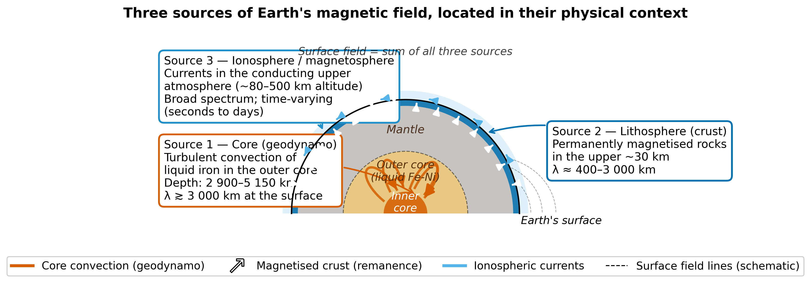
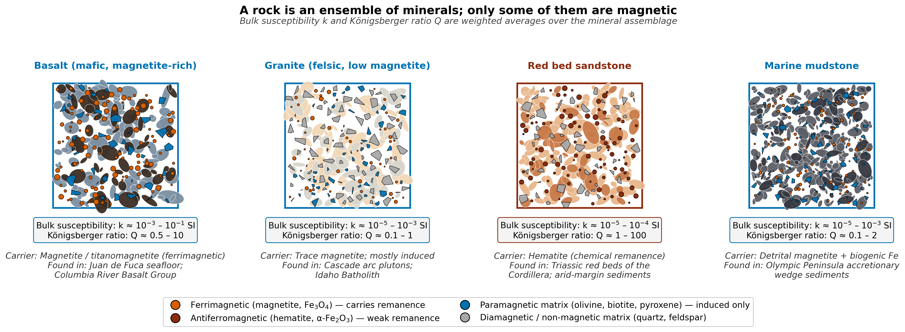
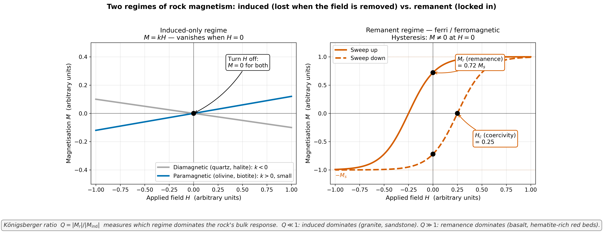

<!-- _class: title -->

# Lecture 23
## Earth Magnetism & Mineral Magnetism
### Where the field comes from, and how rocks remember it

ESS 314 · Spring 2026 · Marine Denolle

---

## 1. The framing question

- Seattle's compass points **15.5° east of true north** in 2026 — it pointed **22.1° east** in 1955.
- KSEA's main runway was renamed **16L/34R → 16R/34L** in 2019 to keep its number honest.
- A planetary-scale physical quantity changes fast enough to alter aviation infrastructure.
- What *is* the field, where does it come from, and how do rocks record it?

*Read more → [Lecture 23 §1](../lectures/23_earth_magnetism.html#1-the-geoscientific-question)*

---

## Learning objectives

By the end of today, students will be able to:

1. Decompose the field into **(D, I, F)** and **(X, Y, Z)**.
2. Locate the **three sources** of the surface field — core, lithosphere, ionosphere — in their physical context and on the power spectrum.
3. Distinguish **induced** from **remanent** magnetisation, use the **Königsberger ratio** $Q$, and recognise the five categories of magnetic ordering.
4. Describe the three remanence-acquisition mechanisms — **TRM, DRM, CRM** — and the Curie temperatures of PNW magnetic minerals.
5. Apply $\tan I = 2 \tan\lambda$ as a **forward** and an **inverse** problem with uncertainty.

---

## 2. The dipole field and the tangent-cylinder geodynamo

- Surface field ≈ **90% dipolar**, axis tilted ~11° from rotation axis.
- The outer-core **geodynamo** is *cylindrical*: convection is organised into columns coaxial with the rotation axis (the **tangent cylinder**).
- At a station, three numbers describe the field: **declination D**, **inclination I**, **total intensity F**.

*Read more → [Lecture 23 §2](../lectures/23_earth_magnetism.html#2-the-dipole-field-and-the-d-i-f-system)*

---

## 2. (D, I, F) ↔ (X, Y, Z) at a station

$$X = F \cos I \cos D, \quad Y = F \cos I \sin D, \quad Z = F \sin I$$

| | D | I | F |
|---|---:|---:|---:|
| **Seattle 2026 (IGRF-13)** | +15.5° | +68.9° | 52 900 nT |

→ (X, Y, Z) = (**18 300, 5 070, 49 360**) nT

The vertical component $Z$ is ~2.6× larger than the horizontal $H$ at Seattle's latitude — the compass needle only sees $H$.

*Read more → [Lecture 23 §2](../lectures/23_earth_magnetism.html#2-the-dipole-field-and-the-d-i-f-system)*

---

## 3. Three sources of the surface field

A surface magnetometer adds **three contributions** from three depths:

1. **Core** (geodynamo) — 2 900–5 150 km depth, $\lambda \gtrsim 3000$ km
2. **Lithosphere** — upper ~30 km, $\lambda \sim 400$–$3000$ km
3. **Ionosphere / magnetosphere** — 80–500 km altitude, time-varying

Magnetic surveying = **separating these three**.

*Read more → [Lecture 23 §3](../lectures/23_earth_magnetism.html#3-three-sources-of-magnetism)*

---

## 3d. Spectral fingerprint — same field, three scales

Spatial profile **(top)** decomposes into three colour-coded components; the **Mauersberger–Lowes spectrum (bottom)** maps each one to its own degree range — core dominates $n \leq 13$, crust dominates $n \gtrsim 16$, external is a floor.

*Read more → [Lecture 23 §3.4](../lectures/23_earth_magnetism.html#3-4-the-spectral-fingerprint-separating-the-three-sources)*

---

## 4. The field drifts — secular variation at Seattle

- D: +22.1° → +15.5° over 71 yr
- I: 71.0° → 68.9°
- F: ≈ 3 000 nT drop

Drift is **outer-core fluid flow**; corrected in surveys via the **IGRF reference epoch**.

*Read more → [Lecture 23 §4](../lectures/23_earth_magnetism.html#4-the-surface-field-changes-secular-variation)*

---

## 5. The mineral scale — a rock is an ensemble

Bulk magnetic response = **volume-weighted average** of the mineral assemblage. A "magnetite-bearing" basalt is mostly plagioclase + pyroxene; a granite carries only trace magnetite; a red bed is dominated by hematite cement.

*Read more → [Lecture 23 §5.1](../lectures/23_earth_magnetism.html#5-1-a-rock-is-an-ensemble-of-minerals)*

---

## 5b. Induced vs. remanent — the central distinction

- **Induced**: $\mathbf{M} = k\,\mathbf{H}$ — vanishes when $H = 0$ (dia-, para-).
- **Remanent**: hysteresis loop, $M_r \neq 0$ at $H = 0$ (ferri-, ferro-).
- **Königsberger ratio** $\,Q = |M_\text{rem}|/|M_\text{ind}|\,$ tells you which regime dominates a real rock in Earth's field.

$Q \ll 1$: anomaly points along **today's** field. $Q \gg 1$: along the **ancient** field.

*Read more → [Lecture 23 §5.2](../lectures/23_earth_magnetism.html#5-2-two-regimes-induced-versus-remanent-magnetisation)*

---

## 5c. Five categories of magnetic ordering

- **Dia-** (quartz, halite): $k \approx -10^{-5}$ — induced only.
- **Para-** (olivine, biotite): $k \approx +10^{-4}$ — induced only.
- **Ferro-** (Fe metal, rare in nature): $k \gg 1$ — remanent.
- **Antiferro-** (hematite, with spin canting): weak parasitic remanence.
- **Ferri-** (**magnetite**, titanomagnetite): unequal antiparallel — the workhorse.

*Read more → [Lecture 23 §5.3](../lectures/23_earth_magnetism.html#5-3-five-categories-of-magnetic-ordering-at-the-mineral-scale)*

---

## 6. Curie temperatures of PNW magnetic minerals

| Mineral | $T_C$ (°C) | Where you meet it |
|---|---:|---|
| Titanomagnetite (TM60) | 150 | Juan de Fuca seafloor basalt |
| Pyrrhotite | 320 | Hydrothermal ore deposits |
| Magnetite (Fe₃O₄) | **580** | Most continental igneous rocks |
| Hematite (α-Fe₂O₃) | 680 | Red beds, oxidised basalt tops |

Above $T_C$ → paramagnetic (no ordering). Below $T_C$ → ordering returns; spins lock in as the grain cools through a narrow **blocking interval**.

*Read more → [Lecture 23 §6.1](../lectures/23_earth_magnetism.html#6-1-thermoremanent-magnetisation-trm-cooling-through-the-curie-temperature)*

---

## 6a. TRM — cooling through the Curie temperature

A grain cooled through $T_C$ in field $H_0$ locks in a TRM **parallel to $H_0$** in the blocking interval just below $T_C$.

Igneous rocks → TRM is the dominant remanence carrier. Oceanic basalts of the Juan de Fuca plate record the field at their eruption (→ Lecture 24).

*Read more → [Lecture 23 §6.1](../lectures/23_earth_magnetism.html#6-1-thermoremanent-magnetisation-trm-cooling-through-the-curie-temperature)*

---

## 6b. DRM and CRM — sediments and chemistry

- **DRM (detrital remanent magnetisation)** — magnetite grains *settling* through the water column align with the ambient field, then are locked at the sediment-water interface. The remanence carrier of **marine and lacustrine sediments**; Cascadia accretionary wedge cores record Pleistocene–Holocene field.
- **CRM (chemical remanent magnetisation)** — a new magnetic mineral *grows in place* in the ambient field at $T < T_C$. Dominant in **red beds** and oxidised basalt tops.
- Bonus: **IRM** (lightning strikes) and **VRM** (slow long-time tail) are the routine overprints removed in the lab.

*Read more → [Lecture 23 §6.2–6.4](../lectures/23_earth_magnetism.html#6-2-detrital-remanent-magnetisation-drm-sediment-grains-aligning)*

---

## 7. The forward problem — GAD inclination from latitude

For a **Geocentric Axial Dipole**:

$$\tan I = 2 \tan \lambda$$

| Latitude $\lambda$ | Predicted $I$ |
|---:|---:|
| 0° (equator) | 0° |
| 30° | 49° |
| 47.65° (Seattle) | 65.5° (GAD); 68.9° (measured) |
| 90° (pole) | 90° |

The factor of **2** comes from $B_r = 2 B_\theta$ at the surface for a dipole.

*Read more → [Lecture 23 §7](../lectures/23_earth_magnetism.html#7-the-forward-and-inverse-problems-paleo-latitude-from-inclination)*

---

## 7b. The inverse problem — paleo-latitude from inclination

$$\lambda = \arctan\!\left(\frac{\tan I}{2}\right)$$

- Propagate $\sigma_I$ → $\sigma_\lambda$.
- **Largest uncertainty near the equator** (steep slope of forward curve).
- Reliable at high paleo-latitudes; soft at low.

*Read more → [Lecture 23 §7](../lectures/23_earth_magnetism.html#7-the-forward-and-inverse-problems-paleo-latitude-from-inclination)*

---

## 8. Research Horizon — Swarm and the geodynamo

- ESA **Swarm** constellation (3 satellites, 2013–present) maps the vector field at 460 km altitude to degree $n \sim 130$.
- Tracks **westward drift** (~0.2°/yr) → azimuthal core flow.
- Detects **geomagnetic jerks** — abrupt year-scale changes in $\dot{B}$.
- Resolves **lithospheric features**: oceanic fabrics, impact structures, continental margins.

The core is *not* in steady state, and we now have the data to watch it.

*Read more → [Lecture 23 §8](../lectures/23_earth_magnetism.html#8-research-horizon-the-swarm-satellites-and-geomagnetic-jerks)*

---

## 9. AI Literacy — derivation as a verification task

**Reasoning Partner activity:**

1. Ask an LLM to **derive** $\tan I = 2\tan\lambda$ from the dipole field expressions in polar coordinates.
2. **Verify, do not trust**: check the inclination definition, the algebra, and the latitude-vs-colatitude convention.
3. **Disagree productively**: if it errs, *name the specific step* in your correction prompt — never ask "is this right?"

LLMs accelerate derivations; they do not replace the student's responsibility to check.

*Read more → [Lecture 23 §9](../lectures/23_earth_magnetism.html#9-ai-literacy-using-a-language-model-as-a-derivation-partner)*

---

## 10. Concept checks

1. **D, I, F at Seattle in 1955.** Compute (X, Y, Z) from D = +22.1°, I = +71.0°, F = 55 980 nT. Which component has changed most since 2026 in *relative* terms? In absolute terms?

2. **Induced or remanent?** A +800 nT anomaly above a granite ($Q \approx 0.3$) and a +800 nT anomaly above a basalt ($Q \approx 6$). Demagnetise both in zero field — which signal survives?

3. **Paleo-latitude error budget.** With $\sigma_I = 3°$, compare $\sigma_\lambda$ for $I = 35°$ vs $I = 75°$. Why are they different?

*Read more → [Lecture 23 §10](../lectures/23_earth_magnetism.html#10-concept-check)*

---

## 11. Connections — what's next

Lecture 24 takes today's framework and asks the next question:

**If a magnetised body sits in the crust, how does its small ($\sim 10^{-3}$) perturbation to F appear on the surface?**

- Forward problem: anomaly shape depends on **magnetic latitude**.
- Half-width depth rule with **measurement-noise propagation**.
- Inverse problem with **m–z trade-off** — the $m \propto z^3$ ridge.
- Application: **Juan de Fuca magnetic stripes** and plate tectonics.

*Continue → [Lecture 24 — Magnetism and Plate Tectonics](../lectures/24_magnetic_field_tectonics.html)*

---

<!-- _class: end -->

## Further Reading

- **Lowrie & Fichtner (2020)**, *Fundamentals of Geophysics*, 3rd ed., Ch. 5.1–5.3.
- **Tauxe et al. (2018)**, *Essentials of Paleomagnetism*, 5th Web Ed. (open access, EarthRef).
- **Butler (1992)**, *Paleomagnetism: Magnetic Domains to Geologic Terranes* (free electronic edition).
- **Hunt, Moskowitz & Banerjee (1995)**, AGU Reference Shelf 3 — magnetic properties of rocks and minerals.
- **Alken et al. (2021)**, IGRF-13. *Earth Planets Space* 73, 49.
- **Maus (2008)**, Power spectrum. *GJI* 174, 135–142.

Full lecture page → [Lecture 23 — Earth Magnetism and Mineral Magnetism](../lectures/23_earth_magnetism.html)
