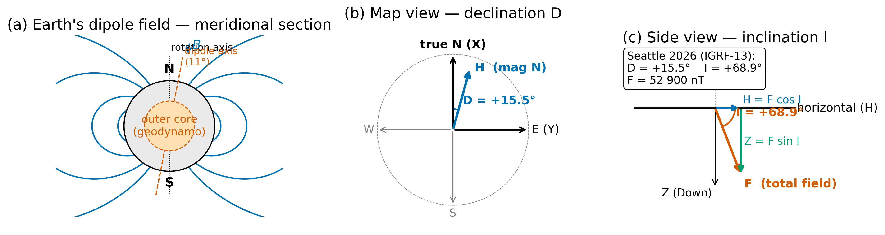
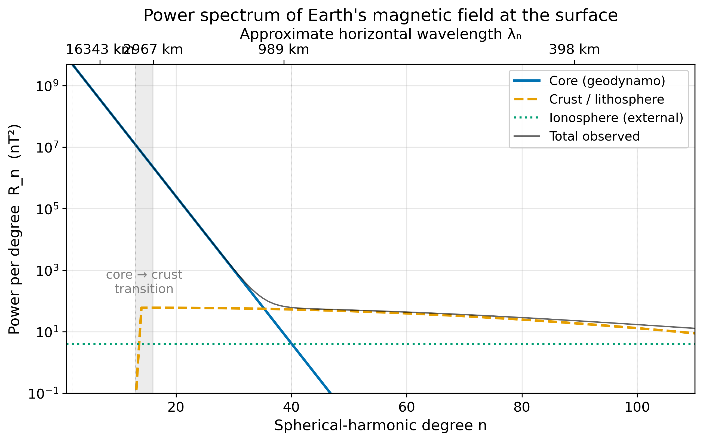
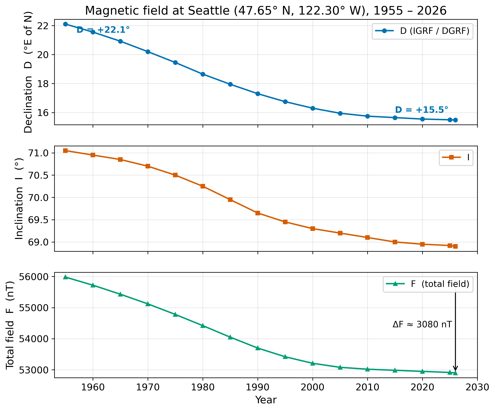
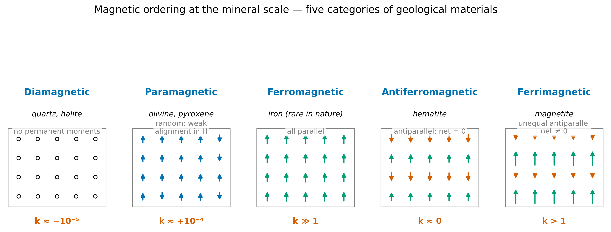
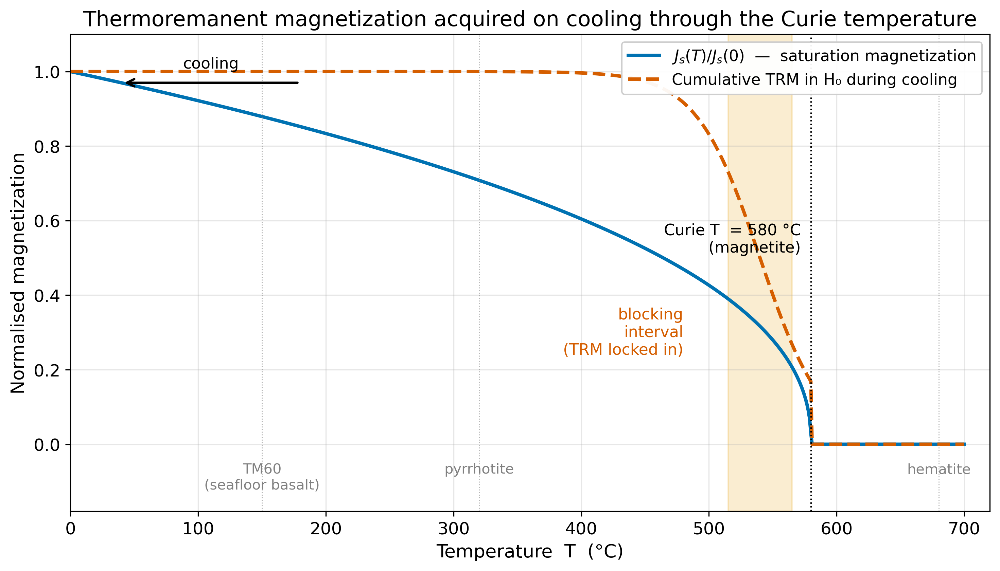
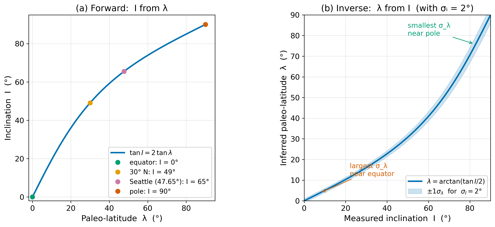

<!-- _class: title -->

# Lecture 23
## Earth Magnetism & Mineral Magnetism
### Where the field comes from, and how rocks remember it

ESS 314 · Spring 2026 · Marine Denolle

---

## Why this lecture

- Seattle's compass points **15.5° east of true north** in 2026 — it pointed **22.1° east** in 1955.
- KSEA's main runway was renamed **16L/34R → 16R/34L** in 2019 to keep its number honest.
- A planetary-scale physical quantity changes fast enough to alter aviation infrastructure.
- What *is* the field, where does it come from, and how do rocks record it?

---

## Learning objectives

By the end of this lecture, students will be able to:

1. Decompose the field into **(D, I, F)** and **(X, Y, Z)**.
2. Identify three sources of the surface field — **core, crust, ionosphere** — on the power spectrum.
3. Distinguish **five categories of magnetic ordering** (dia / para / ferro / antiferro / ferri).
4. Describe **TRM** acquired on cooling through the **Curie temperature**.
5. Apply $\tan I = 2 \tan\lambda$ as a **forward** and an **inverse** problem with uncertainty.

---

## The dipole field — 90% of the surface signal

- Field lines look like those of a **centred dipole**.
- Dipole axis tilted ~11° from rotation axis.
- Tied to **geodynamo** — fluid iron convection in the outer core.

---

## (D, I, F) at a station — three numbers describe the local field

- **Declination D**: angle of H from true north (east positive).
- **Inclination I**: angle of F below horizontal (down positive).
- **Total intensity F**: magnitude of the field vector.

$$X = F \cos I \cos D, \quad Y = F \cos I \sin D, \quad Z = F \sin I$$

**Seattle 2026 (IGRF-13)**: D = +15.5°, I = +68.9°, F = 52 900 nT
→ (X, Y, Z) = (18 300, 5 070, 49 360) nT

---

## Three sources, three wavelength regimes

- **Core** (geodynamo): $n \leq 13$, $\lambda \gtrsim 3000$ km
- **Crust**: $n \sim 16$ – $100$, $\lambda \sim 3000$ – $400$ km
- **Ionosphere**: broad spectrum, time-varying

Different survey scales sample different sources.

---

## The surface field drifts — secular variation at Seattle

- D: +22.1° → +15.5° in 71 years
- I: 71.0° → 68.9°
- F: 56 000 → 52 900 nT (≈ 3 000 nT drop)

Drift is driven by **fluid flow** in the outer core; tracked operationally via the **IGRF**.

---

## Five categories of mineral magnetic ordering

- **Dia-**: no atomic moments (quartz, halite) — $k \approx -10^{-5}$.
- **Para-**: random moments (olivine) — $k \approx +10^{-4}$.
- **Ferro-**: parallel alignment (pure Fe) — $k \gg 1$.
- **Antiferro-**: cancelling antiparallel (hematite) — $k \approx 0$.
- **Ferri-**: unequal antiparallel — **magnetite** is the workhorse.

---

## Curie temperatures of geologic interest

| Mineral | $T_C$ (°C) | Where you meet it |
|---|---:|---|
| Titanomagnetite (TM60) | 150 | Juan de Fuca seafloor basalt |
| Pyrrhotite | 320 | Hydrothermal ore deposits |
| Magnetite (Fe₃O₄) | **580** | Most continental rocks |
| Hematite (α-Fe₂O₃) | 680 | Red beds, some metamorphics |

Below $T_C$: spontaneous ordering possible. Above $T_C$: paramagnetic.

---

## Thermoremanent magnetization (TRM)

A magnetic mineral cooling through $T_C$ in field $H_0$ **locks in** a remanent magnetization parallel to $H_0$ — over a narrow **blocking interval** just below $T_C$.

TRM in lava + DRM in sediment + CRM in red bed = the three pillars of paleomagnetism.

---

## The forward problem — GAD inclination from latitude

For a **Geocentric Axial Dipole**:

$$\tan I = 2 \tan \lambda$$

- Equator ($\lambda = 0$): $I = 0$
- Mid-latitude ($\lambda = 30°$): $I \approx 49°$
- Seattle ($\lambda = 47.65°$): $I_{\text{GAD}} \approx 65.5°$ (modern measured: 68.9°)
- Pole ($\lambda = 90°$): $I = 90°$

The factor of **2** comes from $B_r = 2B_\theta$ for a dipole at the surface.

---

## The inverse problem — paleo-latitude from inclination

$$\lambda = \arctan\!\left(\frac{\tan I}{2}\right)$$

- Propagate $\sigma_I$ through the inverse → $\sigma_\lambda$.
- **Largest $\sigma_\lambda$ near the equator** (slope of forward curve).
- Reliable at high paleo-latitudes; soft at low.

---

## Research horizon — Swarm and the geodynamo

- ESA **Swarm** constellation (3 satellites, 2013–present) maps the vector field at 460 km altitude to degree $n \sim 130$.
- Tracks **westward drift** (~0.2°/yr) → azimuthal core flow.
- Detects **geomagnetic jerks** — abrupt year-scale changes in $dB/dt$.
- Resolves **lithospheric features**: oceanic fabrics, impact structures, continental margins.

The core is *not* in steady state, and we now have the data to watch it.

---

## AI literacy — derivation as a verification task

**Reasoning Partner activity (full text in the lecture notes):**

1. Ask an LLM to **derive** $\tan I = 2\tan\lambda$ from the dipole field expressions in polar coordinates.
2. **Verify, do not trust**: check that the LLM gets the inclination definition right, the algebra clean, and the latitude-vs-colatitude convention consistent.
3. **Disagree productively**: if the model errs, *name the specific step* in your correction prompt — do not ask "is this right?"

LLMs accelerate derivations; they do not replace the student's responsibility to check.

---

## Concept check

1. **D, I, F at Seattle in 1955.** Compute (X, Y, Z) from D = +22.1°, I = +71.0°, F = 55 980 nT. Which component has changed most since 2026 in *relative* terms? In absolute terms?

2. **Curie temperature and a flow.** A basalt cools from 1 200 °C to room temperature in weeks. Which of TM60, magnetite, hematite, pyrrhotite *could not* be carrying the remanence based on the cooling alone?

3. **Paleo-latitude error budget.** With $\sigma_I = 3°$, compare $\sigma_\lambda$ for measured $I = 35°$ vs $I = 75°$. Why are they different?

---

## Next lecture: from field to anomaly to tectonics

Lecture 24 takes today's framework and asks the next question:

**If a magnetised body sits in the crust, how does its small (~$10^{-3}$) perturbation to F appear on the surface?**

- Forward problem: anomaly shape depends on **magnetic latitude**.
- Half-width depth rule with **measurement-noise propagation**.
- Inverse problem with **m–z trade-off** — the m∝z³ ridge.
- Application: **Juan de Fuca magnetic stripes** and plate tectonics.

---

<!-- _class: end -->

## Suggested reading

- **Lowrie & Fichtner (2020)**, *Fundamentals of Geophysics*, 3rd ed., Ch. 11.
- **Tauxe et al. (2018)**, *Essentials of Paleomagnetism* (open access).
- **Alken et al. (2021)**, IGRF-13. *Earth Planets Space* 73, 49.
- **Maus (2008)**, Power spectrum. *GJI* 174, 135–142.

Companion notebook (next step): `notebooks/magnetics_forward.ipynb`
