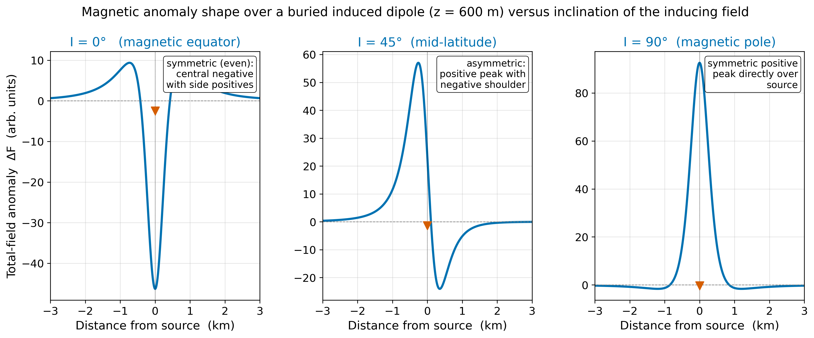
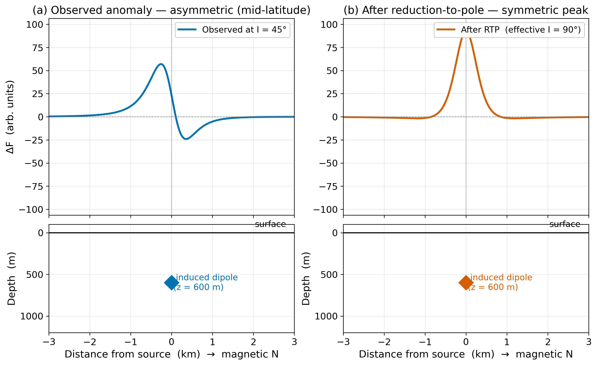
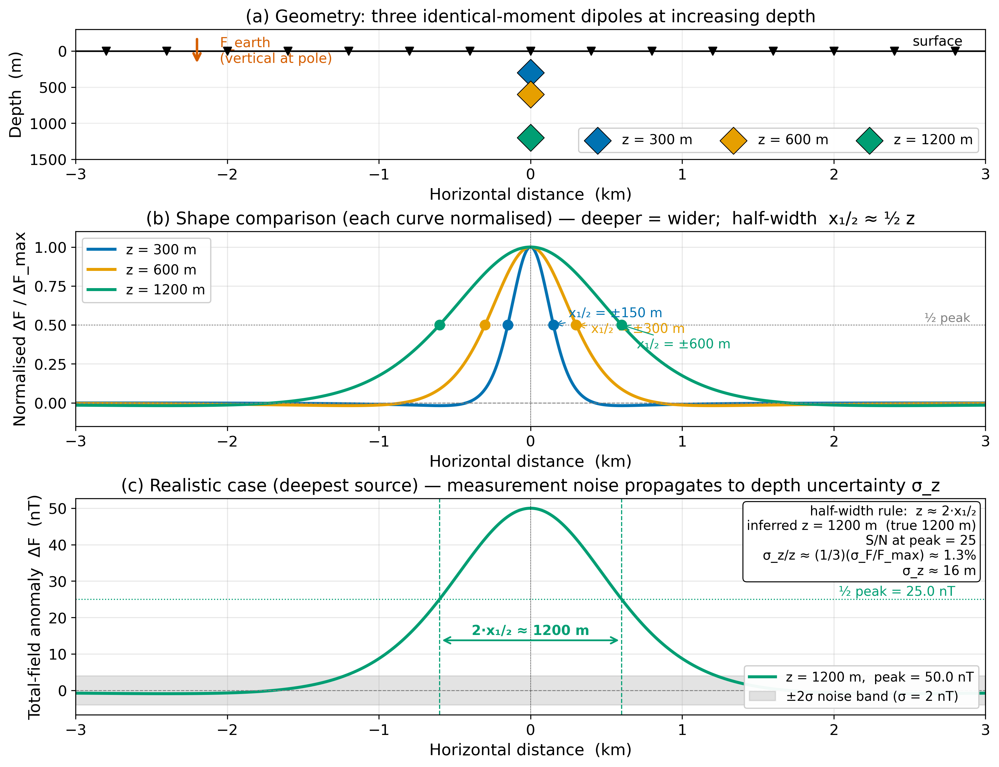
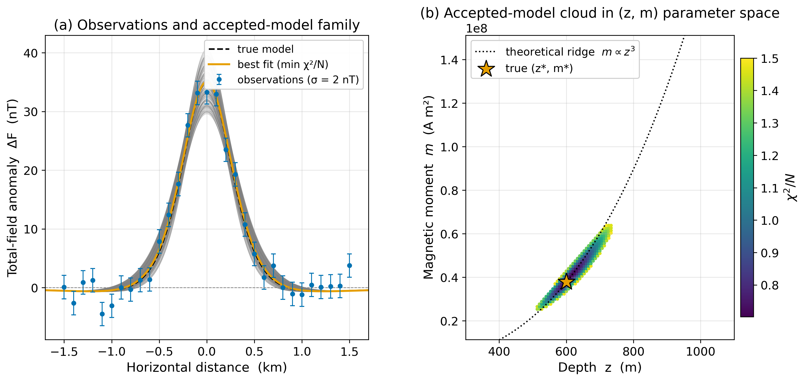
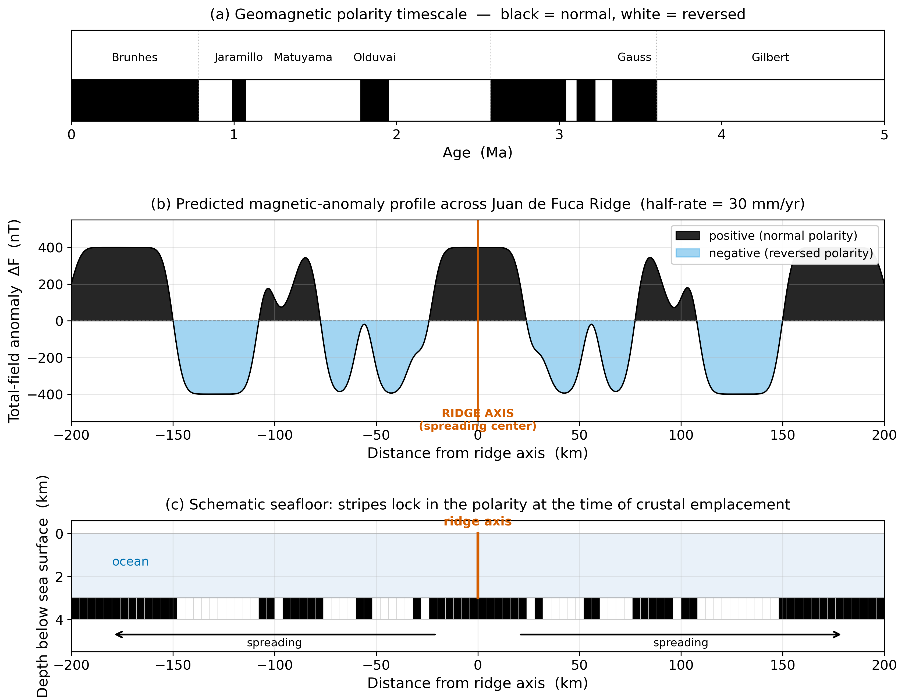

<!-- _class: title -->

# Lecture 24
## Magnetic Field, Magnetism & Tectonic Plates
### Anomalies, ensembles, and the floor of the Pacific

ESS 314 · Spring 2026 · Marine Denolle

---

## Why this lecture

> *"… the floor should now consist of strips of normal and reversed material running parallel to the ridge crest."* — Vine & Matthews, **1963**

- Juan de Fuca Ridge spreads at ~30 mm/yr offshore the Pacific Northwest.
- The same dipole math from Lecture 23 turns into a **subsurface-imaging tool**.
- But there's a new complication: the **anomaly shape depends on magnetic latitude**.

---

## Learning objectives

1. Define the **total-field anomaly** $\Delta F$ and the linearised approximation $\Delta F \approx \mathbf{B}_\text{source} \cdot \hat{\mathbf{F}}_\text{earth}$.
2. Predict the anomaly shape over a buried induced dipole as a function of $I$.
3. Apply the half-width depth rule **$z \approx 2 x_{1/2}$** and propagate noise via $\sigma_z/z \approx (1/3)(\sigma_F / F_\text{max})$.
4. Read an ensemble cloud in $(z, m)$ space and explain the **$m \propto z^3$** ridge.
5. Read magnetic stripes offshore the PNW to recover a **spreading rate**, and connect magnetics to **Seattle Fault Zone** hazards.

---

## From observed F to anomaly $\Delta F$

The magnetometer measures $|F|$. After removing IGRF, diurnal, and external:

$$\Delta F(\mathbf{r}) \;\approx\; \mathbf{B}_\text{source}(\mathbf{r}) \cdot \hat{\mathbf{F}}_\text{earth}$$

- Typical anomalies: **1 – 500 nT** against **50 000 nT** ambient field.
- Linearisation is the magnetic analog of the Bouguer correction in gravity.
- The anomaly is the projection of source-field perturbation onto **local F̂**.

---

## Forward problem — the buried induced dipole

$$\mathbf{m} \;=\; \mathbf{m}_\text{induced} + \mathbf{m}_\text{remanent} \;=\; k V \mathbf{H}_\text{earth} + \mathbf{m}_\text{remanent}$$

For induced-only at the pole (or after RTP):

$$\Delta F(x) \;=\; \frac{\mu_0\,m}{4\pi} \cdot \frac{2 z^2 - x^2}{(x^2 + z^2)^{5/2}}$$

- Peak: $\Delta F_\text{max} = (\mu_0 m / 4\pi)\,(2 / z^3)$
- Half-width: $x_{1/2} \approx 0.5\,z$

---

## Anomaly shape depends on inclination

- **Equator** ($I = 0$): symmetric central negative + side positives.
- **Mid-lat** ($I = 45°$): asymmetric — peak displaced from source.
- **Pole** ($I = 90°$): symmetric positive peak directly over source.

---

## Reduction to pole

A frequency-domain filter that converts mid-latitude anomalies into the equivalent pole anomaly — making peaks **symmetric and centred over the source**.

- Exact for induced sources with $\mathbf{m} \parallel \mathbf{H}_\text{earth}$.
- Essential near the magnetic equator; modest improvement at $I = 69°$ (Seattle).

---

## Half-width depth rule + noise propagation

$$z \;\approx\; 2\, x_{1/2}, \qquad \frac{\sigma_z}{z} \;\approx\; \frac{1}{3}\,\frac{\sigma_F}{\Delta F_\text{max}}$$

- Magnetic prefactor (0.5) < gravity prefactor (0.766) — faster decay with depth.
- Magnetic noise → depth prefactor (1/3) < gravity (1/2) — sharper depths at fixed SNR.

---

## SNR rule of thumb

| $\Delta F_\text{max} / \sigma_F$ | $\sigma_z / z$ | Verdict |
|---:|---:|---|
| > 50 | < 0.7% | Excellent |
| 10 – 50 | 0.7 – 3% | Good |
| < 10 | > 3% | Poor — quote bounds |

Example: $\Delta F_\text{max} = 50$ nT, $\sigma_F = 2$ nT → SNR = 25, $\sigma_z \approx 1.3\%$ of $z$. On a 1.2-km source, $\sigma_z \approx 16$ m.

---

## Ensemble fit — the $m \propto z^3$ ridge

- 31 stations, $\sigma_F = 2$ nT, $\chi^2/N \leq 1.5$.
- Accepted models trace the theoretical ridge $m \propto z^3$.
- Steeper than gravity ($M \propto z^2$): magnetic depth-moment trade-off is **tighter**.
- The half-width measurement breaks the degeneracy.

---

## Inverse problem — two ambiguities, not one

For gravity: one ambiguity (mass ↔ depth).

For magnetics: **two ambiguities**:

1. $(z, m)$ trade-off, **intensified to $m \propto z^3$**.
2. Vector ambiguity: $\mathbf{m} = \mathbf{m}_\text{induced} + \mathbf{m}_\text{remanent}$. The remanent direction is set by the field at the time of cooling — possibly different polarity, possibly different latitude.

**Resolution requires more data**: gradiometry, lab samples, or joint inversion with gravity.

---

## Worked example — Juan de Fuca stripes

- Polarity reversals + spreading → striped pattern.
- Distance from ridge to a polarity boundary = (half-rate) × (boundary age).
- Brunhes/Matuyama (0.78 Ma) at $x \approx 23$ km → **half-rate $\approx 30$ mm/yr**.
- Independent calibration from continental lavas: a **clock** on the seafloor.

---

## Why magnetics, not gravity or seismics, proved seafloor spreading

- Gravity over a ridge: mass deficit (hot mantle), **no time information**.
- Seismic over a ridge: slower mantle, **no time information**.
- **Magnetic stripes encode time** because the polarity timescale is independently calibrated from continental lava flows.
- A property non-unique in one observable becomes **diagnostic** when joined to an independent stratigraphic clock.

---

## Societal relevance — Seattle Fault Zone

- East-west blind reverse fault system beneath downtown Seattle.
- Mapped by USGS aeromagnetic survey at 300-m line spacing (Blakely et al. 2002).
- Tertiary volcanic units on the hanging wall → strong magnetic anomalies.
- Maximum credible event ≈ **M_w 7** in downtown Seattle.
- Magnetic geometry feeds Washington State seismic hazard maps and building codes.

---

## Research horizon — magnetic methods today

- **Joint magnetic-gravity inversion** for ore deposits (Au, Ni, Li).
- **UAV-borne magnetics**: 0.05 nT precision at 30 m line spacing.
- **Cascadia Magnetic Anomaly Reconnaissance (2024-25)**: drone hazard pilot over Bainbridge Island faults.
- **Magnetotellurics** (next lecture): uses time-varying *external* field as an EM source.

ML surrogates accelerate inversions but are trained on physics-based simulations — the physics is *not* optional.

---

## AI literacy — the latitude trap

LLMs frequently apply the half-width rule **without asking about latitude** — assuming pole geometry.

**Activity:**
1. Sketch an equatorial-latitude anomaly profile by hand.
2. Hand it to an LLM with no latitude information and ask for the depth.
3. Did the LLM ask about latitude? Or did it apply the half-width rule directly?
4. Write a rebuttal that either defends the LLM's question, or proves it wrong by deriving the correct procedure.

The grade is on whether *you* caught the error — not on the LLM's answer.

---

## Concept check

1. **Half-width and SNR.** $\Delta F_\text{max} = 80$ nT, $x_{1/2} = 240$ m, $\sigma_F = 4$ nT. Depth, SNR, $\sigma_z/z$?

2. **Half-rate from a stripe.** Matuyama midpoint ($t = 1.78$ Ma) at $x = \pm 17$ km. Half-rate?

3. **Induced or remanent?** Negative anomaly at a Seattle-like latitude over a small body. Two physical explanations? One follow-up measurement to discriminate.

---

## Looking ahead

Lecture 25: **Electromagnetic methods** — magnetotellurics and controlled-source EM.

- Uses **time variation** of Earth's external field as a probe.
- Sees deep into the Earth (1–100 km) via induced response in conductive rock.
- The bridge is the magnetic vector potential $\mathbf{A}$ and the full Maxwell equations.

---

<!-- _class: end -->

## Suggested reading

- **Blakely (1995)**, *Potential Theory in Gravity and Magnetic Applications*.
- **Blakely et al. (2002)**, Seattle Fault aeromagnetics. *GSA Bull.* 114, 169–177.
- **Cande & Kent (1995)** / **Ogg (2020)**: Geomagnetic polarity timescale.
- **Vine & Matthews (1963)**, *Nature* 199, 947.
- **Tauxe et al. (2018)**, *Essentials of Paleomagnetism* (open access).

Companion notebook (next step): `notebooks/magnetics_ensemble.ipynb`
